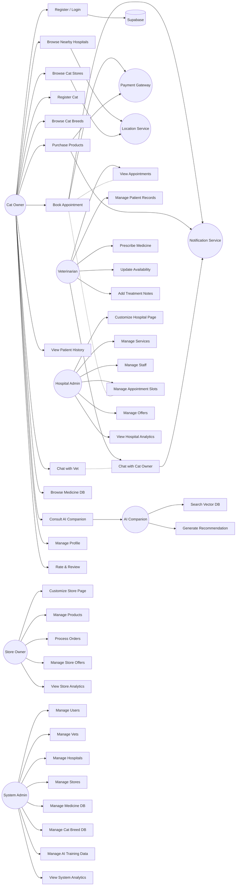

# 01 — Actors & Use Cases

## 1. Actor Identification

### Primary Actors

| # | Actor | Description | Access Level |
|---|-------|-------------|-------------|
| A1 | **Cat Owner (User)** | End user who registers their cats, books vet appointments, shops for cat products, and uses the AI companion for health advice | Basic authenticated access |
| A2 | **Veterinarian (Vet)** | Licensed veterinarian who manages patient records, communicates with cat owners, prescribes medicines, and manages appointments | Vet-level access |
| A3 | **Hospital/Clinic Admin** | Manages a vet hospital/clinic dashboard, staff, services offered, appointment slots, and promotional content | Hospital-level access |
| A4 | **Cat Store Owner** | Manages a cat store's product listings, inventory, orders, and store page customization | Store-level access |
| A5 | **System Admin** | Full platform control — manages all users, vets, stores, hospitals, content moderation, and system configuration | Full admin access |

### System/External Actors

| # | Actor | Type | Description |
|---|-------|------|-------------|
| A6 | **AI Companion** | System | Provides illness diagnosis suggestions by querying the vector database of symptoms/treatments |
| A7 | **Supabase (DB + Auth)** | External | PostgreSQL database, authentication, real-time subscriptions, and storage |
| A8 | **Payment Gateway (Stripe)** | External | Processes payments for store orders and appointment bookings |
| A9 | **Geolocation Service** | External | Provides user location and calculates distances to nearby hospitals/stores |
| A10 | **Notification Service** | External | Sends push notifications, emails, and SMS for appointments, orders, and chat |

---

## 2. Use Cases by Actor

### UC-A1: Cat Owner (User) Use Cases

| UC ID | Use Case | Description |
|-------|----------|-------------|
| UC-1.1 | Register/Login | User creates an account or logs in via email/social auth |
| UC-1.2 | Register Cat | User registers their cat(s) with breed, age, weight, medical history |
| UC-1.3 | Browse Cat Breeds | User browses the cat breed database for information |
| UC-1.4 | Browse Nearby Hospitals | User views a list of vet hospitals/clinics near their location (DoorDash-style) |
| UC-1.5 | Book Appointment | User books a checkup/vaccination/treatment at a nearby hospital |
| UC-1.6 | Chat with Vet | Real-time messaging with an assigned veterinarian |
| UC-1.7 | View Patient History | User views their cat's complete medical history, past appointments, prescriptions |
| UC-1.8 | Browse Cat Store | User browses nearby cat stores (DoorDash-style listing) |
| UC-1.9 | Purchase Products | User buys accessories/food from a cat store |
| UC-1.10 | Browse Medicine Database | User searches and views medicine information, ingredients, contraindications |
| UC-1.11 | Consult AI Companion | User describes symptoms; AI suggests possible illnesses and home remedies |
| UC-1.12 | Manage Profile | User updates personal info, location, notification preferences |
| UC-1.13 | View Orders | User tracks past and current store orders |
| UC-1.14 | Rate & Review | User rates hospitals, stores, and vets |
| UC-1.15 | Manage Payment Methods | User adds/removes payment cards |

### UC-A2: Veterinarian (Vet) Use Cases

| UC ID | Use Case | Description |
|-------|----------|-------------|
| UC-2.1 | Register as Vet | Vet creates account with license verification |
| UC-2.2 | View Appointments | Vet views scheduled appointments |
| UC-2.3 | Manage Patient Records | Vet creates/updates cat patient records, diagnoses, prescriptions |
| UC-2.4 | Chat with Cat Owner | Real-time messaging with cat owners |
| UC-2.5 | Prescribe Medicine | Vet selects medicines from the database and prescribes to a cat |
| UC-2.6 | View Medicine Database | Vet searches medicines, checks allergies/interactions |
| UC-2.7 | Update Availability | Vet sets their available time slots |
| UC-2.8 | View Patient History | Vet reviews complete medical history of a cat |
| UC-2.9 | Add Treatment Notes | Vet adds post-appointment notes and follow-up instructions |

### UC-A3: Hospital/Clinic Admin Use Cases

| UC ID | Use Case | Description |
|-------|----------|-------------|
| UC-3.1 | Register Hospital | Hospital admin registers their clinic on the platform |
| UC-3.2 | Customize Dashboard | Customize the hospital's public-facing page (banner, description, photos) |
| UC-3.3 | Manage Services | Add/edit/remove services offered (checkup, vaccination, surgery, etc.) |
| UC-3.4 | Manage Staff | Add/remove vets and staff members to the hospital |
| UC-3.5 | Manage Appointment Slots | Configure available appointment times and durations |
| UC-3.6 | View Appointments | View all appointments for the hospital |
| UC-3.7 | Manage Offers/Promotions | Create special offers (e.g., "20% off vaccinations this month") |
| UC-3.8 | View Analytics | View appointment statistics, revenue, and ratings |
| UC-3.9 | Respond to Reviews | Respond to user reviews |

### UC-A4: Cat Store Owner Use Cases

| UC ID | Use Case | Description |
|-------|----------|-------------|
| UC-4.1 | Register Store | Store owner registers their shop on the platform |
| UC-4.2 | Customize Store Page | Customize the store's public-facing page (banner, layout, branding) |
| UC-4.3 | Manage Products | Add/edit/remove products (food, accessories, toys, etc.) |
| UC-4.4 | Manage Inventory | Track and update stock levels |
| UC-4.5 | Process Orders | View and fulfill incoming orders |
| UC-4.6 | Manage Offers/Promotions | Create discounts, bundles, and promotional campaigns |
| UC-4.7 | View Analytics | View sales statistics, top products, and revenue |
| UC-4.8 | Respond to Reviews | Respond to customer reviews |
| UC-4.9 | Manage Store Hours | Set operating hours and delivery zones |

### UC-A5: System Admin Use Cases

| UC ID | Use Case | Description |
|-------|----------|-------------|
| UC-5.1 | Manage Users | View/edit/suspend/delete user accounts |
| UC-5.2 | Manage Vets | Verify vet licenses, approve/suspend vet accounts |
| UC-5.3 | Manage Hospitals | Approve/suspend hospital registrations |
| UC-5.4 | Manage Stores | Approve/suspend store registrations |
| UC-5.5 | Manage Medicine DB | Add/edit/remove medicines from the global database |
| UC-5.6 | Manage Cat Breed DB | Add/edit/remove cat breed entries |
| UC-5.7 | Manage AI Training Data | Add/update symptom-solution pairs in the vector database |
| UC-5.8 | View System Analytics | Monitor platform-wide analytics and health metrics |
| UC-5.9 | Moderate Content | Review and moderate user reviews, chat reports |
| UC-5.10 | Configure System | Manage platform settings, commission rates, notification templates |

### UC-A6: AI Companion Use Cases

| UC ID | Use Case | Description |
|-------|----------|-------------|
| UC-6.1 | Process Symptom Query | Convert user's symptom description to vector embedding |
| UC-6.2 | Search Vector DB | Find the most relevant illness/solution matches |
| UC-6.3 | Generate Recommendation | Produce a structured recommendation with confidence score |
| UC-6.4 | Log Interaction | Store the query and recommendation for continuous improvement |

---

## 3. Actor — Use Case Diagram

### Mermaid Code (Full System)

> Render at: https://mermaid.live or any Mermaid-compatible viewer

### PlantUML Code (Actor-Use Case Diagram)

```plantuml
@startuml ActorUseCaseDiagram
left to right direction
skinparam packageStyle rectangle
skinparam actorStyle awesome

actor "Cat Owner" as User
actor "Veterinarian" as Vet
actor "Hospital Admin" as HAdmin
actor "Store Owner" as SOwner
actor "System Admin" as Admin
actor "AI Companion" as AI <<system>>
actor "Supabase" as DB <<external>>
actor "Payment Gateway" as Pay <<external>>
actor "Location Service" as Geo <<external>>
actor "Notification Service" as Notif <<external>>

rectangle "Purrfect Care System" {

    package "User Management" {
        usecase "Register / Login" as UC1
        usecase "Manage Profile" as UC12
        usecase "Register Cat" as UC2
    }

    package "Information Browsing" {
        usecase "Browse Cat Breeds" as UC3
        usecase "Browse Medicine DB" as UC10
        usecase "View Patient History" as UC7
    }

    package "Appointment System" {
        usecase "Browse Nearby Hospitals" as UC4
        usecase "Book Appointment" as UC5
        usecase "View Appointments" as UC22
        usecase "Manage Appointment Slots" as UC35
        usecase "Update Availability" as UC27
    }

    package "Vet-User Communication" {
        usecase "Chat with Vet" as UC6
        usecase "Chat with Cat Owner" as UC24
    }

    package "Veterinary Services" {
        usecase "Manage Patient Records" as UC23
        usecase "Prescribe Medicine" as UC25
        usecase "Add Treatment Notes" as UC29
    }

    package "Hospital Management" {
        usecase "Register Hospital" as UC31
        usecase "Customize Hospital Page" as UC32
        usecase "Manage Services" as UC33
        usecase "Manage Staff" as UC34
        usecase "Manage Hospital Offers" as UC37
        usecase "View Hospital Analytics" as UC38
    }

    package "Cat Store" {
        usecase "Browse Cat Stores" as UC8
        usecase "Purchase Products" as UC9
        usecase "Customize Store Page" as UC42
        usecase "Manage Products" as UC43
        usecase "Process Orders" as UC45
        usecase "Manage Store Offers" as UC46
        usecase "View Store Analytics" as UC47
    }

    package "AI Companion" {
        usecase "Consult AI Companion" as UC11
        usecase "Search Vector DB" as UC62
        usecase "Generate Recommendation" as UC63
    }

    package "Administration" {
        usecase "Manage Users" as UC51
        usecase "Manage Vets" as UC52
        usecase "Manage Hospitals" as UC53
        usecase "Manage Stores" as UC54
        usecase "Manage Medicine DB Admin" as UC55
        usecase "Manage Cat Breed DB" as UC56
        usecase "Manage AI Data" as UC57
        usecase "View System Analytics" as UC58
    }

    package "Social" {
        usecase "Rate & Review" as UC14
        usecase "Respond to Reviews" as UC39
    }
}

' --- Cat Owner connections ---
User --> UC1
User --> UC2
User --> UC3
User --> UC4
User --> UC5
User --> UC6
User --> UC7
User --> UC8
User --> UC9
User --> UC10
User --> UC11
User --> UC12
User --> UC14

' --- Vet connections ---
Vet --> UC1
Vet --> UC22
Vet --> UC23
Vet --> UC24
Vet --> UC25
Vet --> UC27
Vet --> UC29
Vet --> UC10

' --- Hospital Admin connections ---
HAdmin --> UC1
HAdmin --> UC31
HAdmin --> UC32
HAdmin --> UC33
HAdmin --> UC34
HAdmin --> UC35
HAdmin --> UC37
HAdmin --> UC38
HAdmin --> UC39

' --- Store Owner connections ---
SOwner --> UC1
SOwner --> UC42
SOwner --> UC43
SOwner --> UC45
SOwner --> UC46
SOwner --> UC47
SOwner --> UC39

' --- Admin connections ---
Admin --> UC51
Admin --> UC52
Admin --> UC53
Admin --> UC54
Admin --> UC55
Admin --> UC56
Admin --> UC57
Admin --> UC58

' --- AI connections ---
AI --> UC62
AI --> UC63
UC11 ..> UC62 : <<include>>
UC11 ..> UC63 : <<include>>

' --- External connections ---
UC1 --> DB
UC5 --> Pay
UC9 --> Pay
UC4 --> Geo
UC8 --> Geo
UC5 --> Notif
UC9 --> Notif
UC6 --> Notif

' --- Shared relationships ---
UC6 .. UC24 : <<communicate>>
UC5 ..> UC22 : <<triggers>>

@enduml
```

---

## 4. Use Case Descriptions (Detailed)

### UC-1.5: Book Appointment (Key Use Case)

| Field | Description |
|-------|-------------|
| **Use Case ID** | UC-1.5 |
| **Name** | Book Appointment |
| **Primary Actor** | Cat Owner |
| **Secondary Actors** | Payment Gateway, Notification Service, Location Service |
| **Preconditions** | User is logged in, has at least one registered cat, location enabled |
| **Main Flow** | 1. User selects "Find Nearby Hospitals" → 2. System fetches user location → 3. System displays hospitals sorted by distance → 4. User selects a hospital → 5. Hospital page shows services, vets, available slots → 6. User selects service type (checkup/vaccination/treatment) → 7. User selects a vet and time slot → 8. User selects which cat the appointment is for → 9. System shows appointment summary and price → 10. User confirms and pays → 11. System creates appointment record → 12. Notifications sent to user, vet, and hospital |
| **Postconditions** | Appointment created, payment processed, all parties notified |
| **Alternative Flows** | A1: No hospitals nearby → show expanded radius. A2: Payment fails → show retry option. A3: Slot becomes unavailable → suggest alternatives |

### UC-1.9: Purchase Products (Key Use Case)

| Field | Description |
|-------|-------------|
| **Use Case ID** | UC-1.9 |
| **Name** | Purchase Products |
| **Primary Actor** | Cat Owner |
| **Secondary Actors** | Payment Gateway, Notification Service, Location Service |
| **Preconditions** | User is logged in, location enabled |
| **Main Flow** | 1. User selects "Cat Stores" → 2. System fetches location → 3. System displays nearby stores sorted by distance → 4. User selects a store → 5. Store page shows products, categories, offers → 6. User adds items to cart → 7. User reviews cart → 8. User proceeds to checkout → 9. System calculates total with delivery fee → 10. User selects payment method and confirms → 11. System processes payment → 12. Order created and notifications sent to user and store |
| **Postconditions** | Order placed, payment processed, store notified |
| **Alternative Flows** | A1: Store is closed → show store hours. A2: Product out of stock → suggest alternatives. A3: Payment fails → retry |

### UC-1.11: Consult AI Companion (Key Use Case)

| Field | Description |
|-------|-------------|
| **Use Case ID** | UC-1.11 |
| **Name** | Consult AI Companion |
| **Primary Actor** | Cat Owner |
| **Secondary Actors** | AI Companion System |
| **Preconditions** | User is logged in |
| **Main Flow** | 1. User opens AI Companion → 2. User describes cat's symptoms in natural language → 3. System converts text to vector embedding → 4. System queries pgvector for similar symptom-solution pairs → 5. System retrieves top matching illnesses with confidence scores → 6. System displays possible illnesses, home remedies, and when to see a vet → 7. System offers option to book appointment if severity is high → 8. Interaction is logged for improvement |
| **Postconditions** | User receives health advice, interaction logged |
| **Alternative Flows** | A1: No matching symptoms → suggest contacting a vet directly. A2: High-severity match → strongly recommend immediate vet visit |

### UC-1.6 / UC-2.4: Vet-User Chat (Key Use Case)

| Field | Description |
|-------|-------------|
| **Use Case ID** | UC-1.6 / UC-2.4 |
| **Name** | Vet-User Direct Contact |
| **Primary Actors** | Cat Owner, Veterinarian |
| **Secondary Actors** | Notification Service, Supabase Realtime |
| **Preconditions** | User has an active/past appointment with the vet |
| **Main Flow** | 1. User/Vet opens chat → 2. System loads chat history from Supabase → 3. User/Vet types message → 4. Message sent via Supabase Realtime → 5. Recipient receives real-time notification → 6. Chat supports text, images (e.g., photos of symptoms) → 7. Vet can share medicine recommendations in chat |
| **Postconditions** | Messages stored, both parties can review chat history |

### UC-3.2 / UC-4.2: Customize Dashboard (Key Use Case)

| Field | Description |
|-------|-------------|
| **Use Case ID** | UC-3.2 / UC-4.2 |
| **Name** | Customize Hospital/Store Page |
| **Primary Actors** | Hospital Admin / Store Owner |
| **Preconditions** | Hospital/Store is registered and approved |
| **Main Flow** | 1. Admin opens dashboard → 2. Selects "Customize Page" → 3. System shows editable page builder → 4. Admin updates: banner image, description, operating hours, contact info → 5. Admin adds/reorders sections (services, offers, team) → 6. Admin previews changes → 7. Admin publishes → 8. Public-facing page updated |
| **Postconditions** | Hospital/Store page reflects changes visible to all users |
