# 02 — Swimlane / Workflow Diagrams

> **Swimlane diagrams** (also called workflow diagrams) are **activity diagrams** where activities are organized into **lanes** — one per actor/role. They show the **flow of work** across actors using activities, decisions, forks, joins, and transitions.
>
> **How to render**: Use [PlantUML Online](https://www.plantuml.com/plantuml/uml) for the PlantUML code, or [Mermaid Live](https://mermaid.live) for the Mermaid code.

---

## Swimlane 1: User Registration & Cat Registration

### PlantUML (True Swimlane)

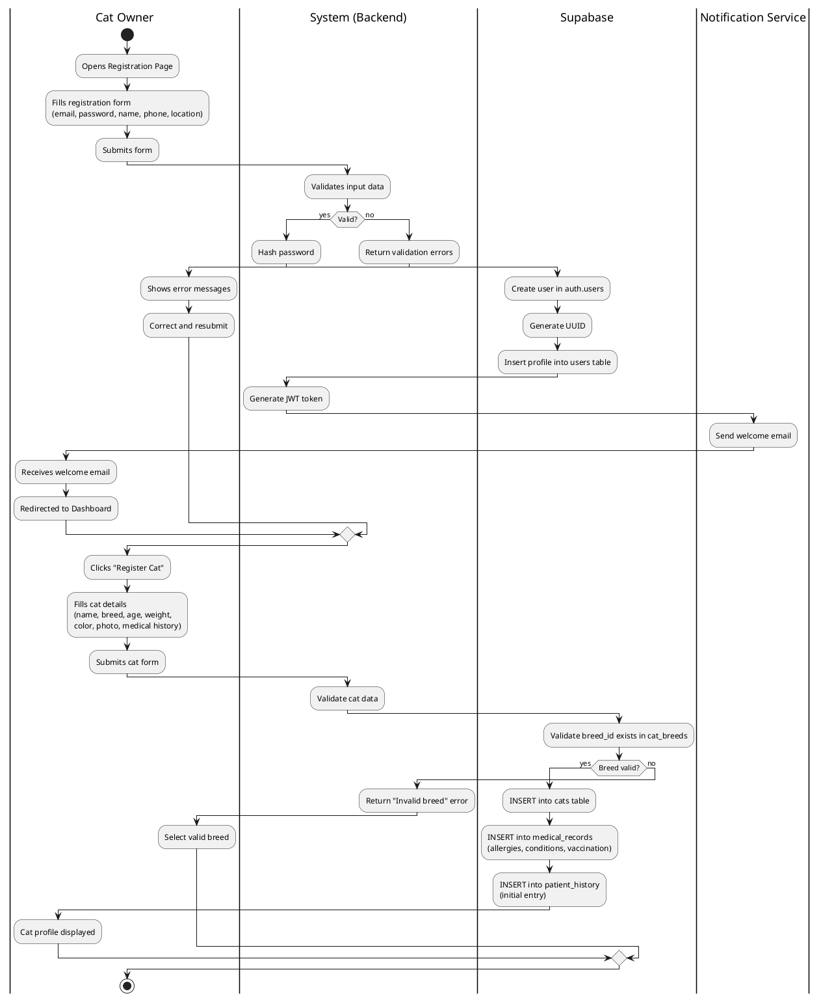

### Mermaid (Flowchart with Subgraphs as Lanes)

```mermaid
flowchart LR
    subgraph CatOwner["🐱 Cat Owner"]
        A1([Start]) --> A2[Open Registration Page]
        A2 --> A3[Fill form: email, password, name, location]
        A3 --> A4[Submit]
    end

    subgraph Backend["⚙️ System Backend"]
        A4 --> B1{Valid input?}
        B1 -->|No| B2[Return errors]
        B2 --> A3
        B1 -->|Yes| B3[Hash password]
    end

    subgraph Supabase["🗄️ Supabase"]
        B3 --> C1[Create user in auth.users]
        C1 --> C2[Insert profile into users table]
    end

    subgraph Backend2["⚙️ System Backend"]
        C2 --> B4[Generate JWT token]
    end

    subgraph NotifSvc["📧 Notification Service"]
        B4 --> N1[Send welcome email]
    end

    subgraph CatOwner2["🐱 Cat Owner"]
        N1 --> A5[Receive welcome email]
        B4 --> A6[Redirected to Dashboard]
        A6 --> A7[Click Register Cat]
        A7 --> A8[Fill cat details: name, breed, age, weight]
        A8 --> A9[Submit]
    end

    subgraph Backend3["⚙️ System Backend"]
        A9 --> B5{Breed valid?}
        B5 -->|No| B6[Return breed error]
        B6 --> A8
    end

    subgraph Supabase2["🗄️ Supabase"]
        B5 -->|Yes| C3[INSERT into cats]
        C3 --> C4[INSERT into medical_records]
        C4 --> C5[INSERT into patient_history]
    end

    subgraph CatOwner3["🐱 Cat Owner"]
        C5 --> A10[Cat profile displayed]
        A10 --> A11([End])
    end
```

---

## Swimlane 2: Book Appointment (DoorDash-style)

### PlantUML (True Swimlane)

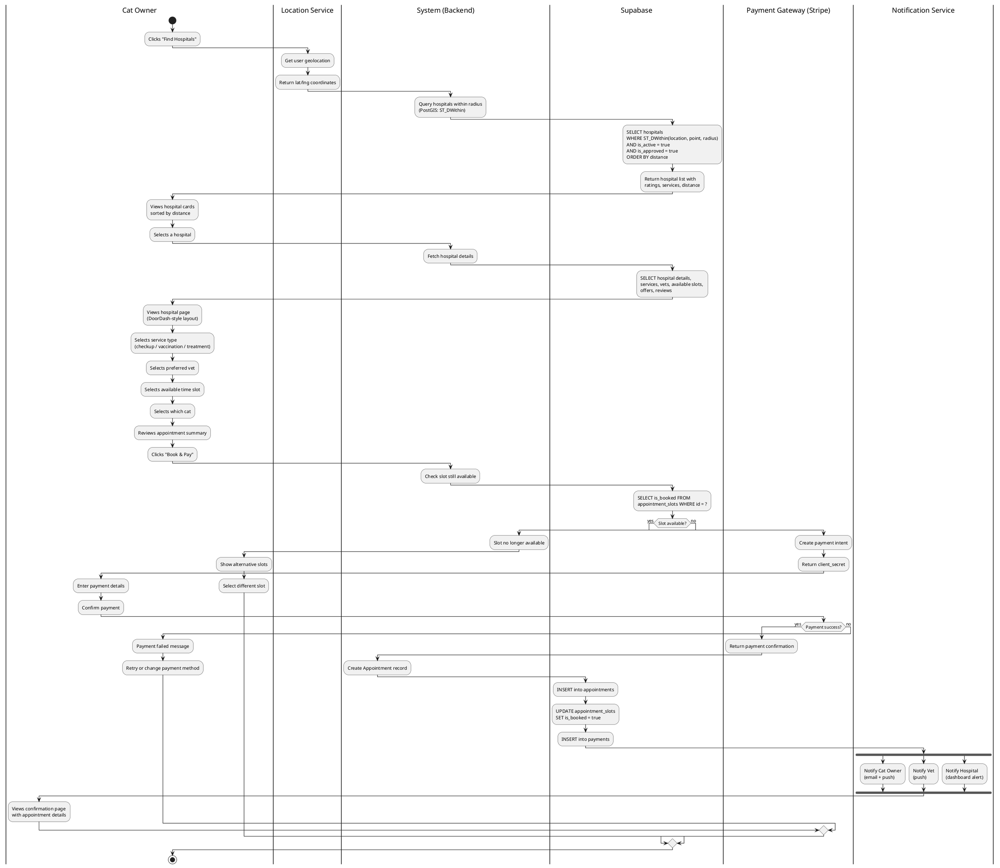

### Mermaid (Flowchart with Subgraphs as Lanes)

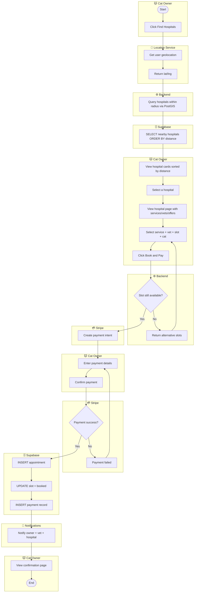

---

## Swimlane 3: Purchase Products (Cat Store — DoorDash-style)

### PlantUML (True Swimlane)

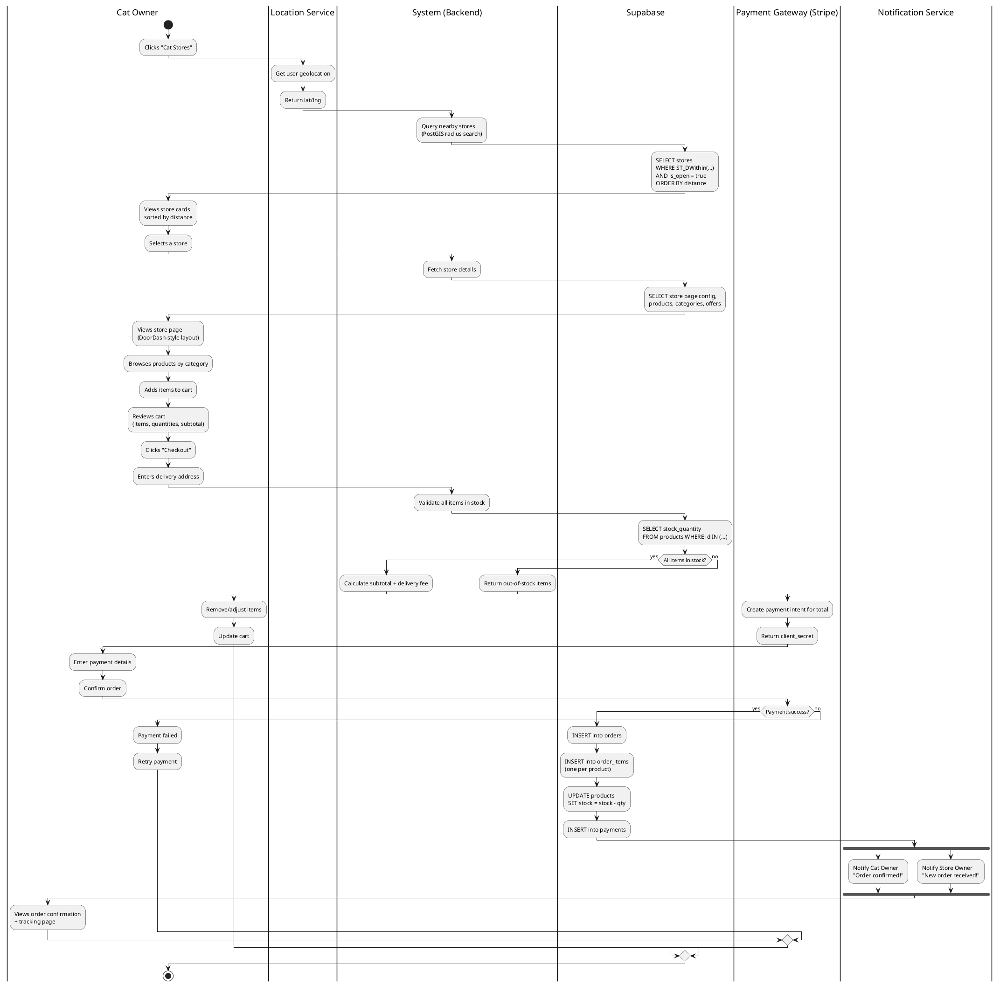

---

## Swimlane 4: Vet-User Direct Chat

### PlantUML (True Swimlane)

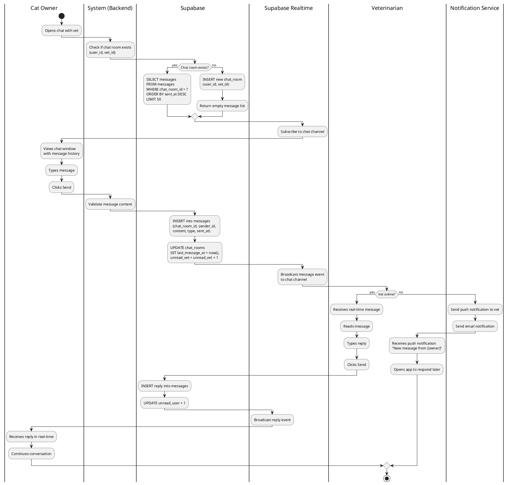

---

## Swimlane 5: AI Companion Consultation

### PlantUML (True Swimlane)

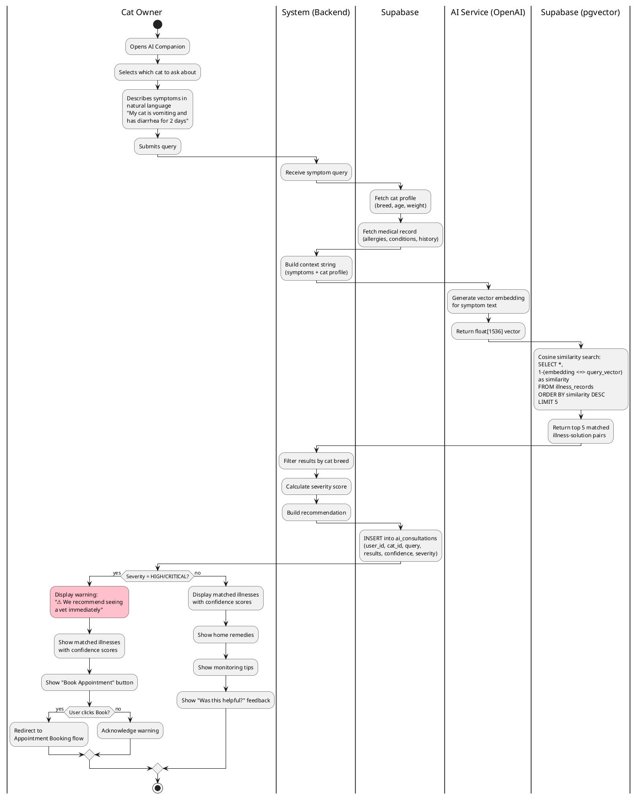

---

## Swimlane 6: Hospital Dashboard Customization

### PlantUML (True Swimlane)

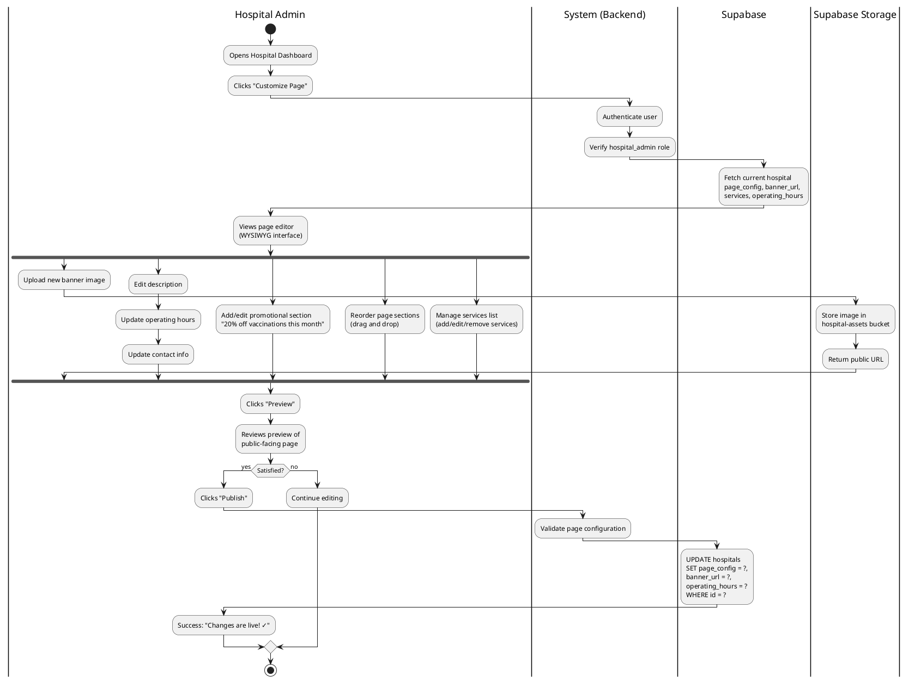

---

## Swimlane 6b: Store Dashboard Customization

### PlantUML (True Swimlane)

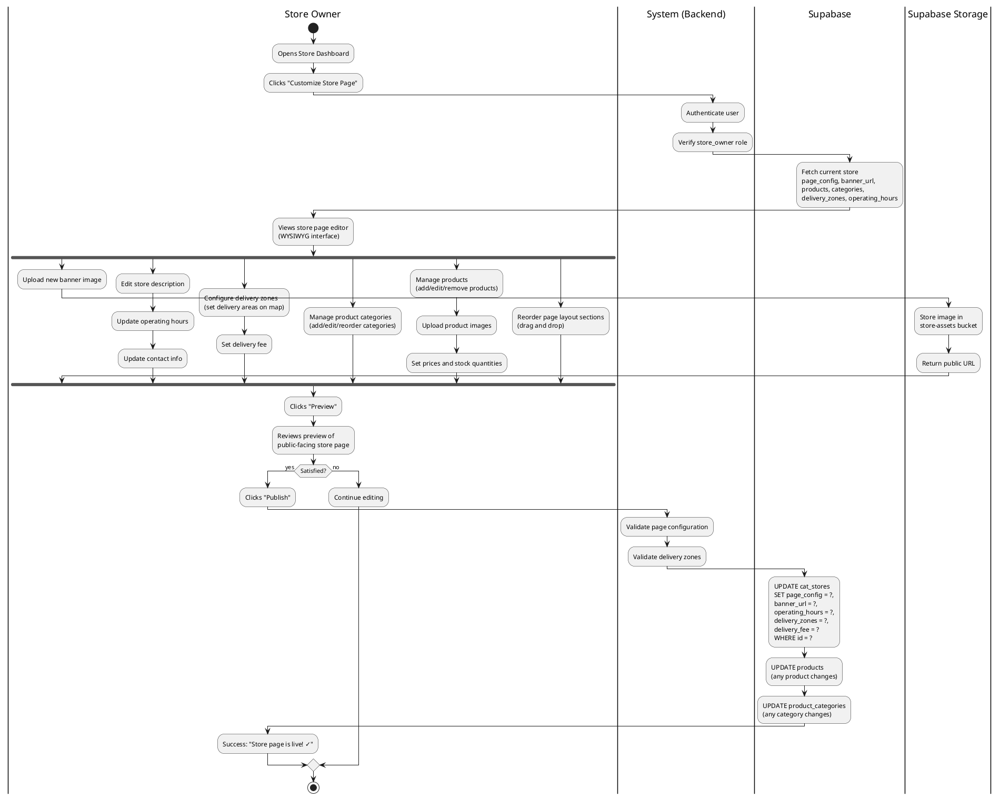

---

## Swimlane 7: Order Fulfillment (Store Owner Processing)

### PlantUML (True Swimlane)

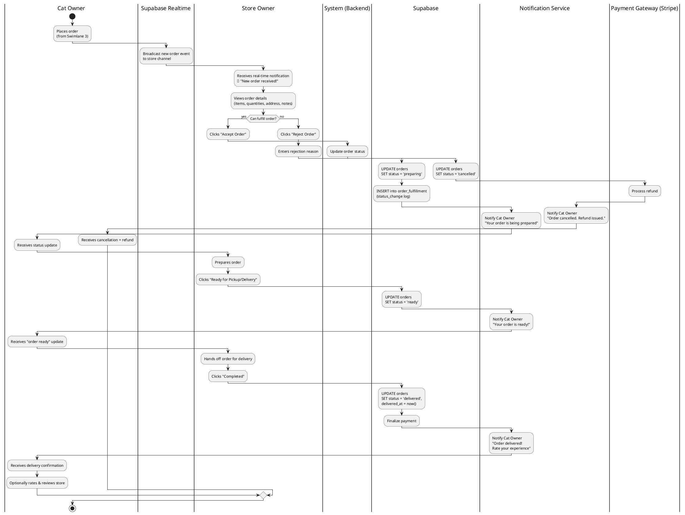

---

## Swimlane 8: Admin — Manage Medicine Database

### PlantUML (True Swimlane)

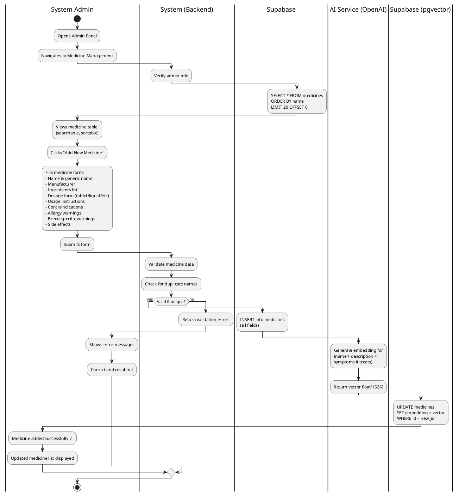

---

## Swimlane 9: Vet — Treatment, Prescribe Medicine & Update Patient Record

### PlantUML (True Swimlane)

```plantuml
@startuml
|Veterinarian|
start
:Opens today's appointments;
:Selects current appointment;

|System (Backend)|
:Fetch full appointment context;

|Supabase|
:SELECT appointment details 
+ cat profile 
+ medical_record (allergies)
+ patient_history 
+ past prescriptions;

|Veterinarian|
:Reviews patient context:
- Cat info & breed
- Known allergies  
- Medical history
- Past prescriptions;

:Conducts examination;
:Enters diagnosis notes;
:Adds treatment record;

|Supabase|
:INSERT into treatments
(appointment_id, vet_id, cat_id,
diagnosis, notes, follow_up);

|Veterinarian|
:Searches medicine database;

|System (Backend)|
:Search medicines by name/condition;

|Supabase|
:SELECT * FROM medicines 
WHERE name ILIKE '%query%';

|Veterinarian|
:Views medicine options 
with ingredients & warnings;
:Selects medicine;
:Sets dosage, frequency, duration;
:Clicks "Prescribe";

|System (Backend)|
:Cross-check cat allergies vs 
medicine contraindications;

|Supabase|
:SELECT allergies FROM 
medical_records WHERE cat_id = ?;
:SELECT contraindications, 
allergy_warnings FROM 
medicines WHERE id = ?;

|System (Backend)|
if (Contraindication found?) then (yes)
    |Veterinarian|
    #pink:⚠️ WARNING: 
    Cat is allergic to [ingredient]
    in this medicine;
    
    if (Override?) then (yes)
        :Acknowledges risk;
        :Adds override reason;
    else (no)
        :Selects different medicine;
        stop
    endif
else (no)
endif

|Supabase|
:INSERT into prescriptions
(appointment_id, cat_id, vet_id,
medicine_id, dosage, frequency,
duration_days, instructions);

:INSERT into patient_history
(cat_id, type='prescription',
appointment_id, prescription_id);

|Notification Service|
:Notify Cat Owner:
"New prescription for [cat name]:
[medicine] - [dosage] [frequency]
for [duration] days";

|Cat Owner|
:Receives prescription notification;
:Views prescription details 
in patient history;

|Veterinarian|
:Prescription confirmed ✓;
:Adds follow-up instructions;
:Marks appointment complete;

|Supabase|
:UPDATE appointments 
SET status = 'completed';
:INSERT into patient_history
(type='appointment_completed');

stop
@enduml
```

---

## Swimlane 10: Review & Rating Flow

### PlantUML (True Swimlane)

```plantuml
@startuml
|Cat Owner|
start
:Completes appointment/order;
:Receives prompt: 
"Rate your experience";
:Opens review form;
:Selects star rating (1-5);
:Writes review comment;
:Submits review;

|System (Backend)|
:Validate review content;
:Check user had actual 
appointment/order with target;

|Supabase|
:INSERT into reviews
(user_id, target_id, 
rating, comment);
:Recalculate average rating:
UPDATE hospitals/stores/vets 
SET rating = AVG(reviews.rating),
total_reviews = COUNT(*);

|Notification Service|
:Notify Hospital Admin / 
Store Owner / Vet:
"New review received (★★★★☆)";

|Hospital Admin / Store Owner|
:Receives review notification;
:Views review in dashboard;

if (Wants to respond?) then (yes)
    :Writes response;
    :Submits response;
    
    |Supabase|
    :INSERT into review_responses
    (review_id, responder_id, 
    response_text);
    
    |Notification Service|
    :Notify Cat Owner:
    "Business responded 
    to your review";
    
    |Cat Owner|
    :Views response;
else (no)
    |Hospital Admin / Store Owner|
    :Acknowledges review;
endif
stop
@enduml
```

---

## Swimlane 11: Offer / Promotion Management

### PlantUML (True Swimlane)

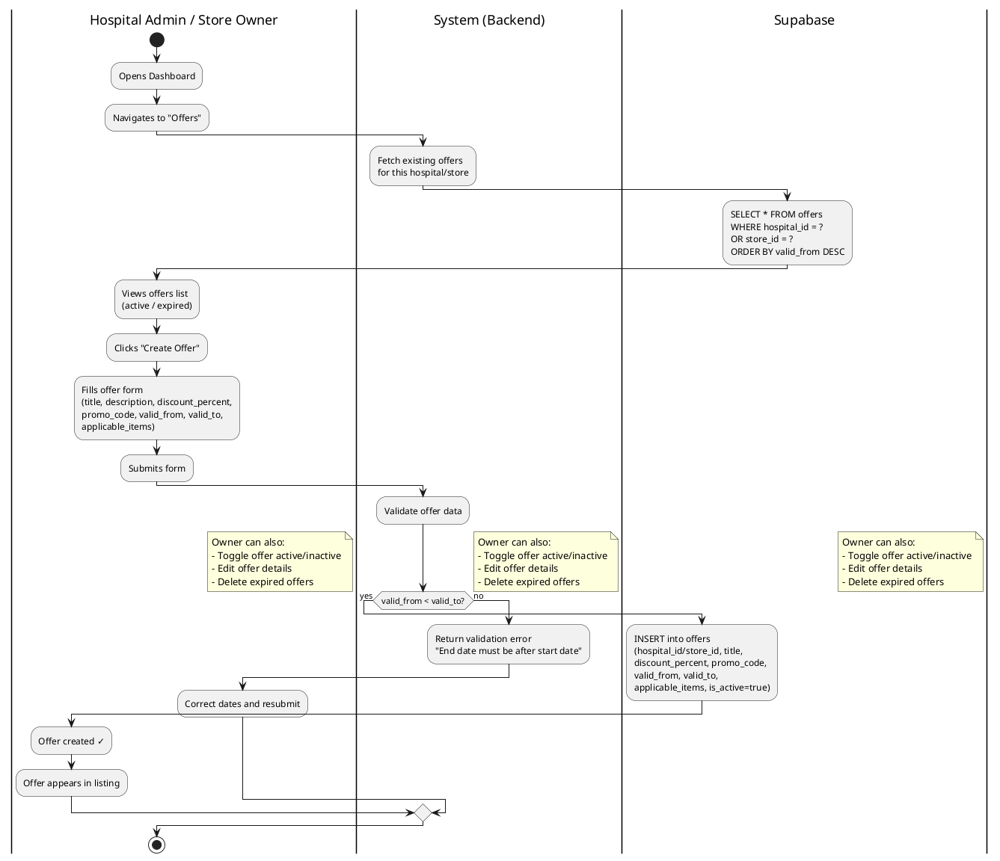

---

## Swimlane 12: Admin — Verify Vets, Approve Hospitals & Stores

### PlantUML (True Swimlane)

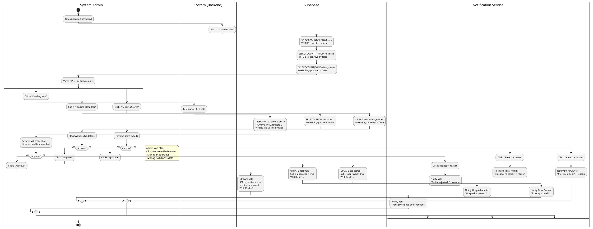

---

## Summary of All Swimlane / Workflow Diagrams

| # | Swimlane | Actors/Lanes | Primary Use Case | Transaction Pattern |
|---|----------|-------------|-----------------|-------------------|
| 1 | Registration | Cat Owner, Backend, Supabase, Notification | UC-1.1, UC-1.2 | TS-1, TS-2 |
| 2 | Book Appointment | Cat Owner, Location, Backend, Supabase, Stripe, Notification | UC-1.5 | TS-3 (Transaction → SubsequentTransaction + Place) |
| 3 | Purchase Products | Cat Owner, Location, Backend, Supabase, Stripe, Notification | UC-1.9 | TS-4 (Transaction with LineItem → SubsequentTransaction) |
| 4 | Vet-User Chat | Cat Owner, Backend, Supabase, Realtime, Vet, Notification | UC-1.6, UC-2.4 | TS-5 (Transaction with TransactionLineItem) |
| 5 | AI Consultation | Cat Owner, Backend, OpenAI, pgvector, Supabase | UC-1.11 | TS-7 (Participant-Transaction-SpecificItem) |
| 6 | Hospital Dashboard Customization | Hospital Admin, Backend, Supabase, Storage | UC-3.2 | TS-8 (Participant-Transaction-Place + Item) |
| 6b | Store Dashboard Customization | Store Owner, Backend, Supabase, Storage | UC-4.2 | TS-9 (Participant-Transaction-Place + Item + Classification) |
| 7 | Order Fulfillment | Cat Owner, Realtime, Store Owner, Backend, Supabase, Stripe, Notification | UC-4.5 | TS-12 (Transaction → SubsequentTransaction) |
| 8 | Medicine Management | System Admin, Backend, Supabase, OpenAI, pgvector | UC-5.5 | TS-13 (Participant-Transaction-Item) |
| 9 | Treatment & Prescription | Vet, Backend, Supabase, Notification, Cat Owner | UC-2.5, UC-2.9 | TS-6 (Transaction → SubsequentTransaction with Item) |
| 10 | Review & Rating | Cat Owner, Backend, Supabase, Notification, Business Owner | UC-1.14 | TS-10 (Transaction → SubsequentTransaction) |
| 11 | Offer Management | Hospital Admin / Store Owner, Backend, Supabase | UC-3.6, UC-4.6 | TS-11 (Participant-Transaction-Item) |
| 12 | Admin Verification & Approval | System Admin, Backend, Supabase, Notification | UC-5.1–UC-5.4 | TS-13 (Participant-Transaction-SpecificItem) |

---

## Diagram Format Guide

| Format | Tool | Best For |
|--------|------|----------|
| **PlantUML** (primary) | [plantuml.com](https://www.plantuml.com/plantuml/uml), VS Code PlantUML extension | **True swimlanes** with `\|Lane\|` syntax — proper UML activity diagrams |
| **Mermaid** (secondary) | [mermaid.live](https://mermaid.live), GitHub markdown | Flowcharts with subgraphs approximating lanes — good for GitHub rendering |

> **Recommendation**: Use the **PlantUML** versions for formal documentation and presentations. The PlantUML activity diagram syntax with `|Lane Name|` partitions renders proper swimlane diagrams with vertical lanes.

