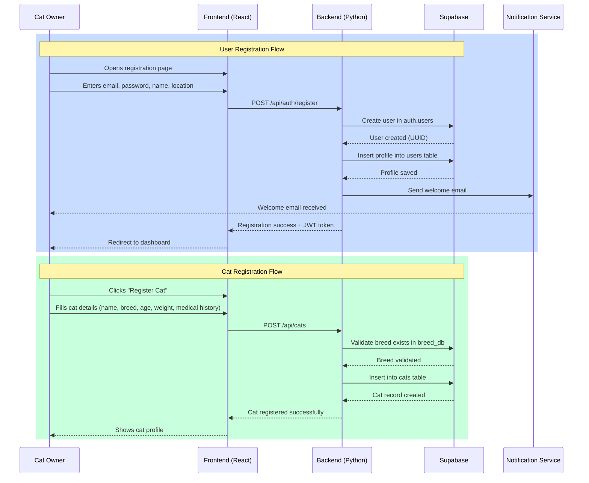
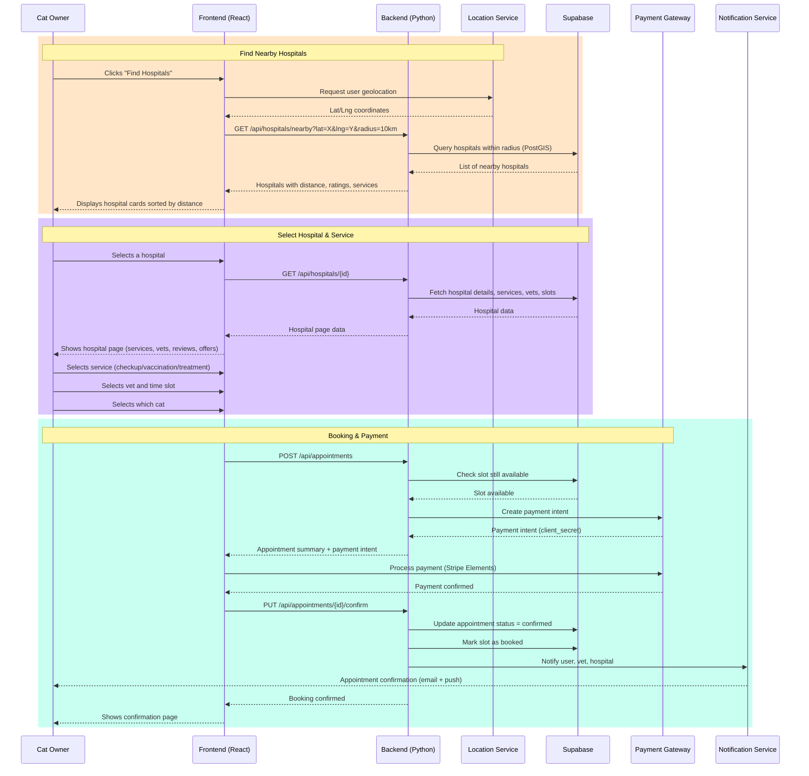
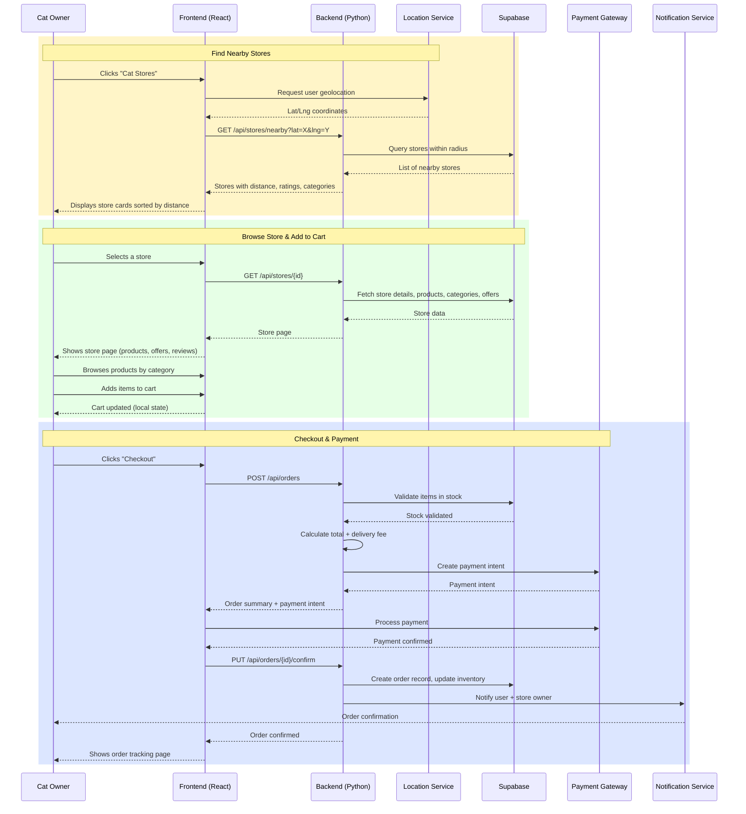
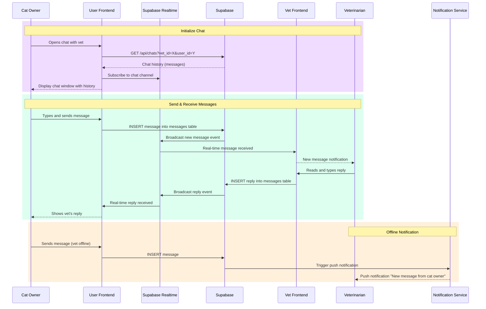
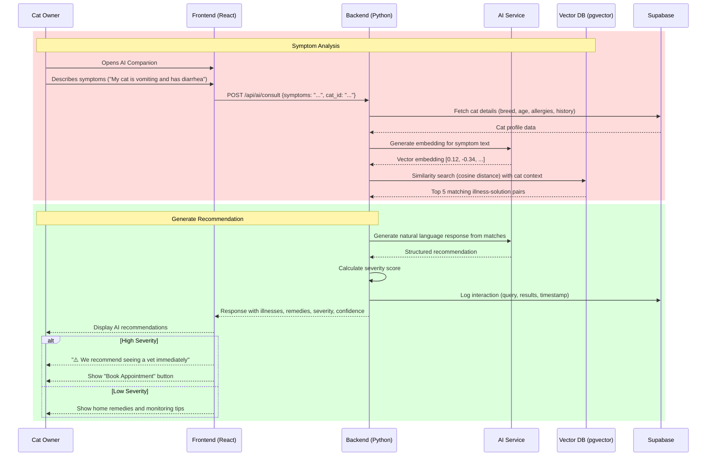
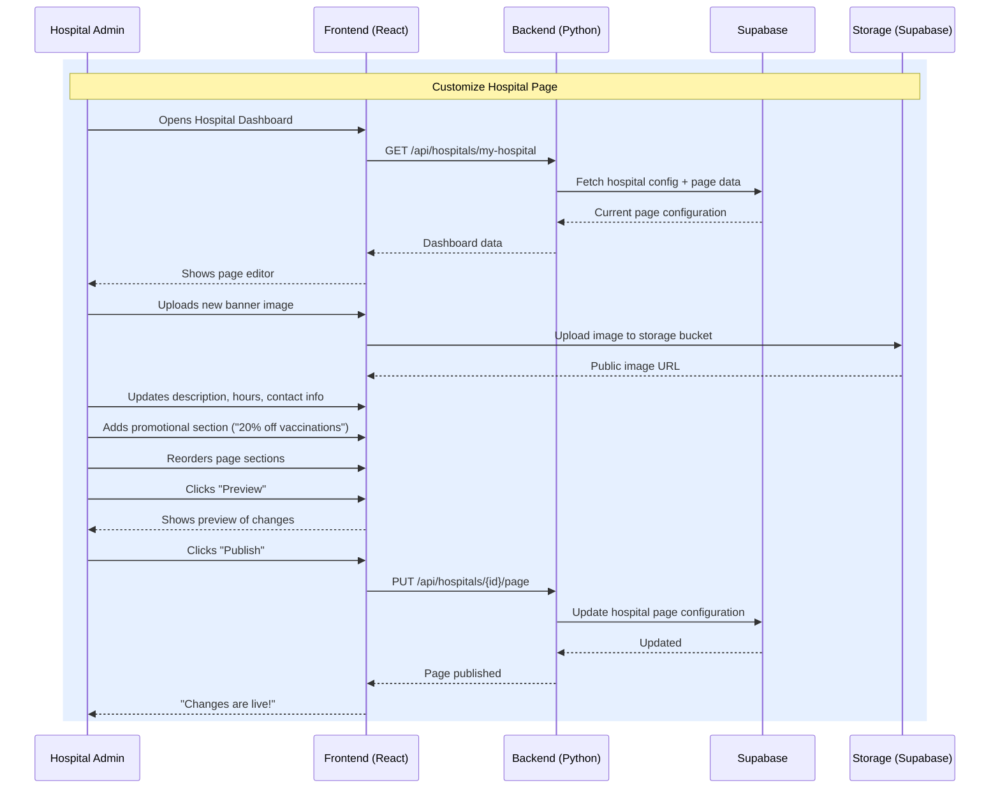
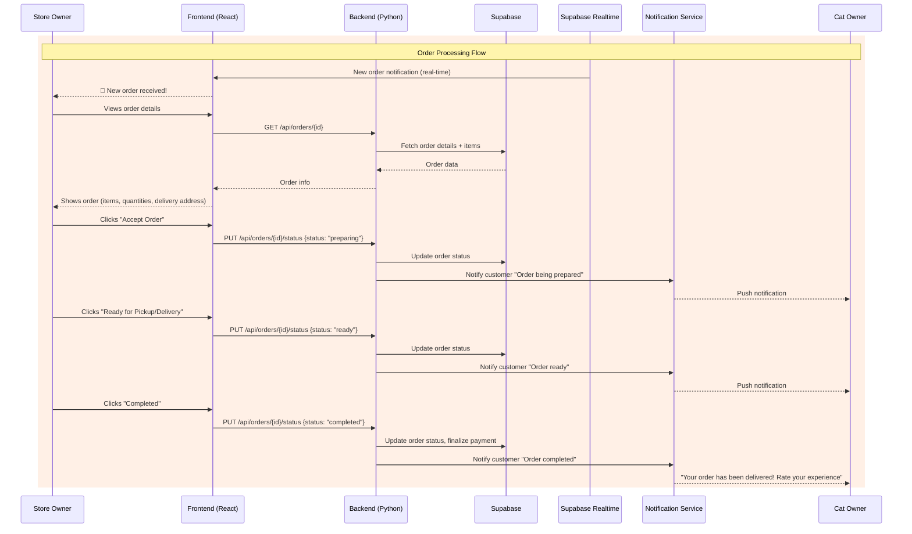
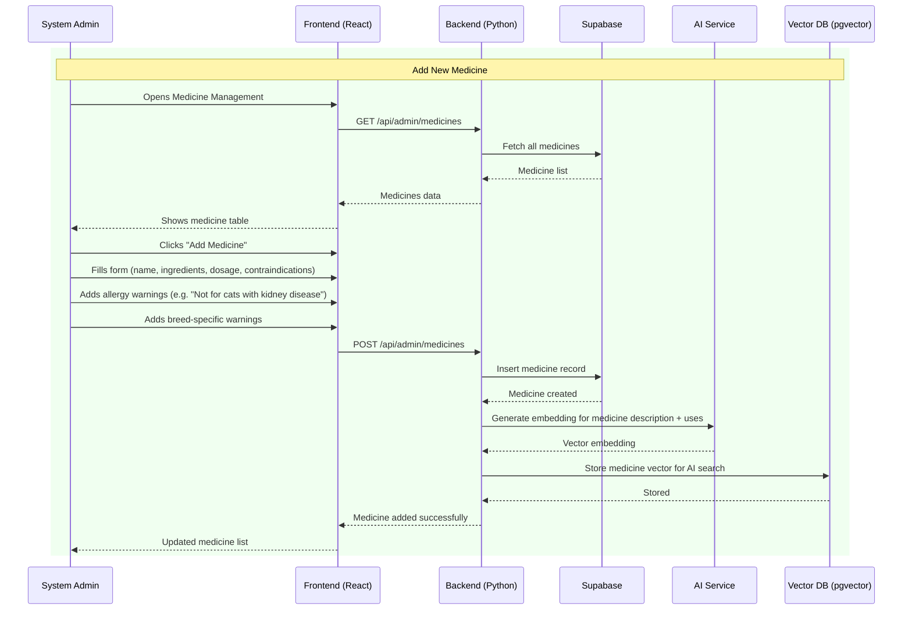
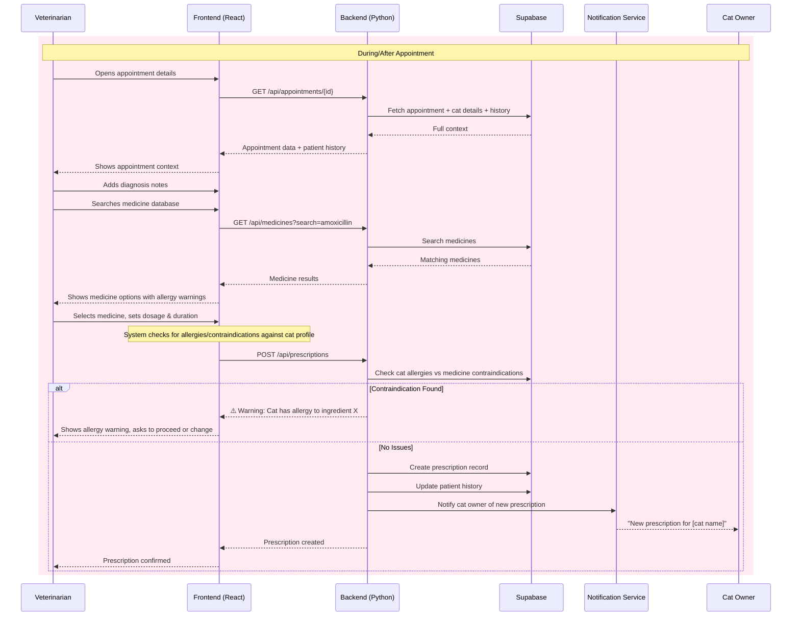

# 02 — Swimlane (Activity) Diagrams

> Swimlane diagrams show the flow of activities across different actors/roles for each use case.
> Render these using Mermaid Live Editor (https://mermaid.live) or any Mermaid-compatible viewer.

---

## Swimlane 1: User Registration & Cat Registration

---

## Swimlane 2: Book Appointment (DoorDash-style)

---

## Swimlane 3: Purchase Products (Cat Store — DoorDash-style)

---

## Swimlane 4: Vet-User Direct Chat

---

## Swimlane 5: AI Companion Consultation

---

## Swimlane 6: Hospital Dashboard Customization

---

## Swimlane 7: Store Order Processing

---

## Swimlane 8: Admin — Manage Medicine Database

---

## Swimlane 9: Vet — Prescribe Medicine & Update Patient Record

---

## Summary of All Swimlane Diagrams

| # | Swimlane | Actors Involved | Primary Use Case |
|---|----------|----------------|-----------------|
| 1 | Registration | User, Frontend, Backend, DB, Notification | UC-1.1, UC-1.2 |
| 2 | Book Appointment | User, Frontend, Backend, Location, DB, Payment, Notification | UC-1.5 |
| 3 | Purchase Products | User, Frontend, Backend, Location, DB, Payment, Notification | UC-1.9 |
| 4 | Vet-User Chat | User, Vet, Frontends, Realtime, DB, Notification | UC-1.6, UC-2.4 |
| 5 | AI Consultation | User, Frontend, Backend, AI, Vector DB, DB | UC-1.11 |
| 6 | Hospital Dashboard | Hospital Admin, Frontend, Backend, DB, Storage | UC-3.2 |
| 7 | Order Processing | Store Owner, Frontend, Backend, DB, Realtime, Notification, User | UC-4.5 |
| 8 | Medicine Management | Admin, Frontend, Backend, DB, AI, Vector DB | UC-5.5 |
| 9 | Prescribe Medicine | Vet, Frontend, Backend, DB, Notification, User | UC-2.5 |
