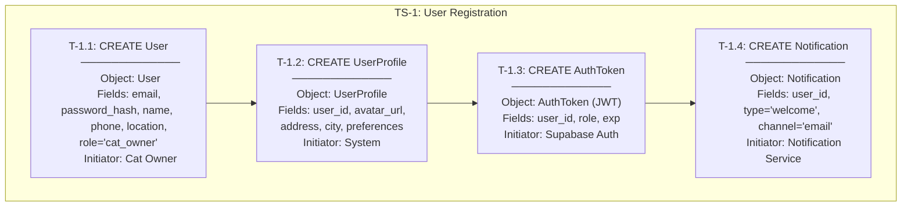
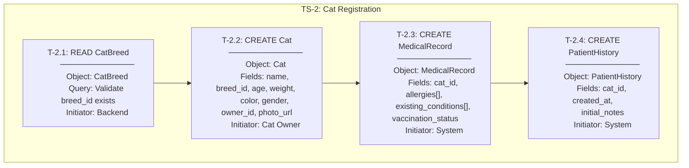
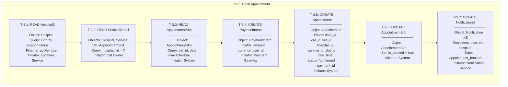
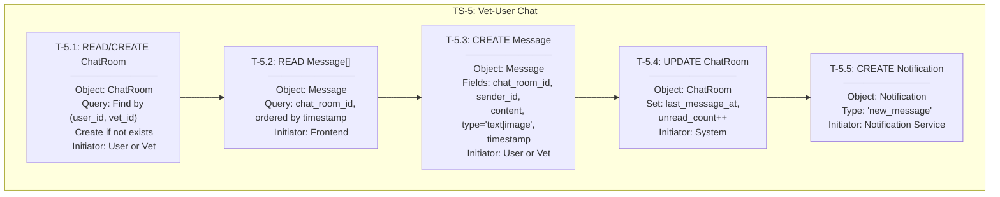
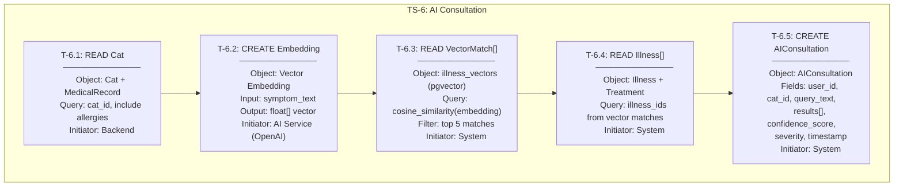
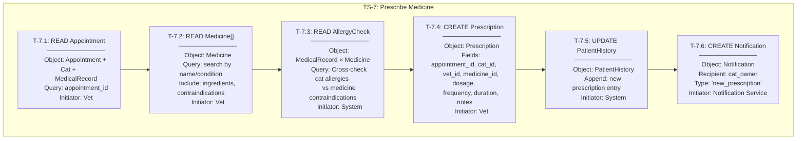
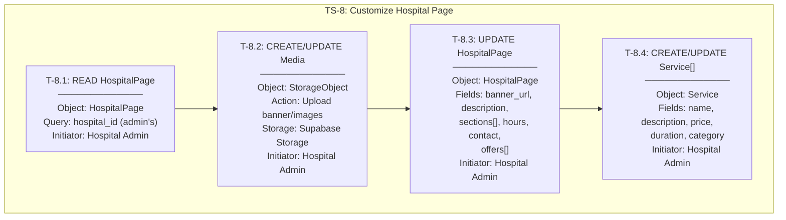
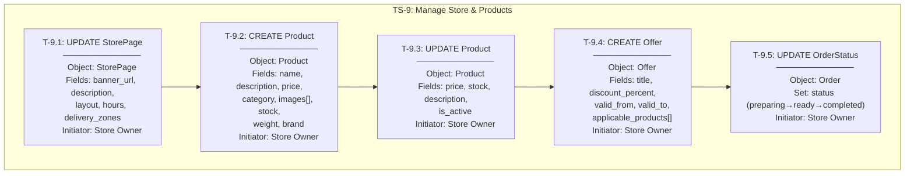
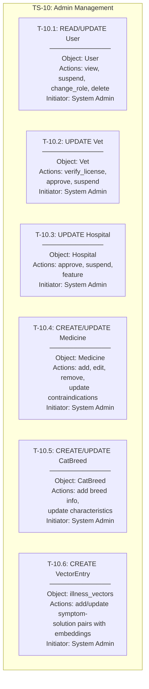

# 03 — Transactional Diagrams

> Transactional diagrams identify the **transaction sets** — the set of objects that must be created, read, updated, or deleted (CRUD) to complete each use case. Each transaction represents a unit of work in the system.

---

## Transaction Set Notation

Each transaction is identified as:
- **T-[UseCase].[Step]** — Transaction identifier
- **Operation**: CREATE / READ / UPDATE / DELETE
- **Objects Involved**: The data objects that participate in the transaction
- **Initiator**: The actor or system component that triggers the transaction

---

## TS-1: User Registration & Login

---

## TS-2: Cat Registration

---

## TS-3: Book Appointment

---

## TS-4: Purchase Products (Cat Store)

```mermaid
graph TD
    subgraph "TS-4: Purchase Products"
        T4_1["T-4.1: READ Store[]
        ─────────────
        Object: CatStore
        Query: Find by location radius
        Filter: is_open=true
        Initiator: Location Service"]
        
        T4_2["T-4.2: READ StoreDetail
        ─────────────
        Objects: CatStore, Product, 
        Category, Offer
        Query: store_id = X
        Initiator: Cat Owner"]
        
        T4_3["T-4.3: CREATE Cart
        ─────────────
        Object: Cart / CartItem
        Fields: user_id, store_id, 
        items[{product_id, qty, price}]
        Initiator: Cat Owner (Frontend)"]
        
        T4_4["T-4.4: READ Product[]
        ─────────────
        Object: Product
        Query: Validate stock for each item
        Initiator: System"]
        
        T4_5["T-4.5: CREATE PaymentIntent
        ─────────────
        Object: PaymentIntent
        Fields: amount + delivery_fee
        Initiator: Payment Gateway"]
        
        T4_6["T-4.6: CREATE Order
        ─────────────
        Object: Order
        Fields: user_id, store_id, items[],
        total, delivery_fee, status='pending',
        payment_id, delivery_address
        Initiator: System"]
        
        T4_7["T-4.7: CREATE OrderItem[]
        ─────────────
        Object: OrderItem (per product)
        Fields: order_id, product_id, 
        quantity, unit_price
        Initiator: System"]
        
        T4_8["T-4.8: UPDATE Product[]
        ─────────────
        Object: Product
        Set: stock = stock - quantity
        For each ordered item
        Initiator: System"]
        
        T4_9["T-4.9: CREATE Notification[]
        ─────────────
        Object: Notification (x2)
        Recipients: user, store_owner
        Type: 'order_placed'
        Initiator: Notification Service"]
    end

    T4_1 --> T4_2
    T4_2 --> T4_3
    T4_3 --> T4_4
    T4_4 --> T4_5
    T4_5 --> T4_6
    T4_6 --> T4_7
    T4_7 --> T4_8
    T4_8 --> T4_9
```

---

## TS-5: Vet-User Chat

---

## TS-6: AI Companion Consultation

---

## TS-7: Prescribe Medicine

---

## TS-8: Hospital Dashboard Customization

---

## TS-9: Store Management

---

## TS-10: Admin Operations

---

## Transaction Summary Table

| TS # | Use Case | # Transactions | Objects Touched | CRUD Operations |
|------|----------|---------------|----------------|-----------------|
| TS-1 | User Registration | 4 | User, UserProfile, AuthToken, Notification | C,C,C,C |
| TS-2 | Cat Registration | 4 | CatBreed, Cat, MedicalRecord, PatientHistory | R,C,C,C |
| TS-3 | Book Appointment | 7 | Hospital, Service, Vet, Slot, Payment, Appointment, Notification | R,R,R,C,C,U,C |
| TS-4 | Purchase Products | 9 | Store, Product, Cart, Payment, Order, OrderItem, Notification | R,R,C,R,C,C,C,U,C |
| TS-5 | Vet-User Chat | 5 | ChatRoom, Message, Notification | R/C,R,C,U,C |
| TS-6 | AI Consultation | 5 | Cat, Embedding, VectorMatch, Illness, AIConsultation | R,C,R,R,C |
| TS-7 | Prescribe Medicine | 6 | Appointment, Medicine, MedicalRecord, Prescription, PatientHistory, Notification | R,R,R,C,U,C |
| TS-8 | Hospital Dashboard | 4 | HospitalPage, Media, Service | R,C/U,U,C/U |
| TS-9 | Store Management | 5 | StorePage, Product, Offer, Order | U,C,U,C,U |
| TS-10 | Admin Operations | 6 | User, Vet, Hospital, Medicine, CatBreed, VectorEntry | R/U,U,U,C/U,C/U,C |
