# 03 — Transactional Diagrams (Based on Transaction Pattern)

> **Methodology**: Based on the **Transaction Sets from Transaction Pattern** paper (Usman Waheed & Syed Irfan Hyder), which defines transactions using **players** from Peter Coad's transaction pattern:
>
> **Players**: Actor, Participant, Transaction, TransactionLineItem, Item, SpecificItem, Place, SubsequentTransaction, SubsequentTransactionLineItem
>
> **Player Attributes** (from the paper):
> | Player | Essential Attributes |
> |--------|---------------------|
> | Actor | name, address, phone |
> | Participant | number, start_date, end_date, authorization_level, password |
> | Transaction | number, date, time, status |
> | TransactionLineItem | number, quantity, status |
> | Item | number, name, description, price, default_value |
> | SpecificItem | serial_number, purchase_date, custom_value |
> | Place | number, name, address |
>
> **Transaction Set Types** identified in the paper:
> 1. Simple Participant-Transaction
> 2. Participant-Transaction-Place
> 3. General Item Transaction (with LineItem)
> 4. Specific Item Transaction
> 5. Specific Item Transaction with LineItem
> 6. General and Specific Item Transaction
> 7. Transaction and Subsequent Transaction (without LineItem)
> 8. Transaction with LineItem and Subsequent Transaction without LineItem
> 9. Transaction and Subsequent Transaction both with LineItem

---

## TS-1: User Registration

**Transaction Set Type**: Simple Participant-Transaction

> The simplest form — a Participant (Actor becoming a system user) creating a Transaction (Registration).

**Players**: Actor → Participant (via Registration Transaction)

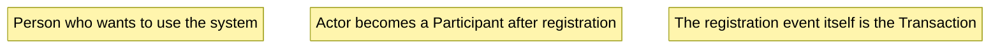

**Example mapping**: `Person → CatOwner → Registration`

---

## TS-2: Cat Registration

**Transaction Set Type**: Participant-Transaction-SpecificItem

> A Participant (CatOwner) creates a Transaction (CatRegistration) for a SpecificItem (the individual Cat). Each cat has a unique identity (like a serial number/microchip), making it a SpecificItem rather than a general Item.

**Players**: Participant, Transaction, SpecificItem

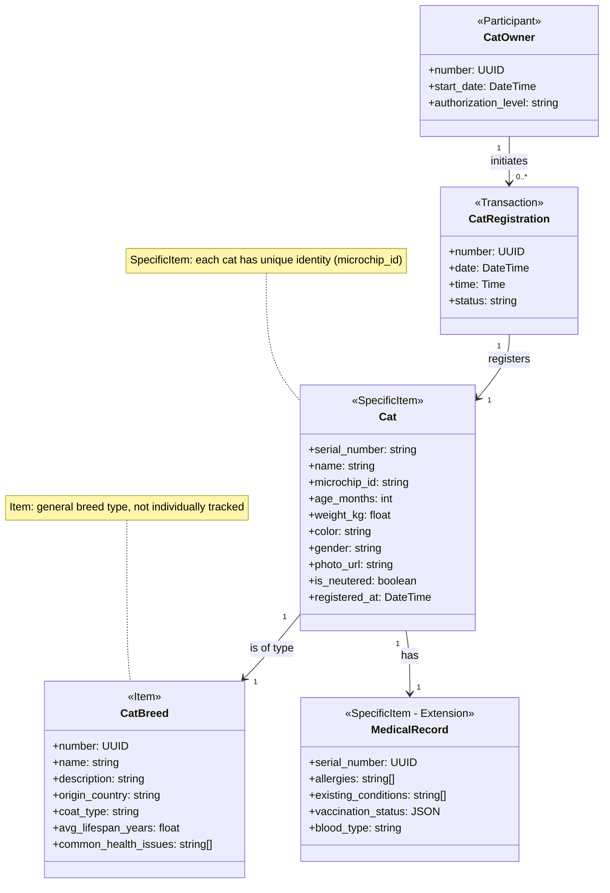

**Example mapping**: `CatOwner → CatRegistration → Cat (specific) → CatBreed (general item)`

---

## TS-3: Book Appointment

**Transaction Set Type**: Transaction and Subsequent Transaction (without LineItem) + Place

> From the paper: *"Patient – appointment – treatment/admission"*. This is exactly the pattern described — a Participant books a Transaction (Appointment), which leads to a SubsequentTransaction (Treatment/Checkup/Vaccination). Place (Hospital) is involved.

**Players**: Participant, Transaction, SubsequentTransaction, SpecificItem, Place

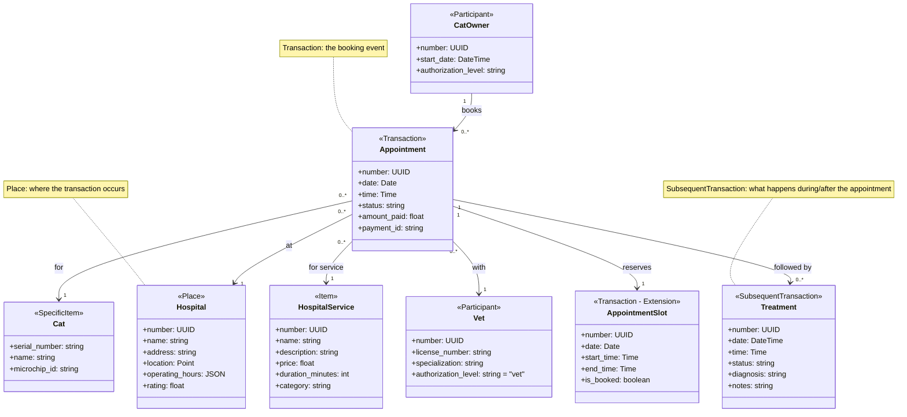

**Example mapping (per PDF)**: `CatOwner (Participant) → Appointment (Transaction) → Treatment (SubsequentTransaction) at Hospital (Place)`

---

## TS-4: Purchase Products (Cat Store)

**Transaction Set Type**: Transaction with LineItem and Subsequent Transaction without LineItem

> From the paper: *"Order – order line item – payment"* and *"Customer – order – order line item – product"*. A Participant places an Order (Transaction) with OrderLineItems referencing Items (Products), followed by Payment (SubsequentTransaction). Place (CatStore) is involved.

**Players**: Participant, Transaction, TransactionLineItem, Item, SubsequentTransaction, Place

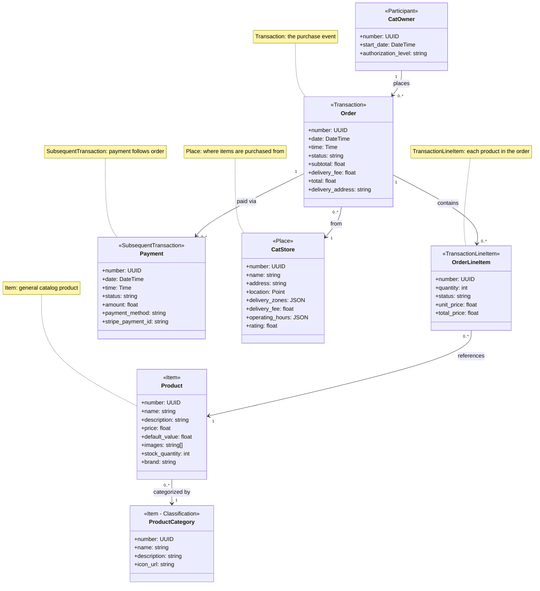

**Example mapping (per PDF)**: `CatOwner (Participant) → Order (Transaction) → OrderLineItem (TransactionLineItem) → Product (Item) → Payment (SubsequentTransaction) at CatStore (Place)`

---

## TS-5: Vet-User Chat / Direct Contact

**Transaction Set Type**: Simple Participant-Transaction (between two Participants)

> Two Participants (CatOwner and Vet) engage in a Transaction (ChatSession). Each Message is a TransactionLineItem within the session.

**Players**: Participant (x2), Transaction, TransactionLineItem

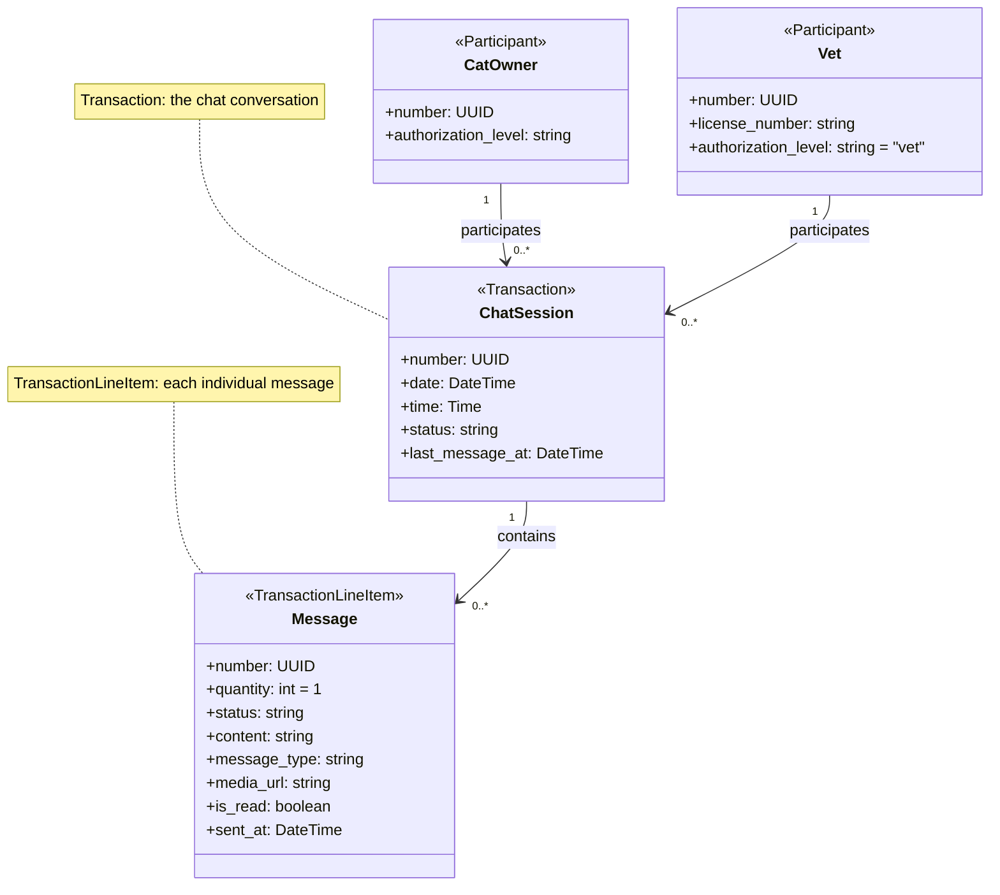

**Example mapping**: `CatOwner (Participant) + Vet (Participant) → ChatSession (Transaction) → Message (TransactionLineItem)`

---

## TS-6: Prescribe Medicine

**Transaction Set Type**: Transaction with LineItem and Subsequent Transaction (Appointment → Prescription)

> An Appointment (Transaction) is followed by a Prescription (SubsequentTransaction). The Prescription has PrescriptionLineItems referencing Medicines (Items). This maps to the PDF pattern: *"Transaction with line item and subsequent transaction without line item"* — but here the subsequent transaction (Prescription) also has line items when multiple medicines are prescribed.

**Players**: Participant (Vet), Transaction, SubsequentTransaction, SubsequentTransactionLineItem, Item, SpecificItem

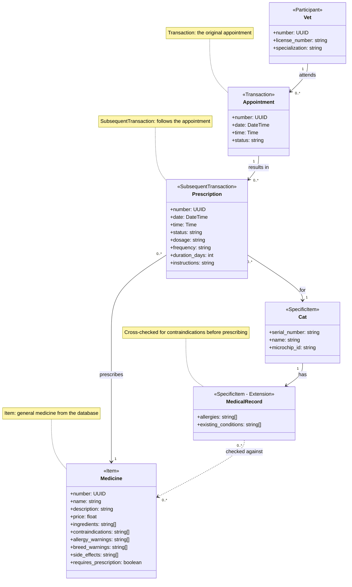

**Example mapping (per PDF)**: `Vet (Participant) → Appointment (Transaction) → Prescription (SubsequentTransaction) → Medicine (Item) for Cat (SpecificItem)`

---

## TS-7: AI Companion Consultation

**Transaction Set Type**: Participant-Transaction-Item

> A Participant (CatOwner) creates a Transaction (AIConsultation) about a SpecificItem (Cat). The system queries Items (IllnessRecords) via vector similarity.

**Players**: Participant, Transaction, SpecificItem, Item

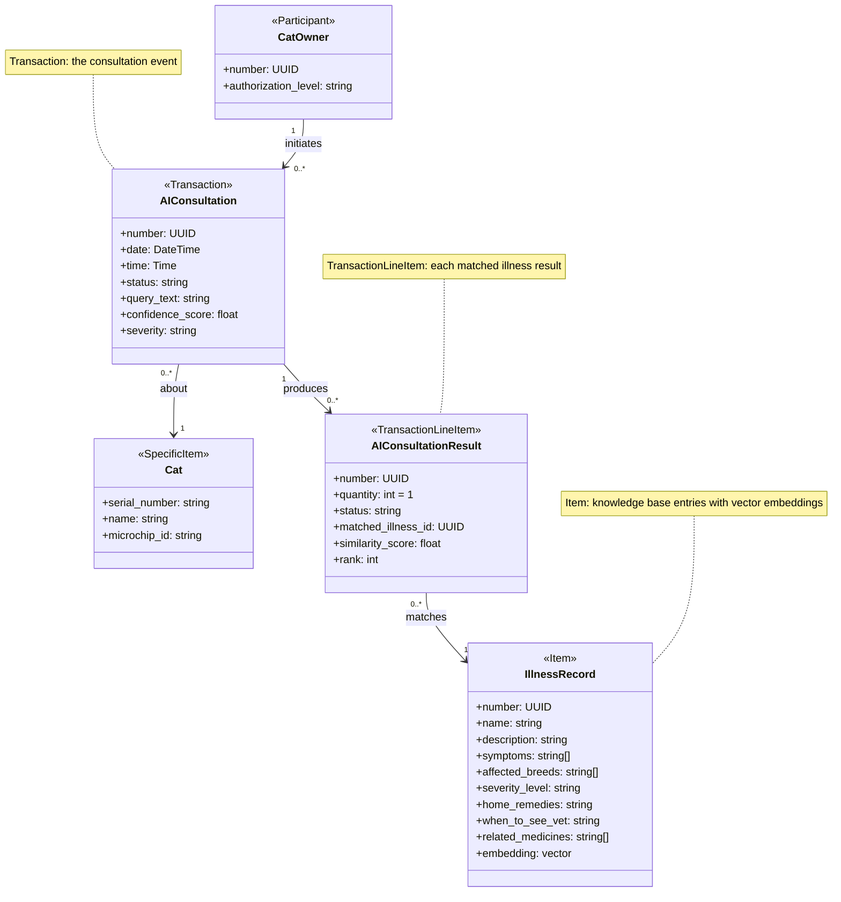

**Example mapping**: `CatOwner (Participant) → AIConsultation (Transaction) → AIConsultationResult (TransactionLineItem) → IllnessRecord (Item) about Cat (SpecificItem)`

---

## TS-8: Hospital/Store Dashboard Customization

**Transaction Set Type**: Simple Participant-Transaction-Place

> A Participant (HospitalAdmin/StoreOwner) performs a Transaction (PageUpdate) on a Place (Hospital/CatStore).

**Players**: Participant, Transaction, Place

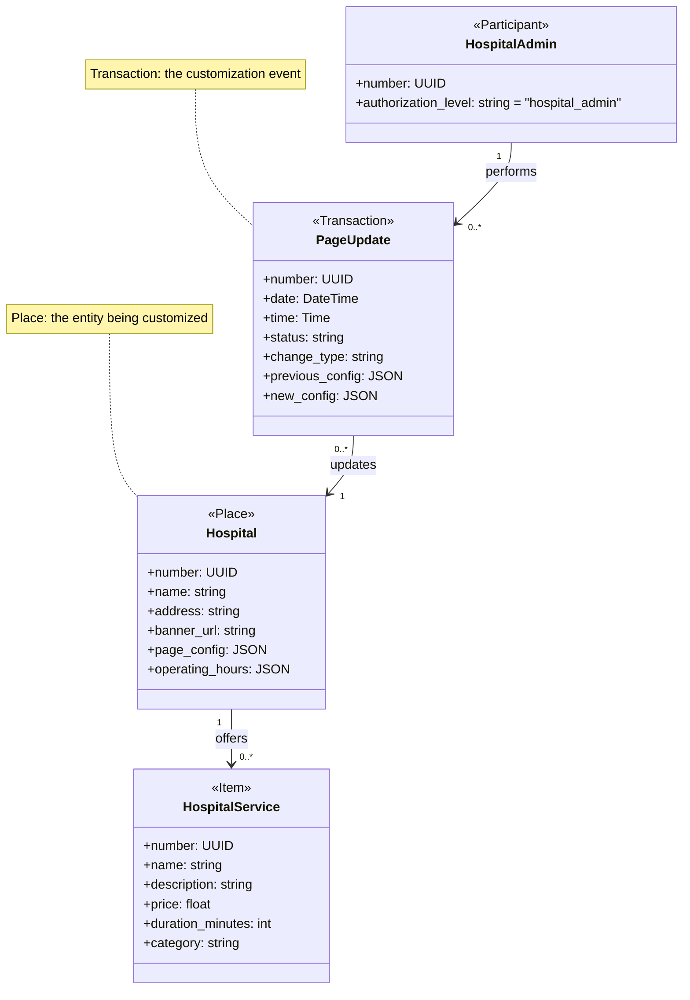

> The same pattern applies to **StoreOwner → StorePageUpdate → CatStore**

---

## TS-9: Review & Rating

**Transaction Set Type**: Participant-Transaction-Place (or Participant-Transaction-Participant)

> A Participant (CatOwner) creates a Transaction (Review) about a Place (Hospital/CatStore) or another Participant (Vet).

**Players**: Participant (reviewer), Transaction, Place/Participant (target)

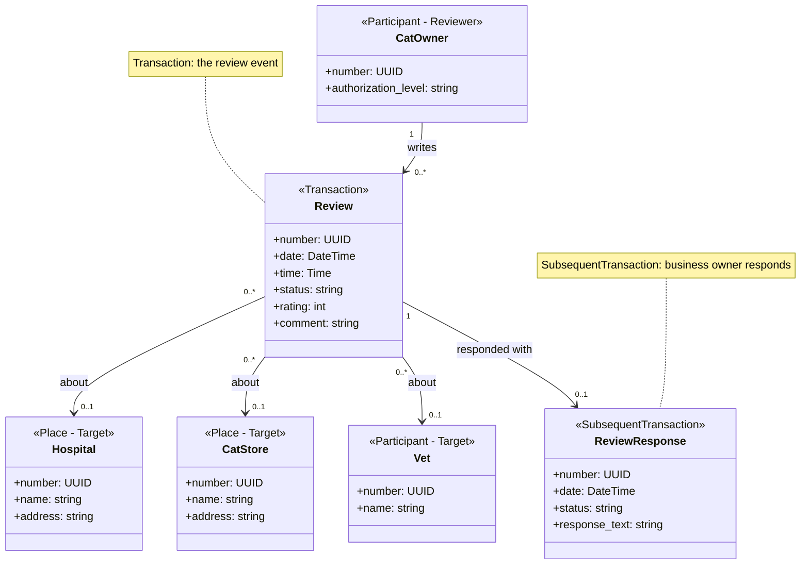

---

## TS-10: Offer/Promotion Management

**Transaction Set Type**: Participant-Transaction-Item-Place

> A Participant (HospitalAdmin/StoreOwner) creates a Transaction (Offer) applicable to Items (Services/Products) at a Place (Hospital/Store).

**Players**: Participant, Transaction, Item, Place

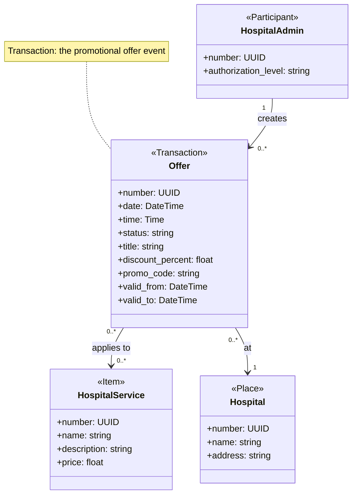

> Same pattern for **StoreOwner → Offer → Product → CatStore**

---

## TS-11: Order Fulfillment (Store Owner processing)

**Transaction Set Type**: Transaction and Subsequent Transaction (without LineItem)

> From the paper: The original Order (Transaction) is followed by OrderFulfillment (SubsequentTransaction) — status changes through preparing → ready → delivered.

**Players**: Participant, Transaction, SubsequentTransaction

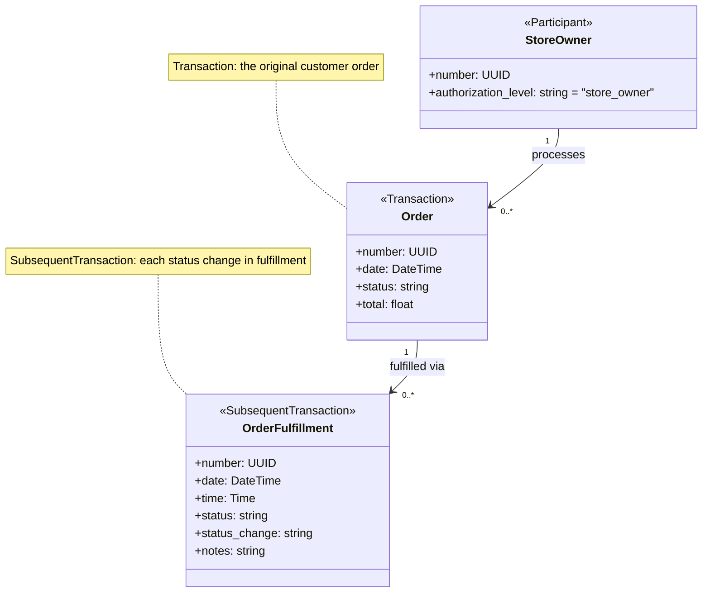

---

## TS-12: Admin Management Operations

**Transaction Set Type**: Participant-Transaction-SpecificItem/Item

> A Participant (SystemAdmin) performs management Transactions (Approval, Verification, Suspension) on SpecificItems (individual users/vets/hospitals) or Items (medicines, breeds).

**Players**: Participant, Transaction, SpecificItem/Item

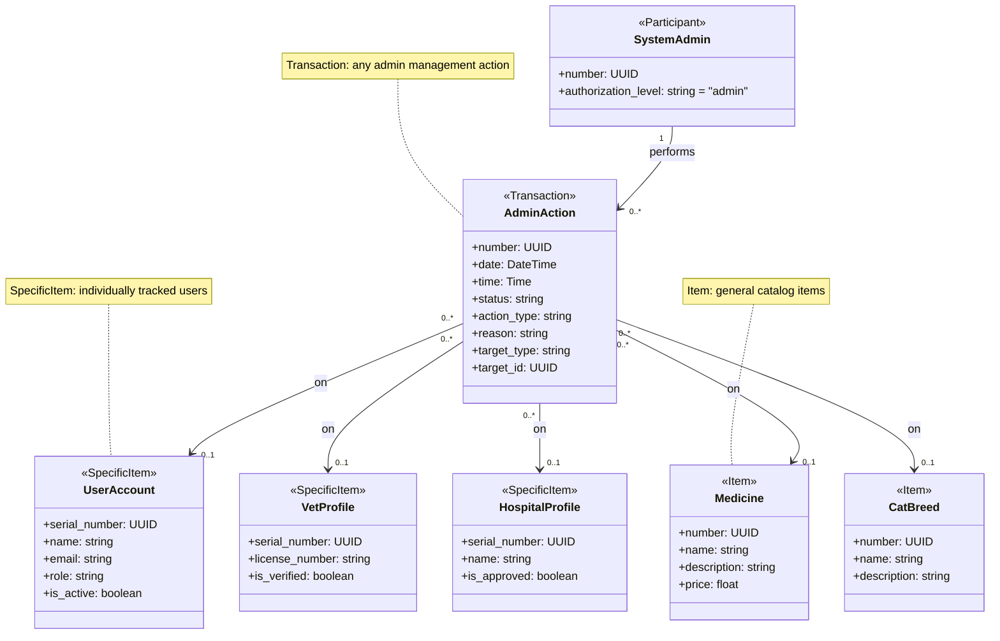

---

## Transaction Set Classification Summary

| TS # | Use Case | Transaction Set Type (per PDF) | Players Used |
|------|----------|-------------------------------|-------------|
| TS-1 | User Registration | Simple Participant-Transaction | Actor → Participant, Transaction |
| TS-2 | Cat Registration | Participant-Transaction-SpecificItem + Item | Participant, Transaction, SpecificItem (Cat), Item (Breed) |
| TS-3 | Book Appointment | Transaction & Subsequent Transaction + Place | Participant (×2), Transaction, SubsequentTransaction, SpecificItem, Place, Item |
| TS-4 | Purchase Products | Transaction with LineItem & Subsequent Transaction + Place | Participant, Transaction, TransactionLineItem, Item, SubsequentTransaction, Place |
| TS-5 | Vet-User Chat | Participant-Transaction with LineItem (two Participants) | Participant (×2), Transaction, TransactionLineItem |
| TS-6 | Prescribe Medicine | Transaction & Subsequent Transaction with LineItem | Participant, Transaction, SubsequentTransaction, Item, SpecificItem |
| TS-7 | AI Consultation | Participant-Transaction-SpecificItem with LineItem | Participant, Transaction, TransactionLineItem, SpecificItem, Item |
| TS-8 | Dashboard Customization | Participant-Transaction-Place | Participant, Transaction, Place |
| TS-9 | Review & Rating | Participant-Transaction + SubsequentTransaction | Participant, Transaction, SubsequentTransaction, Place |
| TS-10 | Offer Management | Participant-Transaction-Item-Place | Participant, Transaction, Item, Place |
| TS-11 | Order Fulfillment | Transaction & Subsequent Transaction | Participant, Transaction, SubsequentTransaction |
| TS-12 | Admin Operations | Participant-Transaction-SpecificItem/Item | Participant, Transaction, SpecificItem, Item |

---

## Behaviors (per PDF Section 4)

Each player in the Purrfect Care system includes these standard behaviors:

| Behavior Category | Behavior | Example in Purrfect Care |
|-------------------|----------|--------------------------|
| **Value Check** | `isActive()` | `Cat.isActive()`, `Hospital.isActive()` |
| | `isAuthorized()` | `Participant.isAuthorized(role)` — check access level |
| | `isStatusValue()` | `Appointment.isStatusValue("confirmed")` |
| | `checkStatus()` | `Order.checkStatus()` — verify current status |
| **Single Record** | `calcForMe()` | `OrderLineItem.calcForMe()` → unit_price × quantity |
| | `rateMe()` | `Hospital.rateMe()` — calculate average rating |
| **Collection** | `howMuch()` | `Order.howMuch()` → SUM of all line item totals |
| | `howMany()` | `CatOwner.howMany()` → COUNT of registered cats |
| | `rankAssociatedPlayer()` | `Hospital.rankAppointments()` — sort by date/status |
| | `calOverAssociatedPlayer()` | `Vet.calOverPrescriptions()` — aggregate stats |
