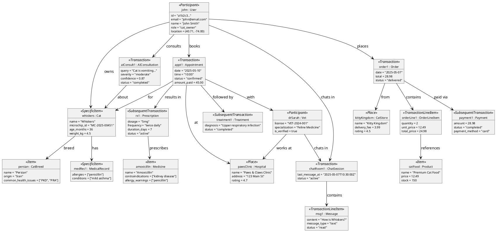

# 04 — Complete Object Diagram

> The object diagram combines all objects identified from the transactional diagrams (Document 03) using the **Transaction Pattern** player roles. Each object is tagged with its player role (Participant, Transaction, TransactionLineItem, Item, SpecificItem, Place, SubsequentTransaction).

---

## Player-Role Mapping for Purrfect Care

| Player Role | Objects |
|-------------|---------|
| **Actor** | Person (unregistered user) |
| **Participant** | CatOwner, Vet, HospitalAdmin, StoreOwner, SystemAdmin |
| **Transaction** | Registration, CatRegistration, Appointment, Order, ChatSession, AIConsultation, PageUpdate, Review, Offer, AdminAction |
| **TransactionLineItem** | OrderLineItem, Message, AIConsultationResult |
| **Item** | CatBreed, HospitalService, Product, ProductCategory, Medicine, IllnessRecord |
| **SpecificItem** | Cat, MedicalRecord, UserAccount, VetProfile, HospitalProfile |
| **Place** | Hospital, CatStore |
| **SubsequentTransaction** | Treatment, Prescription, Payment, OrderFulfillment, ReviewResponse |

---

## Complete Object Diagram (ER with Player Roles)

```mermaid
erDiagram
    %% ============ PARTICIPANTS ============
    User {
        uuid id PK "Participant"
        string email UK
        string password_hash
        string name
        string phone
        string role "authorization_level"
        string avatar_url
        point location
        string address
        string city
        boolean is_active
        timestamp start_date "created_at"
        timestamp end_date
    }

    Vet {
        uuid id PK "Participant"
        uuid user_id FK
        string license_number UK
        string specialization
        int experience_years
        text bio
        string qualifications "string[]"
        uuid hospital_id FK
        boolean is_verified
        float rating
        int total_reviews
    }

    %% ============ SPECIFIC ITEMS ============
    Cat {
        uuid id PK "SpecificItem"
        uuid owner_id FK
        string name
        uuid breed_id FK
        int age_months
        float weight_kg
        string color
        string gender
        string photo_url
        boolean is_neutered
        string microchip_id "serial_number"
        timestamp registered_at
    }

    MedicalRecord {
        uuid id PK "SpecificItem"
        uuid cat_id FK
        string allergies "string[]"
        string existing_conditions "string[]"
        jsonb vaccination_status
        string blood_type
        text notes
        timestamp last_updated
    }

    %% ============ ITEMS ============
    CatBreed {
        uuid id PK "Item"
        string name UK
        string origin_country
        string size_category
        string coat_type
        string temperament
        text description
        float avg_lifespan_years
        float avg_weight_kg
        string common_health_issues "string[]"
        string image_url
    }

    Medicine {
        uuid id PK "Item"
        string name
        string generic_name
        string manufacturer
        string ingredients "string[]"
        string dosage_form
        text description
        text usage_instructions
        string contraindications "string[]"
        string allergy_warnings "string[]"
        string breed_warnings "string[]"
        string side_effects "string[]"
        boolean requires_prescription
        boolean is_active
        vector embedding
    }

    HospitalService {
        uuid id PK "Item"
        uuid hospital_id FK
        string name
        text description
        string category
        float price
        int duration_minutes
        boolean is_active
    }

    Product {
        uuid id PK "Item"
        uuid store_id FK
        uuid category_id FK
        string name
        text description
        float price
        float discount_price
        string images "string[]"
        int stock_quantity
        string brand
        boolean is_active
        float rating
    }

    ProductCategory {
        uuid id PK "Item-Classification"
        string name UK
        string description
        string icon_url
        int sort_order
    }

    IllnessRecord {
        uuid id PK "Item"
        string illness_name
        text description
        string symptoms "string[]"
        string affected_breeds "string[]"
        string severity_level
        text home_remedies
        text when_to_see_vet
        string related_medicines "string[]"
        vector embedding
    }

    %% ============ PLACES ============
    Hospital {
        uuid id PK "Place"
        uuid admin_user_id FK
        string name
        text description
        string phone
        string email
        point location
        string address
        string city
        string banner_url
        jsonb operating_hours
        boolean is_active
        boolean is_approved
        float rating
        int total_reviews
        jsonb page_config
    }

    CatStore {
        uuid id PK "Place"
        uuid owner_user_id FK
        string name
        text description
        string phone
        string email
        point location
        string address
        string city
        string banner_url
        jsonb operating_hours
        jsonb delivery_zones
        float delivery_fee
        boolean is_active
        boolean is_approved
        float rating
        jsonb page_config
    }

    %% ============ TRANSACTIONS ============
    Appointment {
        uuid id PK "Transaction"
        uuid user_id FK
        uuid cat_id FK
        uuid vet_id FK
        uuid hospital_id FK
        uuid service_id FK
        uuid slot_id FK
        timestamp appointment_date "date + time"
        string status
        text notes
        float amount_paid
        string payment_id
        timestamp created_at
    }

    AppointmentSlot {
        uuid id PK "Transaction-Extension"
        uuid hospital_id FK
        uuid vet_id FK
        date slot_date
        time start_time
        time end_time
        boolean is_booked
    }

    Order {
        uuid id PK "Transaction"
        uuid user_id FK
        uuid store_id FK
        float subtotal
        float delivery_fee
        float total
        string status
        string payment_id
        string delivery_address
        point delivery_location
        text notes
        timestamp ordered_at
        timestamp delivered_at
    }

    ChatSession {
        uuid id PK "Transaction"
        uuid user_id FK
        uuid vet_id FK
        timestamp last_message_at "date + time"
        string status
        int unread_user
        int unread_vet
        timestamp created_at
    }

    AIConsultation {
        uuid id PK "Transaction"
        uuid user_id FK
        uuid cat_id FK
        text query_text
        jsonb results
        float confidence_score
        string severity
        string status
        timestamp created_at "date + time"
    }

    Review {
        uuid id PK "Transaction"
        uuid user_id FK
        uuid hospital_id FK
        uuid store_id FK
        uuid vet_id FK
        int rating
        text comment
        timestamp created_at "date + time"
        string status
    }

    Offer {
        uuid id PK "Transaction"
        uuid hospital_id FK
        uuid store_id FK
        string title
        text description
        float discount_percent
        string promo_code
        timestamp valid_from "date"
        timestamp valid_to
        boolean is_active
        string status
    }

    %% ============ TRANSACTION LINE ITEMS ============
    OrderLineItem {
        uuid id PK "TransactionLineItem"
        uuid order_id FK
        uuid product_id FK
        int quantity
        float unit_price
        float total_price
        string status
    }

    Message {
        uuid id PK "TransactionLineItem"
        uuid chat_room_id FK
        uuid sender_id FK
        text content
        string message_type
        string media_url
        boolean is_read
        string status
        timestamp sent_at
    }

    %% ============ SUBSEQUENT TRANSACTIONS ============
    Treatment {
        uuid id PK "SubsequentTransaction"
        uuid appointment_id FK
        uuid vet_id FK
        uuid cat_id FK
        string diagnosis
        text notes
        text follow_up_instructions
        string status
        timestamp created_at "date + time"
    }

    Prescription {
        uuid id PK "SubsequentTransaction"
        uuid appointment_id FK
        uuid cat_id FK
        uuid vet_id FK
        uuid medicine_id FK
        string dosage
        string frequency
        int duration_days
        text instructions
        string status
        timestamp prescribed_at "date + time"
    }

    Payment {
        uuid id PK "SubsequentTransaction"
        uuid order_id FK
        uuid appointment_id FK
        float amount
        string payment_method
        string stripe_payment_id
        string status
        timestamp created_at "date + time"
    }

    PatientHistory {
        uuid id PK "SubsequentTransaction-Log"
        uuid cat_id FK
        string entry_type
        text description
        uuid appointment_id FK
        uuid prescription_id FK
        uuid vet_id FK
        timestamp created_at
    }

    ReviewResponse {
        uuid id PK "SubsequentTransaction"
        uuid review_id FK
        uuid responder_id FK
        text response_text
        string status
        timestamp responded_at "date + time"
    }

    Notification {
        uuid id PK "System"
        uuid user_id FK
        string type
        string title
        text body
        string channel
        jsonb data
        boolean is_read
        timestamp created_at
    }

    %% ============ RELATIONSHIPS ============
    User ||--o{ Cat : "owns (Participant→SpecificItem)"
    User ||--o| Vet : "may be (Participant→Participant)"
    User ||--o| Hospital : "may admin (Participant→Place)"
    User ||--o| CatStore : "may own (Participant→Place)"
    User ||--o{ Appointment : "books (Participant→Transaction)"
    User ||--o{ Order : "places (Participant→Transaction)"
    User ||--o{ Review : "writes (Participant→Transaction)"
    User ||--o{ ChatSession : "participates (Participant→Transaction)"
    User ||--o{ AIConsultation : "initiates (Participant→Transaction)"
    User ||--o{ Notification : "receives"

    Cat ||--|| CatBreed : "is of (SpecificItem→Item)"
    Cat ||--|| MedicalRecord : "has (SpecificItem→SpecificItem)"
    Cat ||--o{ PatientHistory : "has (SpecificItem→SubsequentTransaction)"
    Cat ||--o{ Appointment : "subject of"
    Cat ||--o{ Prescription : "prescribed for"

    Vet ||--o| Hospital : "works at (Participant→Place)"
    Vet ||--o{ Appointment : "attends (Participant→Transaction)"
    Vet ||--o{ AppointmentSlot : "available at"
    Vet ||--o{ Prescription : "writes"
    Vet ||--o{ ChatSession : "participates"

    Hospital ||--o{ HospitalService : "offers (Place→Item)"
    Hospital ||--o{ AppointmentSlot : "schedules"
    Hospital ||--o{ Appointment : "hosts (Place→Transaction)"
    Hospital ||--o{ Offer : "promotes"
    Hospital ||--o{ Review : "receives"

    Appointment ||--o{ Treatment : "followed by (Transaction→SubsequentTransaction)"
    Appointment ||--o{ Prescription : "results in (Transaction→SubsequentTransaction)"
    Appointment ||--o| Payment : "paid via (Transaction→SubsequentTransaction)"
    Appointment ||--o| AppointmentSlot : "reserves"
    Appointment }o--|| HospitalService : "for (Transaction→Item)"

    CatStore ||--o{ Product : "sells (Place→Item)"
    CatStore ||--o{ Order : "receives (Place→Transaction)"
    CatStore ||--o{ Offer : "promotes"
    CatStore ||--o{ Review : "receives"

    Product }o--|| ProductCategory : "categorized (Item→Item)"
    Product ||--o{ OrderLineItem : "ordered as (Item→TransactionLineItem)"

    Order ||--o{ OrderLineItem : "contains (Transaction→TransactionLineItem)"
    Order ||--o| Payment : "paid via (Transaction→SubsequentTransaction)"

    ChatSession ||--o{ Message : "contains (Transaction→TransactionLineItem)"

    Prescription }o--|| Medicine : "of (SubsequentTransaction→Item)"

    Review ||--o| ReviewResponse : "responded (Transaction→SubsequentTransaction)"
```

---

## PlantUML Object Instance Diagram

---

## Object Count Summary by Player Role

| Player Role | Objects | Count |
|-------------|---------|-------|
| **Participant** | User, Vet | 2 |
| **SpecificItem** | Cat, MedicalRecord | 2 |
| **Item** | CatBreed, Medicine, HospitalService, Product, ProductCategory, IllnessRecord | 6 |
| **Place** | Hospital, CatStore | 2 |
| **Transaction** | Appointment, AppointmentSlot, Order, ChatSession, AIConsultation, Review, Offer | 7 |
| **TransactionLineItem** | OrderLineItem, Message | 2 |
| **SubsequentTransaction** | Treatment, Prescription, Payment, PatientHistory, ReviewResponse | 5 |
| **System** | Notification | 1 |
| **Total** | | **27 objects** |
