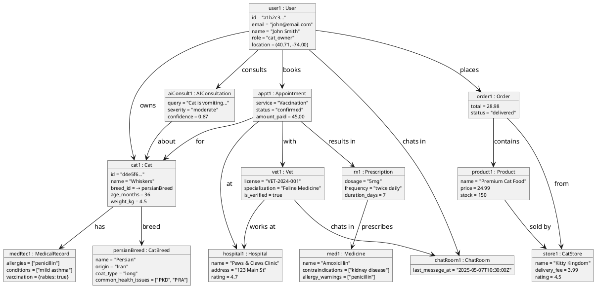

# 04 — Complete Object Diagram

> The object diagram combines all objects identified in the transactional diagrams (Document 03) into a single unified model showing relationships between all data objects in the system.

---

## Complete Object Diagram

### Mermaid Entity-Relationship Diagram

```mermaid
erDiagram
    %% ========== USER MANAGEMENT ==========
    User {
        uuid id PK
        string email UK
        string password_hash
        string name
        string phone
        string role
        string avatar_url
        point location
        string address
        string city
        string country
        boolean is_active
        timestamp created_at
        timestamp updated_at
    }

    UserProfile {
        uuid id PK
        uuid user_id FK
        jsonb preferences
        string notification_settings
        string payment_customer_id
        timestamp last_login
    }

    %% ========== CAT / PET MANAGEMENT ==========
    Cat {
        uuid id PK
        uuid owner_id FK
        string name
        uuid breed_id FK
        integer age_months
        float weight_kg
        string color
        string gender
        string photo_url
        boolean is_neutered
        string microchip_id
        timestamp registered_at
    }

    CatBreed {
        uuid id PK
        string name UK
        string origin_country
        string size_category
        string coat_type
        string temperament
        text description
        float avg_lifespan_years
        float avg_weight_kg
        string[] common_health_issues
        string[] grooming_needs
        string image_url
    }

    MedicalRecord {
        uuid id PK
        uuid cat_id FK
        string[] allergies
        string[] existing_conditions
        jsonb vaccination_status
        string blood_type
        text notes
        timestamp last_updated
    }

    PatientHistory {
        uuid id PK
        uuid cat_id FK
        uuid entry_type
        text description
        uuid appointment_id FK
        uuid prescription_id FK
        uuid vet_id FK
        timestamp created_at
    }

    %% ========== VET & HOSPITAL ==========
    Vet {
        uuid id PK
        uuid user_id FK
        string license_number UK
        string specialization
        integer experience_years
        text bio
        string[] qualifications
        uuid hospital_id FK
        boolean is_verified
        float rating
        integer total_reviews
        timestamp verified_at
    }

    Hospital {
        uuid id PK
        uuid admin_user_id FK
        string name
        text description
        string phone
        string email
        point location
        string address
        string city
        string banner_url
        jsonb operating_hours
        boolean is_active
        boolean is_approved
        float rating
        integer total_reviews
        jsonb page_config
        timestamp created_at
    }

    HospitalService {
        uuid id PK
        uuid hospital_id FK
        string name
        text description
        string category
        float price
        integer duration_minutes
        boolean is_active
    }

    AppointmentSlot {
        uuid id PK
        uuid hospital_id FK
        uuid vet_id FK
        date slot_date
        time start_time
        time end_time
        boolean is_booked
        boolean is_recurring
    }

    Appointment {
        uuid id PK
        uuid user_id FK
        uuid cat_id FK
        uuid vet_id FK
        uuid hospital_id FK
        uuid service_id FK
        uuid slot_id FK
        timestamp appointment_date
        string status
        text notes
        float amount_paid
        string payment_id
        timestamp created_at
        timestamp updated_at
    }

    %% ========== MEDICINE ==========
    Medicine {
        uuid id PK
        string name
        string generic_name
        string manufacturer
        string[] ingredients
        string dosage_form
        text description
        text usage_instructions
        string[] contraindications
        string[] allergy_warnings
        string[] breed_warnings
        string[] side_effects
        boolean requires_prescription
        boolean is_active
        vector embedding
    }

    Prescription {
        uuid id PK
        uuid appointment_id FK
        uuid cat_id FK
        uuid vet_id FK
        uuid medicine_id FK
        string dosage
        string frequency
        integer duration_days
        text instructions
        string status
        timestamp prescribed_at
    }

    %% ========== CHAT ==========
    ChatRoom {
        uuid id PK
        uuid user_id FK
        uuid vet_id FK
        timestamp last_message_at
        integer unread_user
        integer unread_vet
        boolean is_active
        timestamp created_at
    }

    Message {
        uuid id PK
        uuid chat_room_id FK
        uuid sender_id FK
        string content
        string message_type
        string media_url
        boolean is_read
        timestamp sent_at
    }

    %% ========== CAT STORE ==========
    CatStore {
        uuid id PK
        uuid owner_user_id FK
        string name
        text description
        string phone
        string email
        point location
        string address
        string city
        string banner_url
        jsonb operating_hours
        jsonb delivery_zones
        float delivery_fee
        boolean is_active
        boolean is_approved
        float rating
        integer total_reviews
        jsonb page_config
        timestamp created_at
    }

    ProductCategory {
        uuid id PK
        string name
        string description
        string icon_url
        integer sort_order
    }

    Product {
        uuid id PK
        uuid store_id FK
        uuid category_id FK
        string name
        text description
        float price
        float discount_price
        string[] images
        integer stock_quantity
        string brand
        float weight
        string unit
        boolean is_active
        float rating
        integer total_reviews
        timestamp created_at
    }

    Order {
        uuid id PK
        uuid user_id FK
        uuid store_id FK
        float subtotal
        float delivery_fee
        float total
        string status
        string payment_id
        string delivery_address
        point delivery_location
        text notes
        timestamp ordered_at
        timestamp delivered_at
    }

    OrderItem {
        uuid id PK
        uuid order_id FK
        uuid product_id FK
        integer quantity
        float unit_price
        float total_price
    }

    %% ========== OFFERS ==========
    Offer {
        uuid id PK
        uuid hospital_id FK
        uuid store_id FK
        string title
        text description
        float discount_percent
        string promo_code
        timestamp valid_from
        timestamp valid_to
        boolean is_active
        string[] applicable_items
    }

    %% ========== REVIEWS ==========
    Review {
        uuid id PK
        uuid user_id FK
        uuid hospital_id FK
        uuid store_id FK
        uuid vet_id FK
        integer rating
        text comment
        text response
        uuid response_by FK
        timestamp created_at
        timestamp responded_at
    }

    %% ========== AI ==========
    IllnessRecord {
        uuid id PK
        string illness_name
        text description
        string[] symptoms
        string[] affected_breeds
        string severity_level
        text home_remedies
        text when_to_see_vet
        string[] related_medicines
        vector embedding
    }

    AIConsultation {
        uuid id PK
        uuid user_id FK
        uuid cat_id FK
        text query_text
        jsonb results
        float confidence_score
        string severity
        timestamp created_at
    }

    %% ========== NOTIFICATIONS ==========
    Notification {
        uuid id PK
        uuid user_id FK
        string type
        string title
        text body
        string channel
        jsonb data
        boolean is_read
        timestamp created_at
    }

    %% ========== RELATIONSHIPS ==========
    User ||--o| UserProfile : "has"
    User ||--o{ Cat : "owns"
    User ||--o{ Appointment : "books"
    User ||--o{ Order : "places"
    User ||--o{ Review : "writes"
    User ||--o{ Notification : "receives"
    User ||--o{ AIConsultation : "initiates"
    User ||--o| Vet : "may be"
    User ||--o| Hospital : "may admin"
    User ||--o| CatStore : "may own"

    Cat ||--|| CatBreed : "is of"
    Cat ||--|| MedicalRecord : "has"
    Cat ||--o{ PatientHistory : "has"
    Cat ||--o{ Appointment : "subject of"
    Cat ||--o{ Prescription : "prescribed"
    Cat ||--o{ AIConsultation : "about"

    Vet ||--o| Hospital : "works at"
    Vet ||--o{ Appointment : "attends"
    Vet ||--o{ AppointmentSlot : "has"
    Vet ||--o{ Prescription : "writes"
    Vet ||--o{ ChatRoom : "participates"
    Vet ||--o{ Review : "receives"

    Hospital ||--o{ HospitalService : "offers"
    Hospital ||--o{ AppointmentSlot : "has"
    Hospital ||--o{ Appointment : "hosts"
    Hospital ||--o{ Vet : "employs"
    Hospital ||--o{ Offer : "has"
    Hospital ||--o{ Review : "receives"

    CatStore ||--o{ Product : "sells"
    CatStore ||--o{ Order : "receives"
    CatStore ||--o{ Offer : "has"
    CatStore ||--o{ Review : "receives"

    Product ||--|| ProductCategory : "belongs to"
    Product ||--o{ OrderItem : "included in"

    Order ||--o{ OrderItem : "contains"

    ChatRoom ||--o{ Message : "contains"
    ChatRoom }o--|| User : "involves"

    Appointment ||--o{ Prescription : "results in"
    Appointment ||--o{ PatientHistory : "logged in"
```

---

## PlantUML Object Diagram (Instance-Level)

---

## Object Summary Table

| Category | Objects | Count |
|----------|---------|-------|
| **User Management** | User, UserProfile | 2 |
| **Cat/Pet** | Cat, CatBreed, MedicalRecord, PatientHistory | 4 |
| **Veterinary** | Vet, Hospital, HospitalService, AppointmentSlot, Appointment | 5 |
| **Medicine** | Medicine, Prescription | 2 |
| **Communication** | ChatRoom, Message | 2 |
| **Cat Store** | CatStore, ProductCategory, Product, Order, OrderItem | 5 |
| **Engagement** | Offer, Review | 2 |
| **AI** | IllnessRecord, AIConsultation | 2 |
| **System** | Notification | 1 |
| **Total** | | **25 objects** |
