# 05 — Sequence Diagrams

> Sequence diagrams show the interactions between objects/interfaces over time for each use case. 
> Each diagram identifies the interfaces (UI, Controller, Service, Repository) involved.

---

## Interface Layers (MVC + Middleware)

| Layer | Type | Naming Convention | Example |
|-------|------|-------------------|---------|
| **Boundary (UI)** | React Component | `XxxView` / `XxxPage` | `HospitalListView` |
| **Controller** | Python REST Controller | `XxxController` | `AppointmentController` |
| **Service (Middleware)** | Business Logic | `XxxService` | `AppointmentService` |
| **Repository** | Data Access | `XxxRepository` | `AppointmentRepo` |
| **External** | 3rd Party | `XxxGateway` / `XxxClient` | `StripeGateway` |

---

## SD-1: User Registration

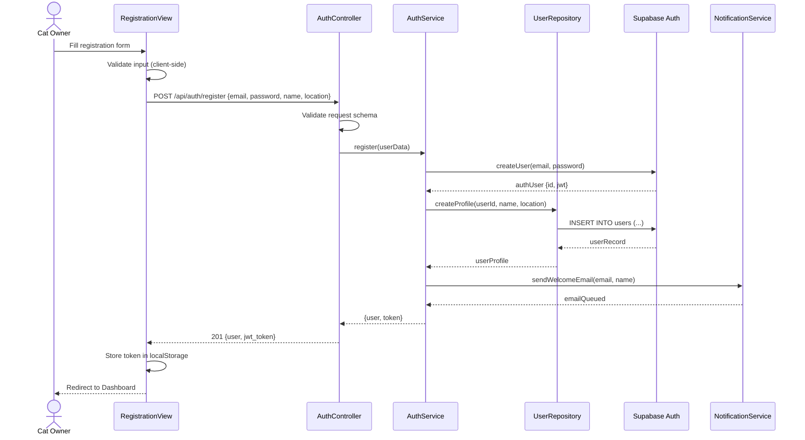

---

## SD-2: Cat Registration

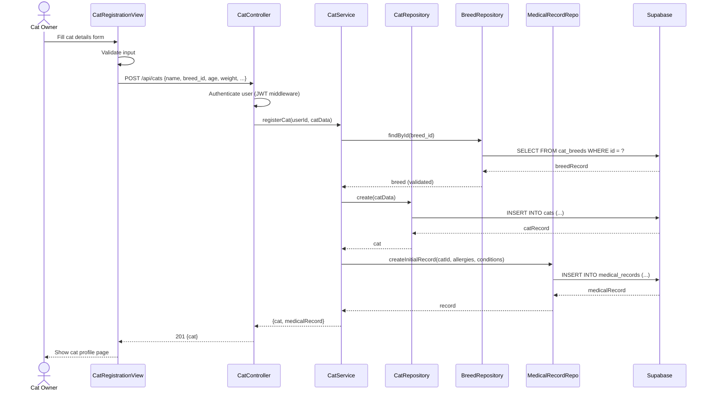

---

## SD-3: Browse Nearby Hospitals (DoorDash-style)

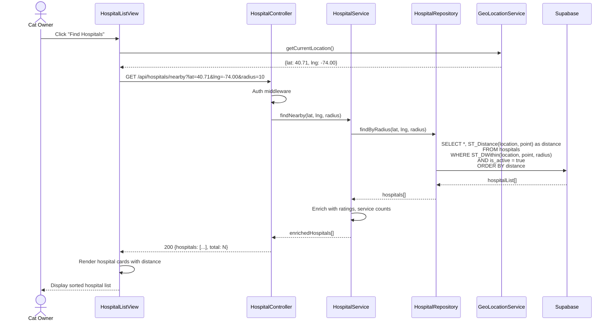

---

## SD-4: Book Appointment

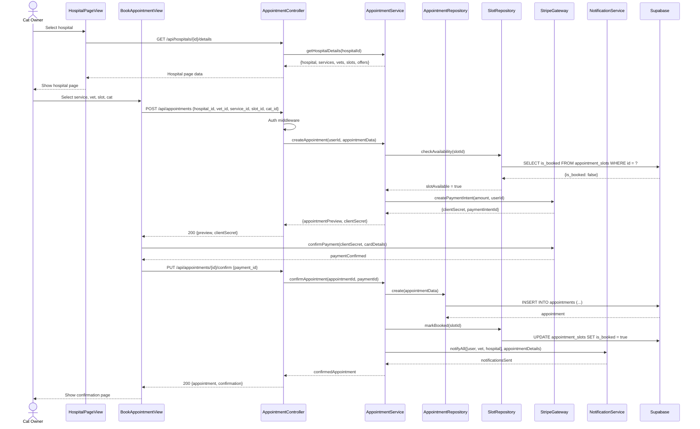

---

## SD-5: Vet-User Chat

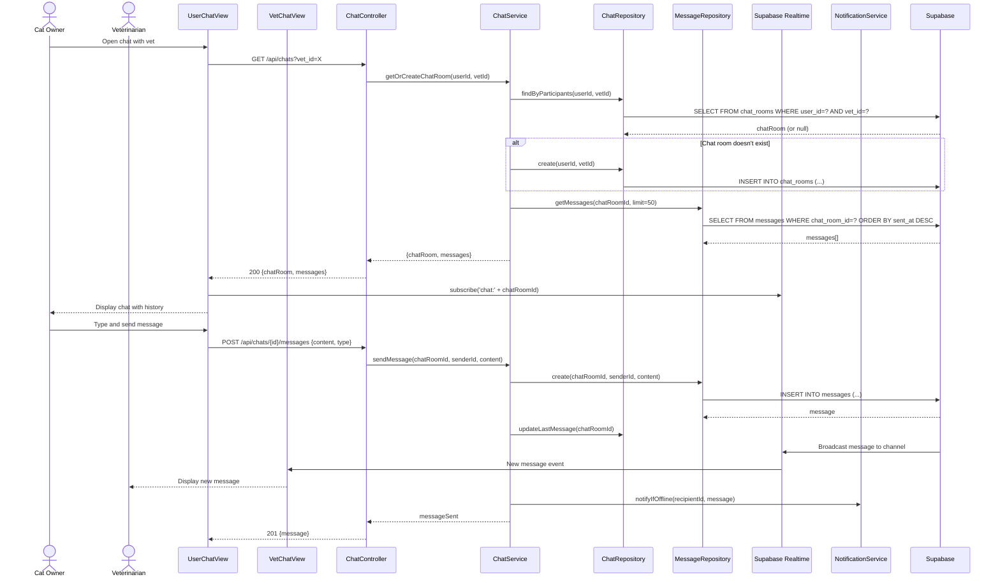

---

## SD-6: AI Companion Consultation

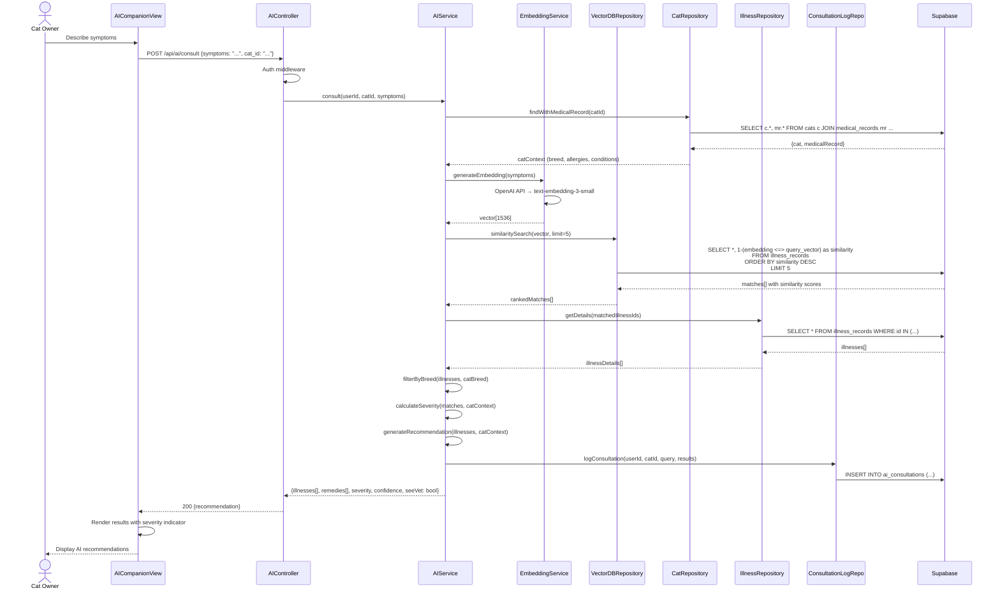

---

## SD-7: Prescribe Medicine

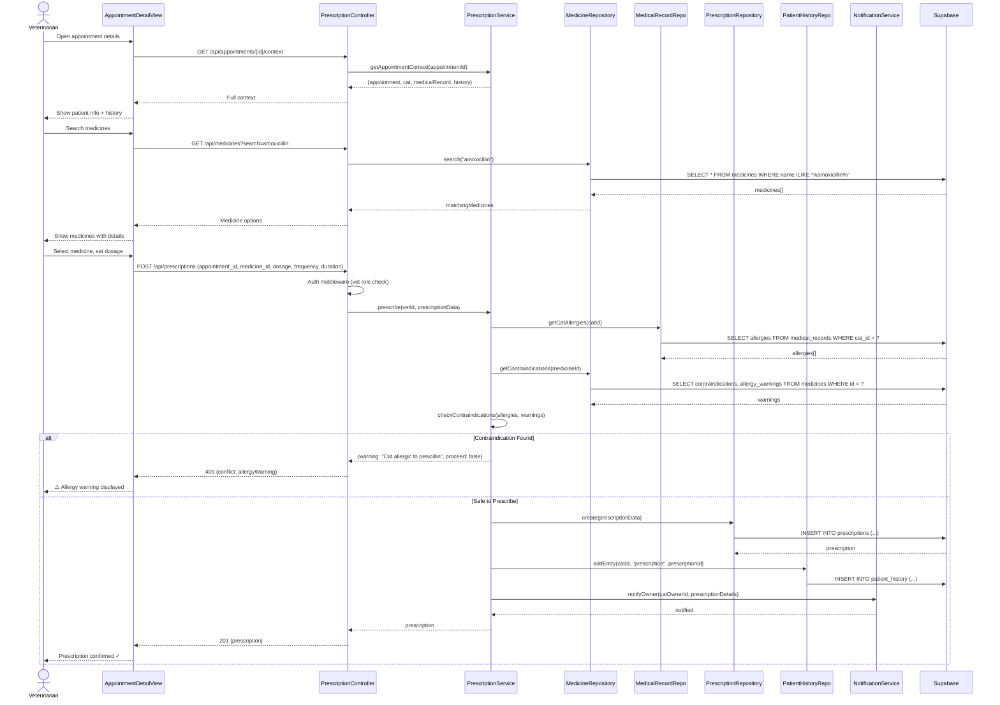

---

## SD-8: Purchase Products (Cat Store)

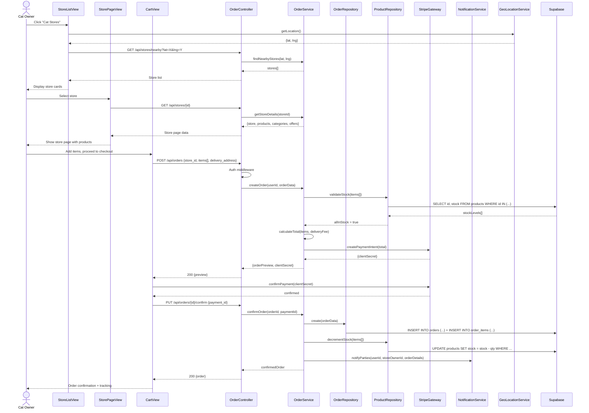

---

## SD-9: Hospital Dashboard Customization

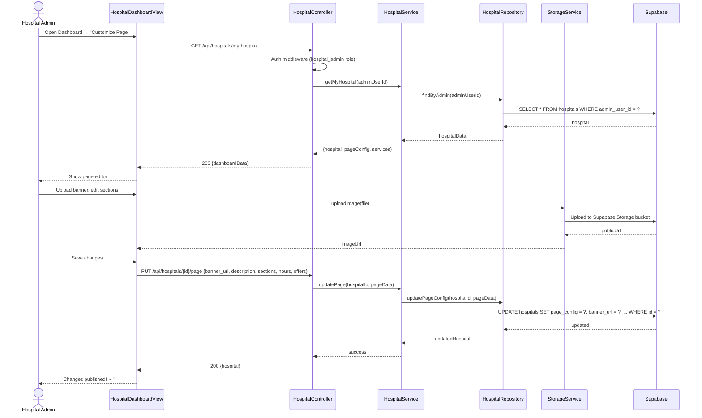

---

## SD-10: Admin — Manage Medicine Database

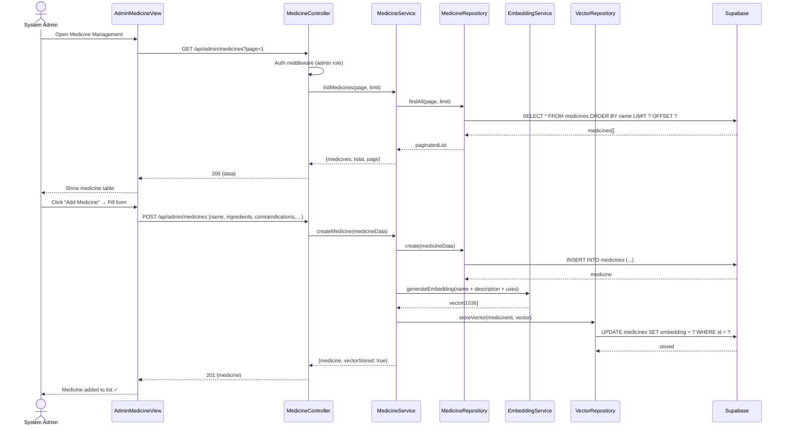

---

## SD-11: Store Dashboard Customization

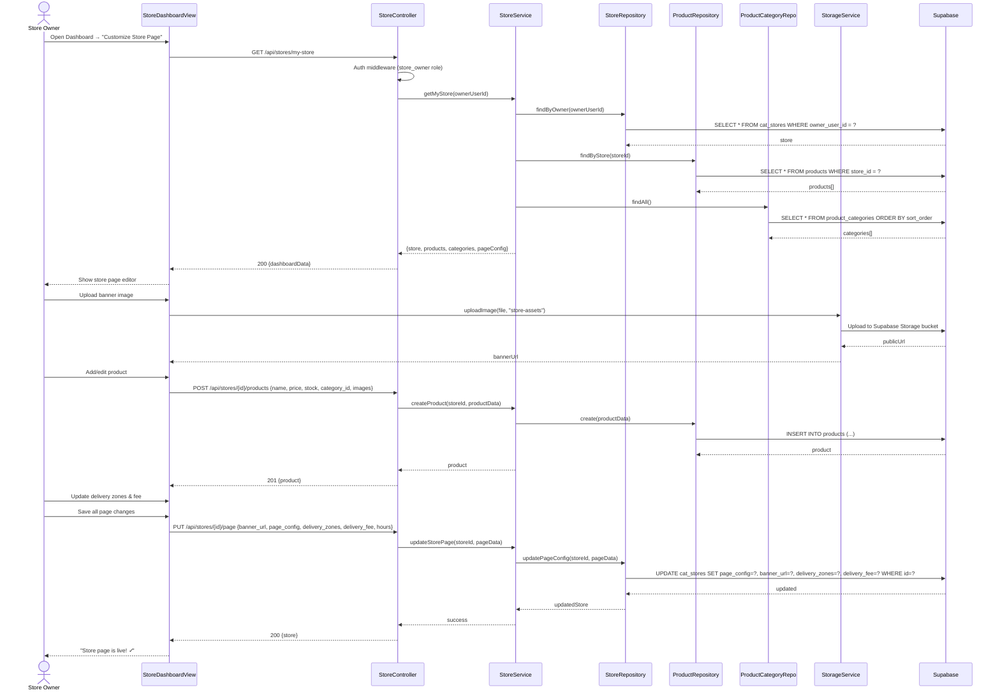

---

## SD-12: Review & Rating

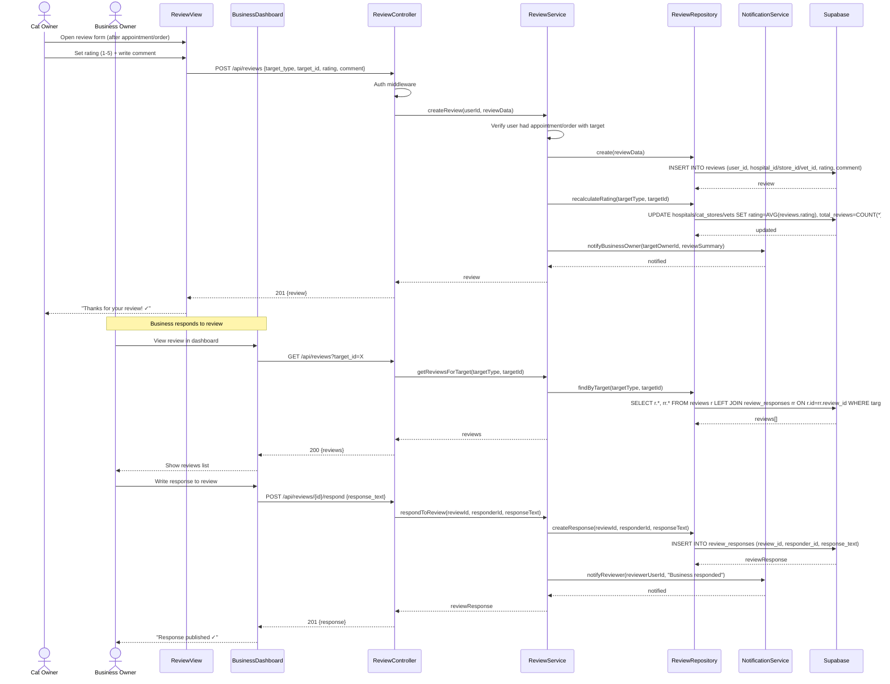

---

## SD-13: Offer/Promotion Management

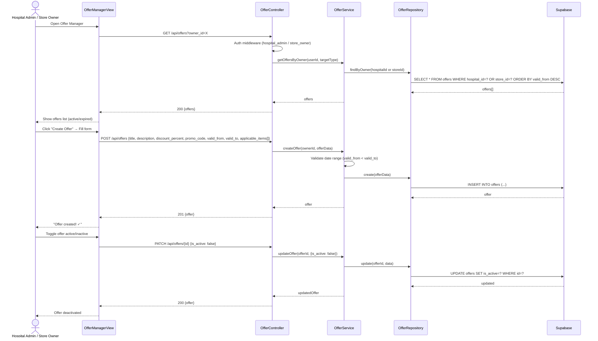

---

## SD-14: Order Fulfillment (Store Owner)

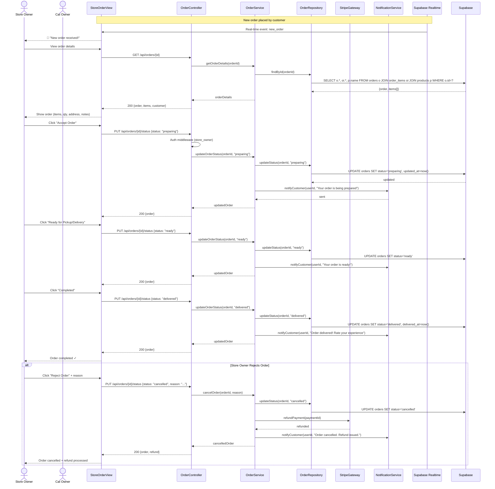

---

## SD-15: Admin Management Operations

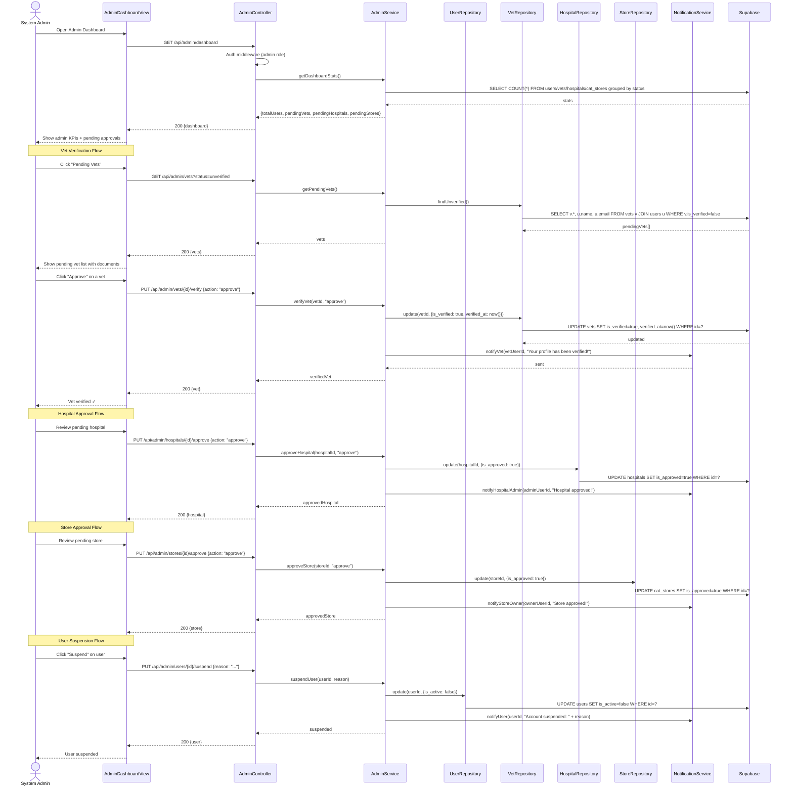

---

## Interfaces Identified (Summary)

### Boundary Interfaces (React Views)
| Interface | Used In |
|-----------|---------|
| `RegistrationView` | SD-1 |
| `CatRegistrationView` | SD-2 |
| `HospitalListView` | SD-3 |
| `HospitalPageView` | SD-4 |
| `BookAppointmentView` | SD-4 |
| `UserChatView` | SD-5 |
| `VetChatView` | SD-5 |
| `AICompanionView` | SD-6 |
| `AppointmentDetailView` | SD-7 |
| `StoreListView` | SD-8 |
| `StorePageView` | SD-8 |
| `CartView` | SD-8 |
| `HospitalDashboardView` | SD-9 |
| `AdminMedicineView` | SD-10 |
| `StoreDashboardView` | SD-11 |
| `ReviewView` | SD-12 |
| `BusinessDashboard` | SD-12 |
| `OfferManagerView` | SD-13 |
| `StoreOrderView` | SD-14 |
| `AdminDashboardView` | SD-15 |

### Controller Interfaces (Python REST)
| Interface | Used In |
|-----------|---------|
| `AuthController` | SD-1 |
| `CatController` | SD-2 |
| `HospitalController` | SD-3, SD-9 |
| `AppointmentController` | SD-4 |
| `ChatController` | SD-5 |
| `AIController` | SD-6 |
| `PrescriptionController` | SD-7 |
| `OrderController` | SD-8, SD-14 |
| `MedicineController` | SD-10 |
| `StoreController` | SD-11 |
| `ReviewController` | SD-12 |
| `OfferController` | SD-13 |
| `AdminController` | SD-15 |

### Service Interfaces (Business Logic / Middleware)
| Interface | Used In |
|-----------|---------|
| `AuthService` | SD-1 |
| `CatService` | SD-2 |
| `HospitalService` | SD-3, SD-9 |
| `AppointmentService` | SD-4 |
| `ChatService` | SD-5 |
| `AIService` | SD-6 |
| `EmbeddingService` | SD-6, SD-10 |
| `PrescriptionService` | SD-7 |
| `OrderService` | SD-8, SD-14 |
| `MedicineService` | SD-10 |
| `StoreService` | SD-11 |
| `ReviewService` | SD-12 |
| `OfferService` | SD-13 |
| `AdminService` | SD-15 |
| `NotificationService` | SD-1, SD-4, SD-5, SD-7, SD-8, SD-12, SD-14, SD-15 |
| `GeoLocationService` | SD-3, SD-8 |
| `StorageService` | SD-9, SD-11 |

### Repository Interfaces (Data Access)
| Interface | Used In |
|-----------|---------|
| `UserRepository` | SD-1, SD-15 |
| `CatRepository` | SD-2, SD-6 |
| `BreedRepository` | SD-2 |
| `MedicalRecordRepo` | SD-2, SD-7 |
| `HospitalRepository` | SD-3, SD-9, SD-15 |
| `AppointmentRepository` | SD-4 |
| `SlotRepository` | SD-4 |
| `ChatRepository` | SD-5 |
| `MessageRepository` | SD-5 |
| `IllnessRepository` | SD-6 |
| `VectorDBRepository` | SD-6 |
| `ConsultationLogRepo` | SD-6 |
| `PrescriptionRepository` | SD-7 |
| `PatientHistoryRepo` | SD-7 |
| `OrderRepository` | SD-8, SD-14 |
| `ProductRepository` | SD-8, SD-11 |
| `MedicineRepository` | SD-10 |
| `VectorRepository` | SD-10 |
| `StoreRepository` | SD-11, SD-15 |
| `ProductCategoryRepo` | SD-11 |
| `ReviewRepository` | SD-12 |
| `OfferRepository` | SD-13 |
| `VetRepository` | SD-15 |

### External Gateway Interfaces
| Interface | Used In |
|-----------|---------|
| `StripeGateway` | SD-4, SD-8, SD-14 |
| `Supabase Auth` | SD-1 |
| `Supabase Realtime` | SD-5, SD-14 |
| `Supabase Storage` | SD-9, SD-11 |

---

## SD ↔ TS Cross-Reference

| SD # | Sequence Diagram | Transaction Set |
|------|-----------------|----------------|
| SD-1 | User Registration | TS-1 |
| SD-2 | Cat Registration | TS-2 |
| SD-3 | Browse Nearby Hospitals | TS-3 (part 1) |
| SD-4 | Book Appointment | TS-3 (part 2) |
| SD-5 | Vet-User Chat | TS-5 |
| SD-6 | AI Consultation | TS-7 |
| SD-7 | Prescribe Medicine | TS-6 |
| SD-8 | Purchase Products | TS-4 |
| SD-9 | Hospital Dashboard | TS-8 |
| SD-10 | Manage Medicine DB | TS-13 (medicines) |
| SD-11 | Store Dashboard | TS-9 |
| SD-12 | Review & Rating | TS-10 |
| SD-13 | Offer Management | TS-11 |
| SD-14 | Order Fulfillment | TS-12 |
| SD-15 | Admin Operations | TS-13 (users/vets/hospitals/stores) |
