# 06 — Partial Class Diagrams

> Partial class diagrams are derived from each sequence diagram's transaction sets + interfaces.
> Each partial diagram shows only the classes and relationships relevant to one use case.

---

## Partial Class Diagram 1: User Registration (from SD-1, TS-1)

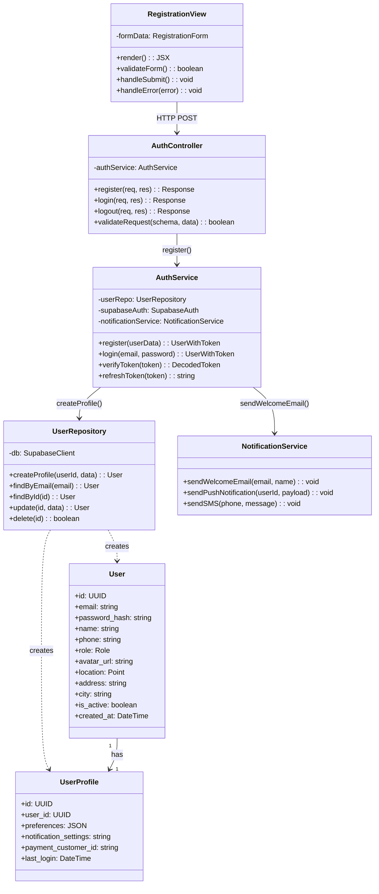

---

## Partial Class Diagram 2: Cat Registration (from SD-2, TS-2)

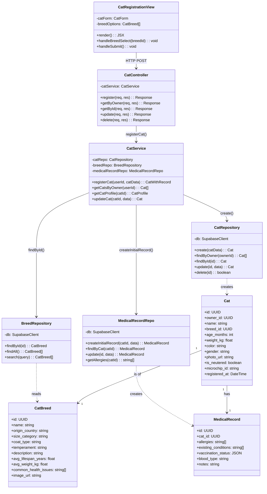

---

## Partial Class Diagram 3: Appointment Booking (from SD-3, SD-4, TS-3)

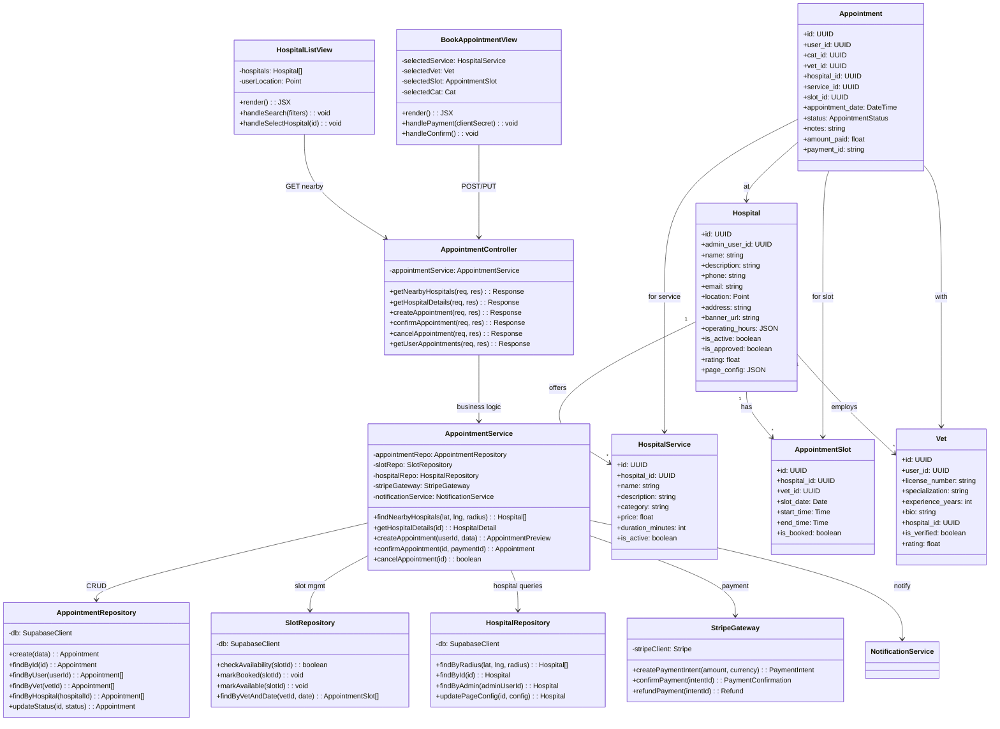

---

## Partial Class Diagram 4: Vet-User Chat (from SD-5, TS-5)

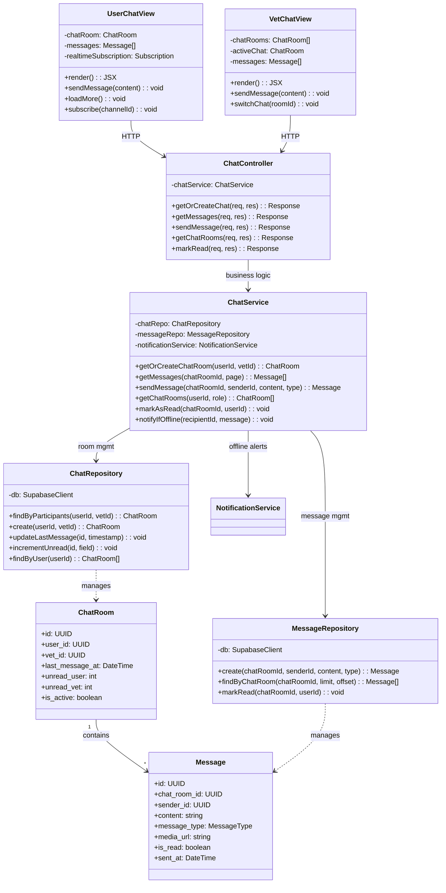

---

## Partial Class Diagram 5: AI Companion (from SD-6, TS-7)

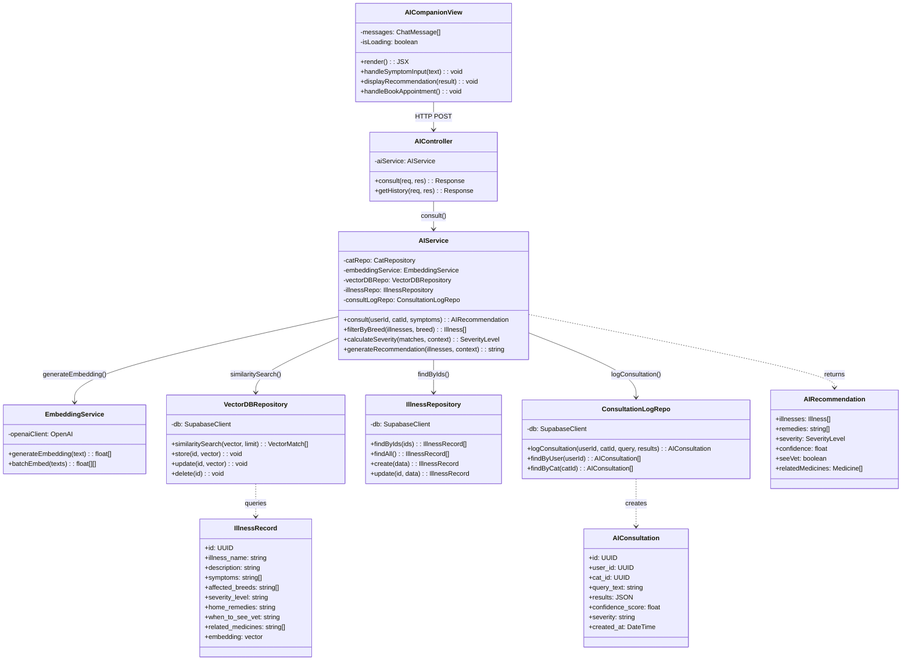

---

## Partial Class Diagram 6: Prescription (from SD-7, TS-6)

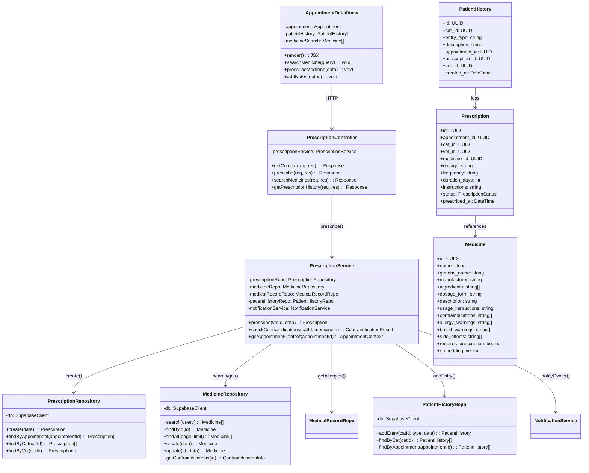

---

## Partial Class Diagram 7: Cat Store & Orders (from SD-8, TS-4, TS-9, TS-12)

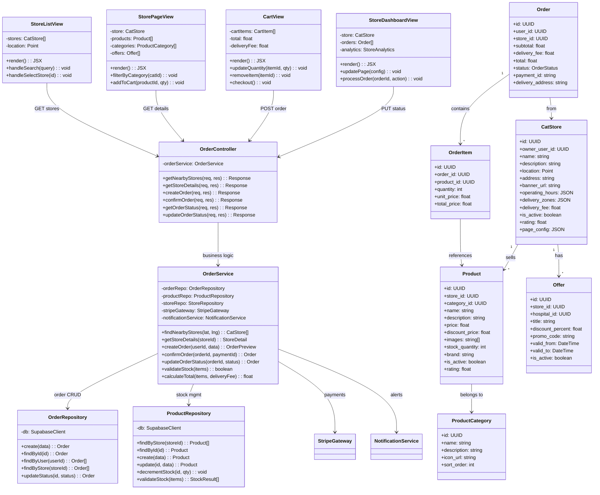

---

## Partial Class Diagram 8: Review System (from TS-10, cross-cutting)

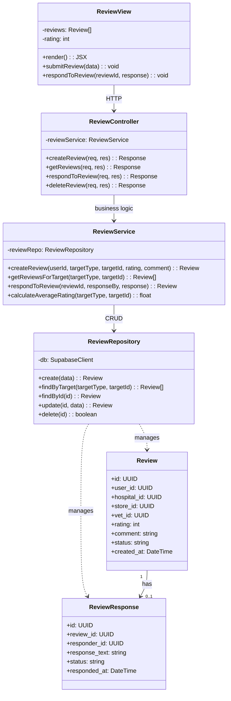

---

## Partial Class Diagram 9: Hospital Dashboard Customization (from SD-9, TS-8)

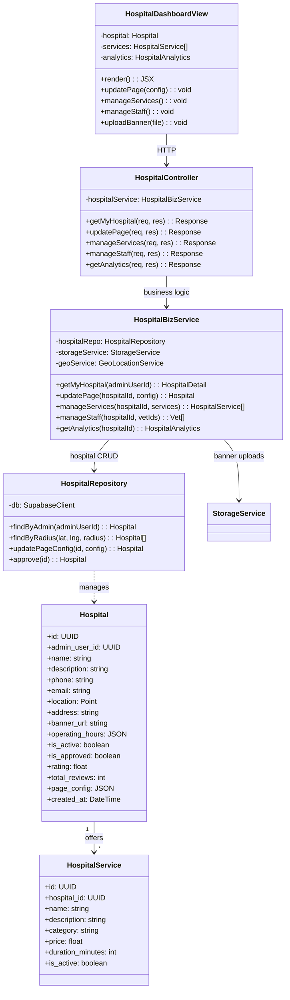

---

## Partial Class Diagram 10: Store Dashboard Customization (from SD-11, TS-9)

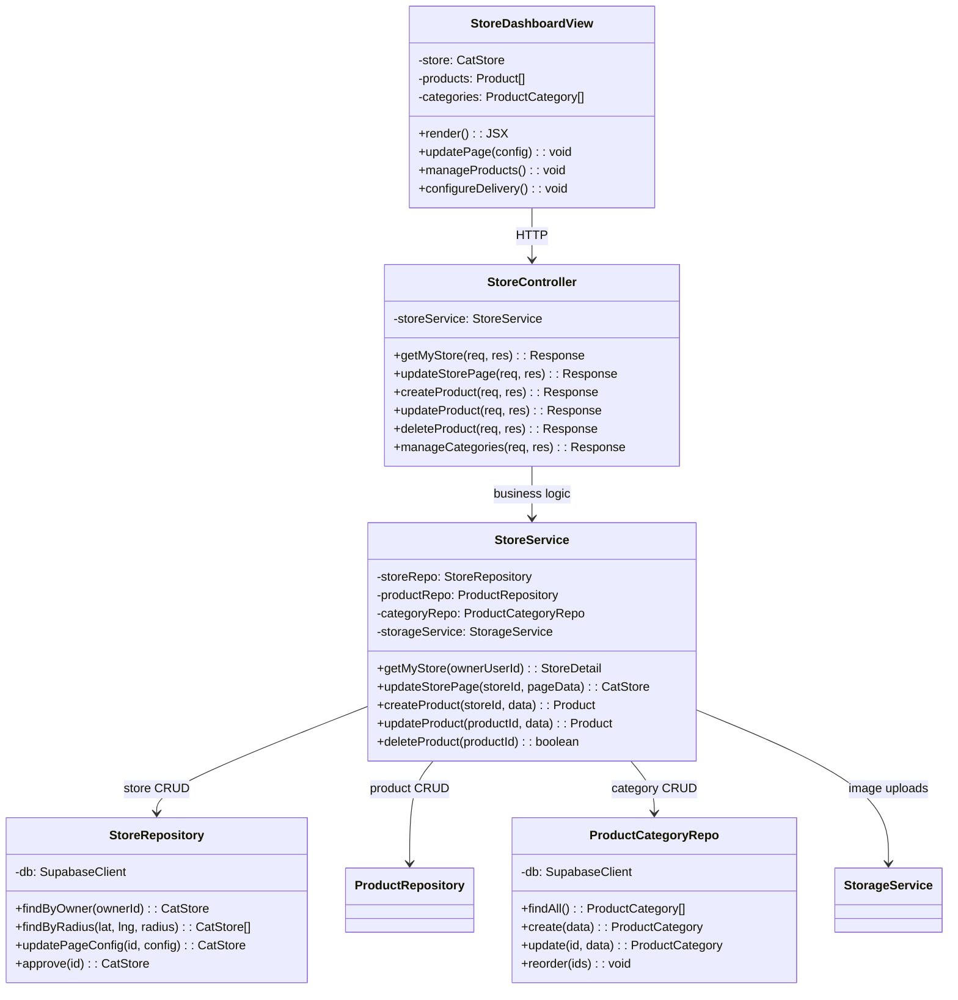

---

## Partial Class Diagram 11: Offer Management (from SD-13, TS-11)

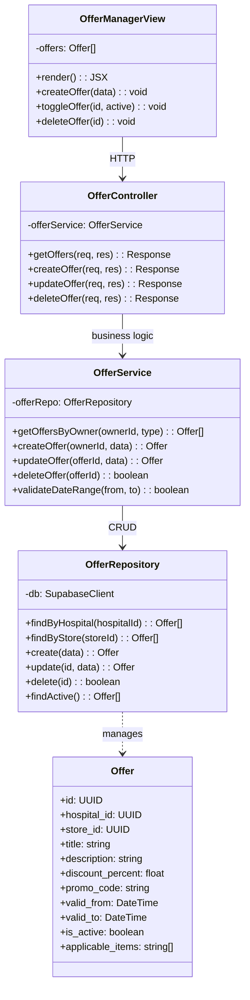

---

## Partial Class Diagram 12: Order Fulfillment (from SD-14, TS-12)

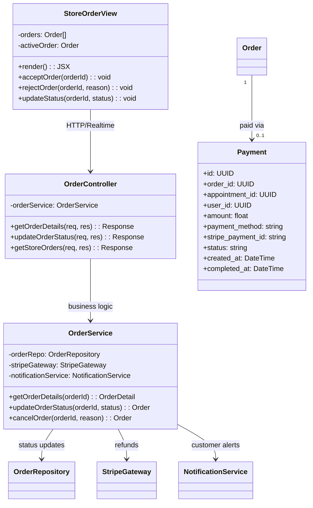

---

## Partial Class Diagram 13: Treatment & Prescription (from SD-7, TS-6)

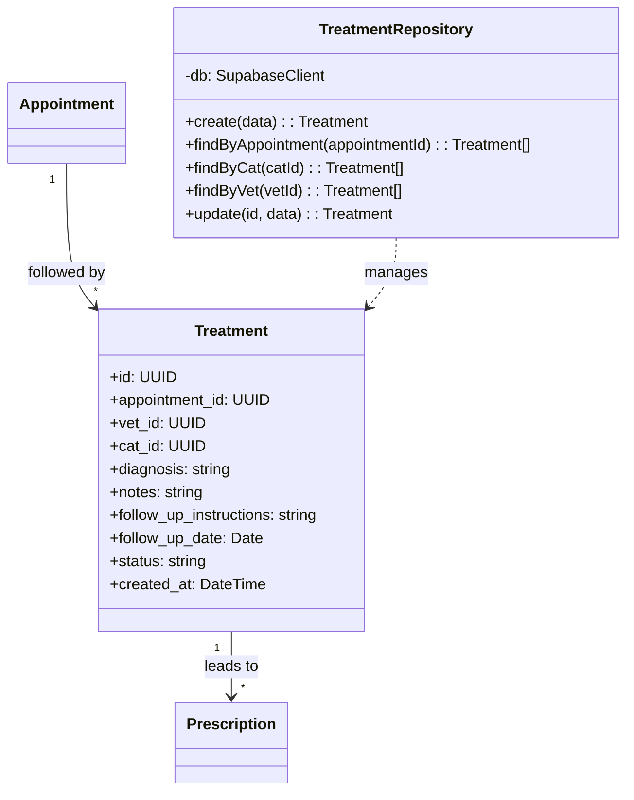

---

## Partial Class Diagram 14: Admin Operations (from SD-15, TS-13)

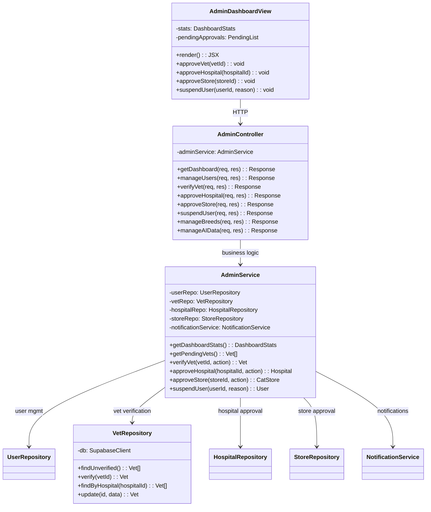

---

## Partial Class Diagram 15: Admin Medicine Management (from SD-10, TS-13)

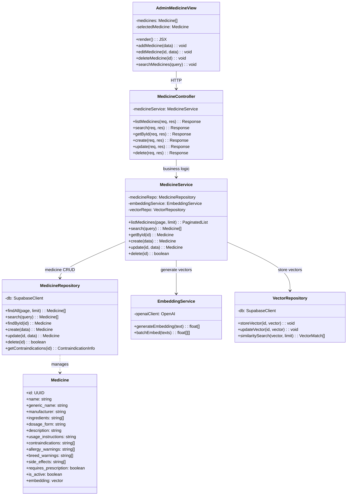
