# 07 — Complete Class Diagram

> The complete class diagram unifies all partial class diagrams (Document 06) into a single comprehensive class diagram showing all classes, attributes, methods, and relationships in the Purrfect Care system.

---

## Complete Class Diagram — MVC Architecture

### Layer 1: Models (Data Classes)

```mermaid
classDiagram
    %% =====================================================
    %% ENUMERATIONS
    %% =====================================================
    class Role {
        <<enumeration>>
        CAT_OWNER
        VET
        HOSPITAL_ADMIN
        STORE_OWNER
        SYSTEM_ADMIN
    }

    class AppointmentStatus {
        <<enumeration>>
        PENDING
        CONFIRMED
        IN_PROGRESS
        COMPLETED
        CANCELLED
        NO_SHOW
    }

    class OrderStatus {
        <<enumeration>>
        PENDING
        CONFIRMED
        PREPARING
        READY
        OUT_FOR_DELIVERY
        DELIVERED
        CANCELLED
        REFUNDED
    }

    class MessageType {
        <<enumeration>>
        TEXT
        IMAGE
        FILE
        PRESCRIPTION_SHARE
    }

    class SeverityLevel {
        <<enumeration>>
        LOW
        MODERATE
        HIGH
        CRITICAL
    }

    class PrescriptionStatus {
        <<enumeration>>
        ACTIVE
        COMPLETED
        CANCELLED
    }

    class NotificationType {
        <<enumeration>>
        WELCOME
        APPOINTMENT_BOOKED
        APPOINTMENT_REMINDER
        NEW_MESSAGE
        NEW_PRESCRIPTION
        ORDER_PLACED
        ORDER_STATUS_UPDATE
        NEW_REVIEW
        SYSTEM_ALERT
    }

    %% =====================================================
    %% USER DOMAIN
    %% =====================================================
    class User {
        +id: UUID
        +email: string
        +password_hash: string
        +name: string
        +phone: string
        +role: Role
        +avatar_url: string
        +location: Point
        +address: string
        +city: string
        +country: string
        +is_active: boolean
        +created_at: DateTime
        +updated_at: DateTime
    }

    class UserProfile {
        +id: UUID
        +user_id: UUID
        +preferences: JSON
        +notification_settings: string
        +payment_customer_id: string
        +last_login: DateTime
    }

    %% =====================================================
    %% CAT DOMAIN
    %% =====================================================
    class Cat {
        +id: UUID
        +owner_id: UUID
        +name: string
        +breed_id: UUID
        +age_months: int
        +weight_kg: float
        +color: string
        +gender: string
        +photo_url: string
        +is_neutered: boolean
        +microchip_id: string
        +registered_at: DateTime
    }

    class CatBreed {
        +id: UUID
        +name: string
        +origin_country: string
        +size_category: string
        +coat_type: string
        +temperament: string
        +description: string
        +avg_lifespan_years: float
        +avg_weight_kg: float
        +common_health_issues: string[]
        +grooming_needs: string[]
        +image_url: string
    }

    class MedicalRecord {
        +id: UUID
        +cat_id: UUID
        +allergies: string[]
        +existing_conditions: string[]
        +vaccination_status: JSON
        +blood_type: string
        +notes: string
        +last_updated: DateTime
    }

    class PatientHistory {
        +id: UUID
        +cat_id: UUID
        +entry_type: string
        +description: string
        +appointment_id: UUID
        +prescription_id: UUID
        +vet_id: UUID
        +created_at: DateTime
    }

    %% =====================================================
    %% VET / HOSPITAL DOMAIN
    %% =====================================================
    class Vet {
        +id: UUID
        +user_id: UUID
        +license_number: string
        +specialization: string
        +experience_years: int
        +bio: string
        +qualifications: string[]
        +hospital_id: UUID
        +is_verified: boolean
        +rating: float
        +total_reviews: int
        +verified_at: DateTime
    }

    class Hospital {
        +id: UUID
        +admin_user_id: UUID
        +name: string
        +description: string
        +phone: string
        +email: string
        +location: Point
        +address: string
        +city: string
        +banner_url: string
        +operating_hours: JSON
        +is_active: boolean
        +is_approved: boolean
        +rating: float
        +total_reviews: int
        +page_config: JSON
        +created_at: DateTime
    }

    class HospitalService {
        +id: UUID
        +hospital_id: UUID
        +name: string
        +description: string
        +category: string
        +price: float
        +duration_minutes: int
        +is_active: boolean
    }

    class AppointmentSlot {
        +id: UUID
        +hospital_id: UUID
        +vet_id: UUID
        +slot_date: Date
        +start_time: Time
        +end_time: Time
        +is_booked: boolean
        +is_recurring: boolean
    }

    class Appointment {
        +id: UUID
        +user_id: UUID
        +cat_id: UUID
        +vet_id: UUID
        +hospital_id: UUID
        +service_id: UUID
        +slot_id: UUID
        +appointment_date: DateTime
        +status: AppointmentStatus
        +notes: string
        +amount_paid: float
        +payment_id: string
        +created_at: DateTime
        +updated_at: DateTime
    }

    %% =====================================================
    %% MEDICINE DOMAIN
    %% =====================================================
    class Medicine {
        +id: UUID
        +name: string
        +generic_name: string
        +manufacturer: string
        +ingredients: string[]
        +dosage_form: string
        +description: string
        +usage_instructions: string
        +contraindications: string[]
        +allergy_warnings: string[]
        +breed_warnings: string[]
        +side_effects: string[]
        +requires_prescription: boolean
        +is_active: boolean
        +embedding: vector
    }

    class Prescription {
        +id: UUID
        +appointment_id: UUID
        +cat_id: UUID
        +vet_id: UUID
        +medicine_id: UUID
        +dosage: string
        +frequency: string
        +duration_days: int
        +instructions: string
        +status: PrescriptionStatus
        +prescribed_at: DateTime
    }

    %% =====================================================
    %% CHAT DOMAIN
    %% =====================================================
    class ChatRoom {
        +id: UUID
        +user_id: UUID
        +vet_id: UUID
        +last_message_at: DateTime
        +unread_user: int
        +unread_vet: int
        +is_active: boolean
        +created_at: DateTime
    }

    class Message {
        +id: UUID
        +chat_room_id: UUID
        +sender_id: UUID
        +content: string
        +message_type: MessageType
        +media_url: string
        +is_read: boolean
        +sent_at: DateTime
    }

    %% =====================================================
    %% STORE DOMAIN
    %% =====================================================
    class CatStore {
        +id: UUID
        +owner_user_id: UUID
        +name: string
        +description: string
        +phone: string
        +email: string
        +location: Point
        +address: string
        +city: string
        +banner_url: string
        +operating_hours: JSON
        +delivery_zones: JSON
        +delivery_fee: float
        +is_active: boolean
        +is_approved: boolean
        +rating: float
        +total_reviews: int
        +page_config: JSON
        +created_at: DateTime
    }

    class ProductCategory {
        +id: UUID
        +name: string
        +description: string
        +icon_url: string
        +sort_order: int
    }

    class Product {
        +id: UUID
        +store_id: UUID
        +category_id: UUID
        +name: string
        +description: string
        +price: float
        +discount_price: float
        +images: string[]
        +stock_quantity: int
        +brand: string
        +weight: float
        +unit: string
        +is_active: boolean
        +rating: float
        +total_reviews: int
        +created_at: DateTime
    }

    class Order {
        +id: UUID
        +user_id: UUID
        +store_id: UUID
        +subtotal: float
        +delivery_fee: float
        +total: float
        +status: OrderStatus
        +payment_id: string
        +delivery_address: string
        +delivery_location: Point
        +notes: string
        +ordered_at: DateTime
        +delivered_at: DateTime
    }

    class OrderItem {
        +id: UUID
        +order_id: UUID
        +product_id: UUID
        +quantity: int
        +unit_price: float
        +total_price: float
    }

    %% =====================================================
    %% ENGAGEMENT DOMAIN
    %% =====================================================
    class Offer {
        +id: UUID
        +hospital_id: UUID
        +store_id: UUID
        +title: string
        +description: string
        +discount_percent: float
        +promo_code: string
        +valid_from: DateTime
        +valid_to: DateTime
        +is_active: boolean
        +applicable_items: string[]
    }

    class Review {
        +id: UUID
        +user_id: UUID
        +hospital_id: UUID
        +store_id: UUID
        +vet_id: UUID
        +rating: int
        +comment: string
        +status: string
        +created_at: DateTime
    }

    class ReviewResponse {
        +id: UUID
        +review_id: UUID
        +responder_id: UUID
        +response_text: string
        +status: string
        +responded_at: DateTime
    }

    %% =====================================================
    %% SUBSEQUENT TRANSACTION DOMAIN
    %% =====================================================
    class Treatment {
        +id: UUID
        +appointment_id: UUID
        +vet_id: UUID
        +cat_id: UUID
        +diagnosis: string
        +notes: string
        +follow_up_instructions: string
        +follow_up_date: Date
        +status: string
        +created_at: DateTime
    }

    class Payment {
        +id: UUID
        +order_id: UUID
        +appointment_id: UUID
        +user_id: UUID
        +amount: float
        +payment_method: string
        +stripe_payment_id: string
        +status: string
        +created_at: DateTime
        +completed_at: DateTime
    }

    %% =====================================================
    %% AI DOMAIN
    %% =====================================================
    class IllnessRecord {
        +id: UUID
        +illness_name: string
        +description: string
        +symptoms: string[]
        +affected_breeds: string[]
        +severity_level: string
        +home_remedies: string
        +when_to_see_vet: string
        +related_medicines: string[]
        +embedding: vector
    }

    class AIConsultation {
        +id: UUID
        +user_id: UUID
        +cat_id: UUID
        +query_text: string
        +results: JSON
        +confidence_score: float
        +severity: string
        +created_at: DateTime
    }

    %% =====================================================
    %% SYSTEM DOMAIN
    %% =====================================================
    class Notification {
        +id: UUID
        +user_id: UUID
        +type: NotificationType
        +title: string
        +body: string
        +channel: string
        +data: JSON
        +is_read: boolean
        +created_at: DateTime
    }

    %% =====================================================
    %% RELATIONSHIPS
    %% =====================================================
    User "1" --> "0..1" UserProfile : has
    User "1" --> "*" Cat : owns
    User "1" --> "0..1" Vet : registered as
    User "1" --> "0..1" Hospital : admins
    User "1" --> "0..1" CatStore : owns
    User "1" --> "*" Appointment : books
    User "1" --> "*" Order : places
    User "1" --> "*" Review : writes
    User "1" --> "*" ChatRoom : participates
    User "1" --> "*" Notification : receives
    User "1" --> "*" AIConsultation : initiates

    Cat "*" --> "1" CatBreed : is of breed
    Cat "1" --> "1" MedicalRecord : has
    Cat "1" --> "*" PatientHistory : has history
    Cat "1" --> "*" Appointment : subject of
    Cat "1" --> "*" Prescription : prescribed for
    Cat "1" --> "*" AIConsultation : consulted about

    Vet "1" --> "0..1" Hospital : works at
    Vet "1" --> "*" Appointment : attends
    Vet "1" --> "*" AppointmentSlot : available at
    Vet "1" --> "*" Prescription : prescribes
    Vet "1" --> "*" ChatRoom : chats in
    Vet "1" --> "*" Review : reviewed via

    Hospital "1" --> "*" HospitalService : offers
    Hospital "1" --> "*" AppointmentSlot : schedules
    Hospital "1" --> "*" Appointment : hosts
    Hospital "1" --> "*" Vet : employs
    Hospital "1" --> "*" Offer : promotes
    Hospital "1" --> "*" Review : receives

    Appointment "*" --> "1" HospitalService : for service
    Appointment "1" --> "1" AppointmentSlot : at slot
    Appointment "1" --> "*" Treatment : followed by
    Appointment "1" --> "*" Prescription : results in
    Appointment "1" --> "*" PatientHistory : logged in
    Appointment "1" --> "0..1" Payment : paid via

    Treatment "1" --> "*" Prescription : leads to
    Prescription "*" --> "1" Medicine : of medicine

    ChatRoom "1" --> "*" Message : contains

    CatStore "1" --> "*" Product : sells
    CatStore "1" --> "*" Order : receives
    CatStore "1" --> "*" Offer : promotes
    CatStore "1" --> "*" Review : receives

    Product "*" --> "1" ProductCategory : categorized
    Product "1" --> "*" OrderItem : ordered as

    Order "1" --> "*" OrderItem : contains
    Order "1" --> "0..1" Payment : paid via

    Review "1" --> "0..1" ReviewResponse : responded with

    Vet "1" --> "*" Treatment : performs
```

---

### Layer 2: Controllers (REST API)

```mermaid
classDiagram
    class BaseController {
        <<abstract>>
        #validateRequest(schema, data): boolean
        #authenticateUser(req): User
        #authorizeRole(user, roles[]): boolean
        #handleError(error, res): Response
        #paginate(query, page, limit): PaginatedResult
    }

    class AuthController {
        -authService: AuthService
        +register(req, res): Response
        +login(req, res): Response
        +logout(req, res): Response
        +refreshToken(req, res): Response
        +forgotPassword(req, res): Response
        +resetPassword(req, res): Response
    }

    class CatController {
        -catService: CatService
        +register(req, res): Response
        +getByOwner(req, res): Response
        +getById(req, res): Response
        +update(req, res): Response
        +delete(req, res): Response
        +getBreeds(req, res): Response
        +getBreedById(req, res): Response
    }

    class HospitalController {
        -hospitalService: HospitalService
        +getNearby(req, res): Response
        +getDetails(req, res): Response
        +getMyHospital(req, res): Response
        +updatePage(req, res): Response
        +manageServices(req, res): Response
        +manageStaff(req, res): Response
        +manageSlots(req, res): Response
        +getAnalytics(req, res): Response
    }

    class AppointmentController {
        -appointmentService: AppointmentService
        +create(req, res): Response
        +confirm(req, res): Response
        +cancel(req, res): Response
        +getByUser(req, res): Response
        +getByVet(req, res): Response
        +getByHospital(req, res): Response
        +updateStatus(req, res): Response
    }

    class ChatController {
        -chatService: ChatService
        +getOrCreateChat(req, res): Response
        +getMessages(req, res): Response
        +sendMessage(req, res): Response
        +getChatRooms(req, res): Response
        +markRead(req, res): Response
    }

    class PrescriptionController {
        -prescriptionService: PrescriptionService
        +prescribe(req, res): Response
        +getContext(req, res): Response
        +searchMedicines(req, res): Response
        +getHistory(req, res): Response
    }

    class OrderController {
        -orderService: OrderService
        +getNearbyStores(req, res): Response
        +getStoreDetails(req, res): Response
        +createOrder(req, res): Response
        +confirmOrder(req, res): Response
        +getOrderStatus(req, res): Response
        +updateOrderStatus(req, res): Response
        +getStoreOrders(req, res): Response
    }

    class AIController {
        -aiService: AIService
        +consult(req, res): Response
        +getHistory(req, res): Response
    }

    class MedicineController {
        -medicineService: MedicineService
        +search(req, res): Response
        +getById(req, res): Response
        +create(req, res): Response
        +update(req, res): Response
        +delete(req, res): Response
    }

    class ReviewController {
        -reviewService: ReviewService
        +create(req, res): Response
        +getByTarget(req, res): Response
        +respond(req, res): Response
        +delete(req, res): Response
    }

    class AdminController {
        -adminService: AdminService
        +manageUsers(req, res): Response
        +manageVets(req, res): Response
        +manageHospitals(req, res): Response
        +manageStores(req, res): Response
        +manageMedicines(req, res): Response
        +manageBreeds(req, res): Response
        +manageAIData(req, res): Response
        +getAnalytics(req, res): Response
    }

    class StoreController {
        -storeService: StoreService
        +getMyStore(req, res): Response
        +updateStorePage(req, res): Response
        +createProduct(req, res): Response
        +updateProduct(req, res): Response
        +deleteProduct(req, res): Response
    }

    class OfferController {
        -offerService: OfferService
        +getOffers(req, res): Response
        +createOffer(req, res): Response
        +updateOffer(req, res): Response
        +deleteOffer(req, res): Response
    }

    BaseController <|-- AuthController
    BaseController <|-- CatController
    BaseController <|-- HospitalController
    BaseController <|-- AppointmentController
    BaseController <|-- ChatController
    BaseController <|-- PrescriptionController
    BaseController <|-- OrderController
    BaseController <|-- AIController
    BaseController <|-- MedicineController
    BaseController <|-- ReviewController
    BaseController <|-- AdminController
    BaseController <|-- StoreController
    BaseController <|-- OfferController
```

---

### Layer 3: Services (Middleware / Business Logic)

```mermaid
classDiagram
    class AuthService {
        -userRepo: UserRepository
        -supabaseAuth: SupabaseAuth
        -notificationService: NotificationService
        +register(userData): UserWithToken
        +login(email, password): UserWithToken
        +verifyToken(token): DecodedToken
        +refreshToken(token): string
        +forgotPassword(email): void
        +resetPassword(token, newPassword): void
    }

    class CatService {
        -catRepo: CatRepository
        -breedRepo: BreedRepository
        -medicalRecordRepo: MedicalRecordRepo
        +registerCat(userId, catData): CatWithRecord
        +getCatsByOwner(userId): Cat[]
        +getCatProfile(catId): CatProfile
        +updateCat(catId, data): Cat
        +deleteCat(catId): boolean
    }

    class HospitalBizService {
        -hospitalRepo: HospitalRepository
        -geoService: GeoLocationService
        +findNearby(lat, lng, radius): Hospital[]
        +getDetails(hospitalId): HospitalDetail
        +updatePage(hospitalId, config): Hospital
        +manageServices(hospitalId, services): HospitalService[]
        +manageStaff(hospitalId, vetIds): Vet[]
        +getAnalytics(hospitalId): HospitalAnalytics
    }

    class AppointmentService {
        -appointmentRepo: AppointmentRepository
        -slotRepo: SlotRepository
        -stripeGateway: StripeGateway
        -notificationService: NotificationService
        +createAppointment(userId, data): AppointmentPreview
        +confirmAppointment(id, paymentId): Appointment
        +cancelAppointment(id): boolean
        +getByUser(userId): Appointment[]
        +getByVet(vetId): Appointment[]
        +updateStatus(id, status): Appointment
    }

    class ChatService {
        -chatRepo: ChatRepository
        -messageRepo: MessageRepository
        -notificationService: NotificationService
        +getOrCreateChatRoom(userId, vetId): ChatRoom
        +getMessages(chatRoomId, page): Message[]
        +sendMessage(roomId, senderId, content, type): Message
        +getChatRooms(userId, role): ChatRoom[]
        +markAsRead(roomId, userId): void
    }

    class PrescriptionService {
        -prescriptionRepo: PrescriptionRepository
        -medicineRepo: MedicineRepository
        -medicalRecordRepo: MedicalRecordRepo
        -patientHistoryRepo: PatientHistoryRepo
        -notificationService: NotificationService
        +prescribe(vetId, data): Prescription
        +checkContraindications(catId, medicineId): ContraindicationResult
        +getContext(appointmentId): AppointmentContext
        +getHistory(catId): Prescription[]
    }

    class OrderService {
        -orderRepo: OrderRepository
        -productRepo: ProductRepository
        -stripeGateway: StripeGateway
        -notificationService: NotificationService
        -geoService: GeoLocationService
        +findNearbyStores(lat, lng): CatStore[]
        +createOrder(userId, data): OrderPreview
        +confirmOrder(orderId, paymentId): Order
        +updateStatus(orderId, status): Order
        +validateStock(items): boolean
        +calculateTotal(items, fee): float
    }

    class AIService {
        -catRepo: CatRepository
        -embeddingService: EmbeddingService
        -vectorDBRepo: VectorDBRepository
        -illnessRepo: IllnessRepository
        -consultLogRepo: ConsultationLogRepo
        +consult(userId, catId, symptoms): AIRecommendation
        +filterByBreed(illnesses, breed): Illness[]
        +calculateSeverity(matches, context): SeverityLevel
        +getHistory(userId): AIConsultation[]
    }

    class MedicineService {
        -medicineRepo: MedicineRepository
        -embeddingService: EmbeddingService
        +search(query): Medicine[]
        +getById(id): Medicine
        +create(data): Medicine
        +update(id, data): Medicine
        +delete(id): boolean
    }

    class ReviewService {
        -reviewRepo: ReviewRepository
        +create(userId, data): Review
        +getByTarget(type, targetId): Review[]
        +respond(reviewId, userId, response): ReviewResponse
        +calculateAvgRating(type, targetId): float
    }

    class StoreService {
        -storeRepo: StoreRepository
        -productRepo: ProductRepository
        -categoryRepo: ProductCategoryRepo
        -storageService: StorageService
        +getMyStore(ownerUserId): StoreDetail
        +updateStorePage(storeId, pageData): CatStore
        +createProduct(storeId, data): Product
        +updateProduct(productId, data): Product
        +deleteProduct(productId): boolean
    }

    class OfferService {
        -offerRepo: OfferRepository
        +getOffersByOwner(ownerId, type): Offer[]
        +createOffer(ownerId, data): Offer
        +updateOffer(offerId, data): Offer
        +deleteOffer(offerId): boolean
        +validateDateRange(from, to): boolean
    }

    class AdminService {
        -userRepo: UserRepository
        -vetRepo: VetRepository
        -hospitalRepo: HospitalRepository
        -storeRepo: StoreRepository
        -notificationService: NotificationService
        +getDashboardStats(): DashboardStats
        +verifyVet(vetId, action): Vet
        +approveHospital(hospitalId, action): Hospital
        +approveStore(storeId, action): CatStore
        +suspendUser(userId, reason): User
    }

    class EmbeddingService {
        -openaiClient: OpenAI
        +generateEmbedding(text): float[]
        +batchEmbed(texts): float[][]
    }

    class NotificationService {
        -supabase: SupabaseClient
        +sendEmail(to, template, data): void
        +sendPush(userId, payload): void
        +sendSMS(phone, message): void
        +notifyAll(userIds, payload): void
    }

    class GeoLocationService {
        +getDistance(point1, point2): float
        +findWithinRadius(table, lat, lng, radius): any[]
    }

    class StorageService {
        -supabase: SupabaseClient
        +uploadImage(bucket, file): string
        +deleteImage(bucket, path): void
        +getPublicUrl(bucket, path): string
    }

    class StripeGateway {
        -stripeClient: Stripe
        +createPaymentIntent(amount, currency, meta): PaymentIntent
        +confirmPayment(intentId): PaymentConfirmation
        +refundPayment(intentId, amount): Refund
        +createCustomer(email, name): Customer
    }
```

---

### Layer 4: Repositories (Data Access)

```mermaid
classDiagram
    class BaseRepository {
        <<abstract>>
        #db: SupabaseClient
        #tableName: string
        +findById(id): T
        +findAll(page, limit): T[]
        +create(data): T
        +update(id, data): T
        +delete(id): boolean
        +count(filter): int
    }

    class UserRepository {
        +findByEmail(email): User
        +findByRole(role): User[]
        +updateLocation(id, location): User
        +deactivate(id): boolean
    }

    class CatRepository {
        +findByOwner(ownerId): Cat[]
        +findWithMedicalRecord(catId): CatWithRecord
    }

    class BreedRepository {
        +search(query): CatBreed[]
        +findByName(name): CatBreed
    }

    class MedicalRecordRepo {
        +findByCat(catId): MedicalRecord
        +getAllergies(catId): string[]
        +updateVaccination(catId, vaccine, status): MedicalRecord
    }

    class PatientHistoryRepo {
        +findByCat(catId): PatientHistory[]
        +addEntry(catId, type, data): PatientHistory
        +findByAppointment(appointmentId): PatientHistory[]
    }

    class HospitalRepository {
        +findByRadius(lat, lng, radius): Hospital[]
        +findByAdmin(adminUserId): Hospital
        +updatePageConfig(id, config): Hospital
        +approve(id): Hospital
    }

    class AppointmentRepository {
        +findByUser(userId): Appointment[]
        +findByVet(vetId): Appointment[]
        +findByHospital(hospitalId): Appointment[]
        +updateStatus(id, status): Appointment
    }

    class SlotRepository {
        +findByVetAndDate(vetId, date): AppointmentSlot[]
        +checkAvailability(slotId): boolean
        +markBooked(slotId): void
        +markAvailable(slotId): void
        +createRecurring(vetId, pattern): AppointmentSlot[]
    }

    class ChatRepository {
        +findByParticipants(userId, vetId): ChatRoom
        +findByUser(userId): ChatRoom[]
        +updateLastMessage(id, timestamp): void
        +incrementUnread(id, field): void
    }

    class MessageRepository {
        +findByChatRoom(roomId, limit, offset): Message[]
        +markRead(roomId, userId): void
    }

    class PrescriptionRepository {
        +findByAppointment(appointmentId): Prescription[]
        +findByCat(catId): Prescription[]
        +findByVet(vetId): Prescription[]
    }

    class MedicineRepository {
        +search(query): Medicine[]
        +getContraindications(id): ContraindicationInfo
    }

    class OrderRepository {
        +findByUser(userId): Order[]
        +findByStore(storeId): Order[]
        +updateStatus(id, status): Order
    }

    class ProductRepository {
        +findByStore(storeId): Product[]
        +findByCategory(categoryId): Product[]
        +decrementStock(id, qty): void
        +validateStock(items): StockResult[]
    }

    class StoreRepository {
        +findByRadius(lat, lng, radius): CatStore[]
        +findByOwner(ownerId): CatStore
        +updatePageConfig(id, config): CatStore
    }

    class ReviewRepository {
        +findByTarget(type, targetId): Review[]
        +calculateAvg(type, targetId): float
    }

    class IllnessRepository {
        +findByIds(ids): IllnessRecord[]
    }

    class VectorDBRepository {
        +similaritySearch(vector, limit): VectorMatch[]
        +store(id, vector): void
        +update(id, vector): void
    }

    class ConsultationLogRepo {
        +findByUser(userId): AIConsultation[]
        +findByCat(catId): AIConsultation[]
    }

    class VetRepository {
        +findUnverified(): Vet[]
        +verify(vetId): Vet
        +findByHospital(hospitalId): Vet[]
    }

    class OfferRepository {
        +findByHospital(hospitalId): Offer[]
        +findByStore(storeId): Offer[]
        +findActive(): Offer[]
    }

    class ProductCategoryRepo {
        +findAll(): ProductCategory[]
        +reorder(ids): void
    }

    class TreatmentRepository {
        +findByAppointment(appointmentId): Treatment[]
        +findByCat(catId): Treatment[]
        +findByVet(vetId): Treatment[]
    }

    class PaymentRepository {
        +findByOrder(orderId): Payment
        +findByAppointment(appointmentId): Payment
        +findByUser(userId): Payment[]
    }

    BaseRepository <|-- UserRepository
    BaseRepository <|-- CatRepository
    BaseRepository <|-- BreedRepository
    BaseRepository <|-- MedicalRecordRepo
    BaseRepository <|-- PatientHistoryRepo
    BaseRepository <|-- HospitalRepository
    BaseRepository <|-- AppointmentRepository
    BaseRepository <|-- SlotRepository
    BaseRepository <|-- ChatRepository
    BaseRepository <|-- MessageRepository
    BaseRepository <|-- PrescriptionRepository
    BaseRepository <|-- MedicineRepository
    BaseRepository <|-- OrderRepository
    BaseRepository <|-- ProductRepository
    BaseRepository <|-- StoreRepository
    BaseRepository <|-- ReviewRepository
    BaseRepository <|-- IllnessRepository
    BaseRepository <|-- VectorDBRepository
    BaseRepository <|-- ConsultationLogRepo
    BaseRepository <|-- VetRepository
    BaseRepository <|-- OfferRepository
    BaseRepository <|-- ProductCategoryRepo
    BaseRepository <|-- TreatmentRepository
    BaseRepository <|-- PaymentRepository
```

---

### Layer 5: Views (React Components)

```mermaid
classDiagram
    class RegistrationView {
        -formData: RegistrationForm
        +render(): JSX
        +handleSubmit(): void
        +selectRole(role): void
    }

    class CatRegistrationView {
        -cats: Cat[]
        -breeds: CatBreed[]
        +render(): JSX
        +handleSubmit(catData): void
        +selectBreed(breedId): void
    }

    class HospitalListView {
        -hospitals: Hospital[]
        -userLocation: Point
        +render(): JSX
        +filterByDistance(radius): void
        +selectHospital(id): void
    }

    class AppointmentBookingView {
        -hospital: Hospital
        -services: HospitalService[]
        -slots: AppointmentSlot[]
        +render(): JSX
        +selectService(id): void
        +selectSlot(id): void
        +confirmBooking(): void
    }

    class ChatView {
        -chatRooms: ChatRoom[]
        -messages: Message[]
        -activeRoom: ChatRoom
        +render(): JSX
        +sendMessage(content): void
        +attachImage(file): void
        +markAsRead(roomId): void
    }

    class PrescriptionView {
        -appointment: Appointment
        -catRecord: MedicalRecord
        -medicines: Medicine[]
        +render(): JSX
        +searchMedicine(query): void
        +prescribe(data): void
    }

    class StoreListView {
        -stores: CatStore[]
        -cart: CartItem[]
        +render(): JSX
        +addToCart(productId, qty): void
        +checkout(): void
    }

    class AICompanionView {
        -history: AIConsultation[]
        -currentResult: AIRecommendation
        +render(): JSX
        +submitSymptoms(text): void
        +bookFromAI(hospitalId): void
    }

    class ReviewView {
        -reviews: Review[]
        -rating: int
        +render(): JSX
        +submitReview(data): void
        +respondToReview(id, text): void
    }

    class HospitalDashboardView {
        -hospital: Hospital
        -services: HospitalService[]
        -analytics: HospitalAnalytics
        +render(): JSX
        +updatePage(config): void
        +manageServices(): void
        +manageStaff(): void
        +uploadBanner(file): void
    }

    class StoreDashboardView {
        -store: CatStore
        -products: Product[]
        -categories: ProductCategory[]
        +render(): JSX
        +updatePage(config): void
        +manageProducts(): void
        +configureDelivery(): void
    }

    class OfferManagerView {
        -offers: Offer[]
        +render(): JSX
        +createOffer(data): void
        +toggleOffer(id, active): void
        +deleteOffer(id): void
    }

    class StoreOrderView {
        -orders: Order[]
        -activeOrder: Order
        +render(): JSX
        +acceptOrder(orderId): void
        +rejectOrder(orderId, reason): void
        +updateStatus(orderId, status): void
    }

    class AdminDashboardView {
        -stats: DashboardStats
        -pendingApprovals: PendingList
        +render(): JSX
        +approveVet(vetId): void
        +approveHospital(hospitalId): void
        +approveStore(storeId): void
        +suspendUser(userId, reason): void
    }

    class AdminMedicineView {
        -medicines: Medicine[]
        -selectedMedicine: Medicine
        +render(): JSX
        +addMedicine(data): void
        +editMedicine(id, data): void
        +deleteMedicine(id): void
    }

    %% View → Controller relationships
    RegistrationView --> AuthController : HTTP
    CatRegistrationView --> CatController : HTTP
    HospitalListView --> HospitalController : HTTP
    AppointmentBookingView --> AppointmentController : HTTP
    ChatView --> ChatController : WebSocket
    PrescriptionView --> PrescriptionController : HTTP
    StoreListView --> OrderController : HTTP
    AICompanionView --> AIController : HTTP
    ReviewView --> ReviewController : HTTP
    HospitalDashboardView --> HospitalController : HTTP
    StoreDashboardView --> StoreController : HTTP
    OfferManagerView --> OfferController : HTTP
    StoreOrderView --> OrderController : HTTP
    AdminDashboardView --> AdminController : HTTP
    AdminMedicineView --> MedicineController : HTTP
```

---

## Class Count Summary

| Layer | Count | Classes |
|-------|-------|---------|
| **Models (Data)** | 28 | User, UserProfile, Cat, CatBreed, MedicalRecord, PatientHistory, Vet, Hospital, HospitalService, AppointmentSlot, Appointment, Medicine, Prescription, ChatRoom, Message, CatStore, ProductCategory, Product, Order, OrderItem, Offer, Review, ReviewResponse, Treatment, Payment, IllnessRecord, AIConsultation, Notification |
| **Enumerations** | 7 | Role, AppointmentStatus, OrderStatus, MessageType, SeverityLevel, PrescriptionStatus, NotificationType |
| **Controllers** | 13 | BaseController + 12 concrete (Auth, Cat, Hospital, Appointment, Chat, Prescription, Order, AI, Medicine, Review, Admin, Store, Offer) |
| **Services** | 18 | AuthService, CatService, HospitalBizService, AppointmentService, ChatService, PrescriptionService, OrderService, AIService, MedicineService, ReviewService, StoreService, OfferService, AdminService, EmbeddingService, NotificationService, GeoLocationService, StorageService, StripeGateway |
| **Repositories** | 23 | BaseRepository + 22 concrete (User, Cat, Breed, MedicalRecord, PatientHistory, Hospital, Appointment, Slot, Chat, Message, Prescription, Medicine, Order, Product, Store, Review, Illness, VectorDB, ConsultationLog, Vet, Offer, ProductCategory, Treatment, Payment) |
| **Views (React)** | 15 | RegistrationView, CatRegistrationView, HospitalListView, AppointmentBookingView, ChatView, PrescriptionView, StoreListView, AICompanionView, ReviewView, HospitalDashboardView, StoreDashboardView, OfferManagerView, StoreOrderView, AdminDashboardView, AdminMedicineView |
| **Total** | **~104** | |
