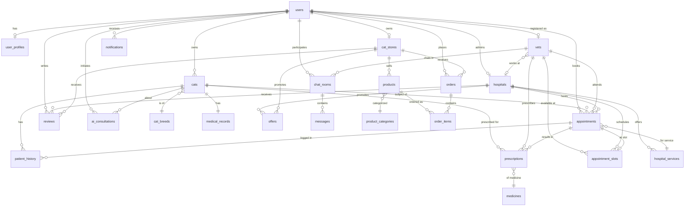

# 08 — Database Diagram & Complete Schema

> Complete database design for Purrfect Care using Supabase (PostgreSQL). Includes ER diagram, all tables with field explanations, indexes, and RLS policies.

---

## Database ER Diagram



---

## Table Definitions

### 1. `users` — All platform users

| Column | Type | Constraints | Description |
|--------|------|-------------|-------------|
| `id` | UUID | PK, DEFAULT uuid_generate_v4() | Unique user ID (matches Supabase auth.users.id) |
| `email` | VARCHAR(255) | UNIQUE, NOT NULL | User email address |
| `name` | VARCHAR(100) | NOT NULL | Full name |
| `phone` | VARCHAR(20) | | Phone number |
| `role` | VARCHAR(20) | NOT NULL, CHECK IN ('cat_owner','vet','hospital_admin','store_owner','admin') | Access control role |
| `avatar_url` | TEXT | | Profile picture URL |
| `location` | GEOGRAPHY(POINT, 4326) | | User's geolocation (PostGIS) |
| `address` | TEXT | | Street address |
| `city` | VARCHAR(100) | | City |
| `country` | VARCHAR(100) | | Country |
| `is_active` | BOOLEAN | DEFAULT true | Account status |
| `created_at` | TIMESTAMPTZ | DEFAULT now() | Registration timestamp |
| `updated_at` | TIMESTAMPTZ | DEFAULT now() | Last update |

**Indexes**: `idx_users_email`, `idx_users_role`, `idx_users_location` (GiST)

---

### 2. `user_profiles` — Extended user preferences

| Column | Type | Constraints | Description |
|--------|------|-------------|-------------|
| `id` | UUID | PK | Profile ID |
| `user_id` | UUID | FK → users.id, UNIQUE | Owner |
| `preferences` | JSONB | DEFAULT '{}' | UI/notification preferences |
| `notification_settings` | VARCHAR(50) | DEFAULT 'all' | Email/push/sms settings |
| `payment_customer_id` | VARCHAR(255) | | Stripe customer ID |
| `last_login` | TIMESTAMPTZ | | Last login time |

---

### 3. `cat_breeds` — Cat breed encyclopedia

| Column | Type | Constraints | Description |
|--------|------|-------------|-------------|
| `id` | UUID | PK | Breed ID |
| `name` | VARCHAR(100) | UNIQUE, NOT NULL | Breed name (e.g., "Persian", "Maine Coon") |
| `origin_country` | VARCHAR(100) | | Country of origin |
| `size_category` | VARCHAR(20) | CHECK IN ('small','medium','large','giant') | Size classification |
| `coat_type` | VARCHAR(50) | | Hair type (short, long, hairless, etc.) |
| `temperament` | TEXT | | Personality traits |
| `description` | TEXT | | Detailed breed description |
| `avg_lifespan_years` | DECIMAL(4,1) | | Average lifespan |
| `avg_weight_kg` | DECIMAL(4,1) | | Average weight |
| `common_health_issues` | TEXT[] | DEFAULT '{}' | Known genetic/health conditions |
| `grooming_needs` | TEXT[] | DEFAULT '{}' | Grooming requirements |
| `image_url` | TEXT | | Breed reference image |

---

### 4. `cats` — Registered cats

| Column | Type | Constraints | Description |
|--------|------|-------------|-------------|
| `id` | UUID | PK | Cat ID |
| `owner_id` | UUID | FK → users.id, NOT NULL | Cat owner |
| `name` | VARCHAR(100) | NOT NULL | Cat's name |
| `breed_id` | UUID | FK → cat_breeds.id | Breed reference |
| `age_months` | INTEGER | | Age in months |
| `weight_kg` | DECIMAL(5,2) | | Current weight |
| `color` | VARCHAR(50) | | Coat color |
| `gender` | VARCHAR(10) | CHECK IN ('male','female') | Gender |
| `photo_url` | TEXT | | Cat photo |
| `is_neutered` | BOOLEAN | DEFAULT false | Spay/neuter status |
| `microchip_id` | VARCHAR(50) | | Microchip number |
| `registered_at` | TIMESTAMPTZ | DEFAULT now() | Registration date |

**Indexes**: `idx_cats_owner_id`

---

### 5. `medical_records` — Cat health records

| Column | Type | Constraints | Description |
|--------|------|-------------|-------------|
| `id` | UUID | PK | Record ID |
| `cat_id` | UUID | FK → cats.id, UNIQUE, NOT NULL | Cat reference |
| `allergies` | TEXT[] | DEFAULT '{}' | Known allergies (e.g., ["penicillin", "chicken"]) |
| `existing_conditions` | TEXT[] | DEFAULT '{}' | Chronic conditions (e.g., ["diabetes", "asthma"]) |
| `vaccination_status` | JSONB | DEFAULT '{}' | Map of vaccine→{date, next_due} |
| `blood_type` | VARCHAR(10) | | Blood type (A, B, AB) |
| `notes` | TEXT | | Additional medical notes |
| `last_updated` | TIMESTAMPTZ | DEFAULT now() | Last update timestamp |

---

### 6. `patient_history` — Timeline of medical events

| Column | Type | Constraints | Description |
|--------|------|-------------|-------------|
| `id` | UUID | PK | Entry ID |
| `cat_id` | UUID | FK → cats.id, NOT NULL | Cat reference |
| `entry_type` | VARCHAR(30) | NOT NULL, CHECK IN ('appointment','prescription','diagnosis','vaccination','surgery','note') | Type of history entry |
| `description` | TEXT | | Event description |
| `appointment_id` | UUID | FK → appointments.id | Related appointment |
| `prescription_id` | UUID | FK → prescriptions.id | Related prescription |
| `vet_id` | UUID | FK → vets.id | Attending vet |
| `created_at` | TIMESTAMPTZ | DEFAULT now() | Entry timestamp |

**Indexes**: `idx_patient_history_cat_id`, `idx_patient_history_created_at`

---

### 7. `vets` — Veterinarian profiles

| Column | Type | Constraints | Description |
|--------|------|-------------|-------------|
| `id` | UUID | PK | Vet ID |
| `user_id` | UUID | FK → users.id, UNIQUE, NOT NULL | User account link |
| `license_number` | VARCHAR(50) | UNIQUE, NOT NULL | Veterinary license |
| `specialization` | VARCHAR(100) | | Area of expertise |
| `experience_years` | INTEGER | | Years of experience |
| `bio` | TEXT | | Professional biography |
| `qualifications` | TEXT[] | DEFAULT '{}' | Degrees and certifications |
| `hospital_id` | UUID | FK → hospitals.id | Affiliated hospital |
| `is_verified` | BOOLEAN | DEFAULT false | Admin-verified status |
| `rating` | DECIMAL(3,2) | DEFAULT 0 | Average rating (0-5) |
| `total_reviews` | INTEGER | DEFAULT 0 | Review count |
| `verified_at` | TIMESTAMPTZ | | Verification date |

---

### 8. `hospitals` — Vet hospitals/clinics

| Column | Type | Constraints | Description |
|--------|------|-------------|-------------|
| `id` | UUID | PK | Hospital ID |
| `admin_user_id` | UUID | FK → users.id, NOT NULL | Admin who manages this hospital |
| `name` | VARCHAR(200) | NOT NULL | Hospital name |
| `description` | TEXT | | About the hospital |
| `phone` | VARCHAR(20) | | Contact phone |
| `email` | VARCHAR(255) | | Contact email |
| `location` | GEOGRAPHY(POINT, 4326) | NOT NULL | GPS coordinates (PostGIS) |
| `address` | TEXT | NOT NULL | Street address |
| `city` | VARCHAR(100) | | City |
| `banner_url` | TEXT | | Banner image for public page |
| `operating_hours` | JSONB | | {mon: {open: "09:00", close: "17:00"}, ...} |
| `is_active` | BOOLEAN | DEFAULT true | Currently operating |
| `is_approved` | BOOLEAN | DEFAULT false | Admin-approved |
| `rating` | DECIMAL(3,2) | DEFAULT 0 | Average rating |
| `total_reviews` | INTEGER | DEFAULT 0 | Review count |
| `page_config` | JSONB | DEFAULT '{}' | Custom page layout/sections (DoorDash-style) |
| `created_at` | TIMESTAMPTZ | DEFAULT now() | Registration date |

**Indexes**: `idx_hospitals_location` (GiST), `idx_hospitals_is_approved`

---

### 9. `hospital_services` — Services offered by hospitals

| Column | Type | Constraints | Description |
|--------|------|-------------|-------------|
| `id` | UUID | PK | Service ID |
| `hospital_id` | UUID | FK → hospitals.id, NOT NULL | Hospital |
| `name` | VARCHAR(100) | NOT NULL | Service name (e.g., "General Checkup") |
| `description` | TEXT | | Service details |
| `category` | VARCHAR(50) | CHECK IN ('checkup','vaccination','surgery','treatment','dental','grooming','emergency') | Category |
| `price` | DECIMAL(10,2) | NOT NULL | Price |
| `duration_minutes` | INTEGER | DEFAULT 30 | Typical duration |
| `is_active` | BOOLEAN | DEFAULT true | Available for booking |

---

### 10. `appointment_slots` — Vet availability

| Column | Type | Constraints | Description |
|--------|------|-------------|-------------|
| `id` | UUID | PK | Slot ID |
| `hospital_id` | UUID | FK → hospitals.id, NOT NULL | Hospital |
| `vet_id` | UUID | FK → vets.id, NOT NULL | Veterinarian |
| `slot_date` | DATE | NOT NULL | Date |
| `start_time` | TIME | NOT NULL | Start time |
| `end_time` | TIME | NOT NULL | End time |
| `is_booked` | BOOLEAN | DEFAULT false | Whether slot is taken |
| `is_recurring` | BOOLEAN | DEFAULT false | Weekly recurring slot |

**Indexes**: `idx_slots_vet_date`, `idx_slots_available` (WHERE is_booked = false)

---

### 11. `appointments` — Booked appointments

| Column | Type | Constraints | Description |
|--------|------|-------------|-------------|
| `id` | UUID | PK | Appointment ID |
| `user_id` | UUID | FK → users.id, NOT NULL | Cat owner |
| `cat_id` | UUID | FK → cats.id, NOT NULL | Patient cat |
| `vet_id` | UUID | FK → vets.id, NOT NULL | Attending vet |
| `hospital_id` | UUID | FK → hospitals.id, NOT NULL | Hospital |
| `service_id` | UUID | FK → hospital_services.id, NOT NULL | Service booked |
| `slot_id` | UUID | FK → appointment_slots.id | Time slot |
| `appointment_date` | TIMESTAMPTZ | NOT NULL | Date and time |
| `status` | VARCHAR(20) | DEFAULT 'pending', CHECK IN ('pending','confirmed','in_progress','completed','cancelled','no_show') | Status |
| `notes` | TEXT | | Appointment notes |
| `amount_paid` | DECIMAL(10,2) | | Payment amount |
| `payment_id` | VARCHAR(255) | | Stripe payment ID |
| `created_at` | TIMESTAMPTZ | DEFAULT now() | Booking time |
| `updated_at` | TIMESTAMPTZ | DEFAULT now() | Last status change |

**Indexes**: `idx_appointments_user`, `idx_appointments_vet`, `idx_appointments_hospital`, `idx_appointments_status`

---

### 12. `medicines` — Medicine database

| Column | Type | Constraints | Description |
|--------|------|-------------|-------------|
| `id` | UUID | PK | Medicine ID |
| `name` | VARCHAR(200) | NOT NULL | Brand name |
| `generic_name` | VARCHAR(200) | | Generic/chemical name |
| `manufacturer` | VARCHAR(200) | | Manufacturer |
| `ingredients` | TEXT[] | NOT NULL | Active ingredients list |
| `dosage_form` | VARCHAR(50) | | tablet, liquid, injection, topical |
| `description` | TEXT | | Full description |
| `usage_instructions` | TEXT | | How to administer |
| `contraindications` | TEXT[] | DEFAULT '{}' | Conditions where medicine should NOT be used |
| `allergy_warnings` | TEXT[] | DEFAULT '{}' | Ingredients that may cause allergic reactions |
| `breed_warnings` | TEXT[] | DEFAULT '{}' | Breeds with known adverse reactions |
| `side_effects` | TEXT[] | DEFAULT '{}' | Possible side effects |
| `requires_prescription` | BOOLEAN | DEFAULT true | Prescription-only flag |
| `is_active` | BOOLEAN | DEFAULT true | Available in database |
| `embedding` | VECTOR(1536) | | OpenAI embedding for AI search |

**Indexes**: `idx_medicines_name` (GIN trigram), `idx_medicines_embedding` (ivfflat for vector search)

---

### 13. `prescriptions` — Vet prescriptions for cats

| Column | Type | Constraints | Description |
|--------|------|-------------|-------------|
| `id` | UUID | PK | Prescription ID |
| `appointment_id` | UUID | FK → appointments.id | Related appointment |
| `cat_id` | UUID | FK → cats.id, NOT NULL | Patient cat |
| `vet_id` | UUID | FK → vets.id, NOT NULL | Prescribing vet |
| `medicine_id` | UUID | FK → medicines.id, NOT NULL | Medicine prescribed |
| `dosage` | VARCHAR(100) | NOT NULL | Dosage (e.g., "5mg") |
| `frequency` | VARCHAR(100) | NOT NULL | Frequency (e.g., "twice daily") |
| `duration_days` | INTEGER | NOT NULL | Duration in days |
| `instructions` | TEXT | | Special instructions |
| `status` | VARCHAR(20) | DEFAULT 'active', CHECK IN ('active','completed','cancelled') | Status |
| `prescribed_at` | TIMESTAMPTZ | DEFAULT now() | Prescription date |

---

### 14. `chat_rooms` — Vet-user chat rooms

| Column | Type | Constraints | Description |
|--------|------|-------------|-------------|
| `id` | UUID | PK | Chat room ID |
| `user_id` | UUID | FK → users.id, NOT NULL | Cat owner |
| `vet_id` | UUID | FK → vets.id, NOT NULL | Veterinarian |
| `last_message_at` | TIMESTAMPTZ | | Timestamp of last message |
| `unread_user` | INTEGER | DEFAULT 0 | Unread count for user |
| `unread_vet` | INTEGER | DEFAULT 0 | Unread count for vet |
| `is_active` | BOOLEAN | DEFAULT true | Chat is active |
| `created_at` | TIMESTAMPTZ | DEFAULT now() | Creation time |

**Unique constraint**: `UNIQUE(user_id, vet_id)`

---

### 15. `messages` — Chat messages

| Column | Type | Constraints | Description |
|--------|------|-------------|-------------|
| `id` | UUID | PK | Message ID |
| `chat_room_id` | UUID | FK → chat_rooms.id, NOT NULL | Chat room |
| `sender_id` | UUID | FK → users.id, NOT NULL | Who sent it |
| `content` | TEXT | NOT NULL | Message content |
| `message_type` | VARCHAR(20) | DEFAULT 'text', CHECK IN ('text','image','file','prescription_share') | Type |
| `media_url` | TEXT | | Attached media URL |
| `is_read` | BOOLEAN | DEFAULT false | Read receipt |
| `sent_at` | TIMESTAMPTZ | DEFAULT now() | Sent timestamp |

**Indexes**: `idx_messages_chat_room`, `idx_messages_sent_at`

---

### 16. `cat_stores` — Cat product stores

| Column | Type | Constraints | Description |
|--------|------|-------------|-------------|
| `id` | UUID | PK | Store ID |
| `owner_user_id` | UUID | FK → users.id, NOT NULL | Store owner |
| `name` | VARCHAR(200) | NOT NULL | Store name |
| `description` | TEXT | | About the store |
| `phone` | VARCHAR(20) | | Contact phone |
| `email` | VARCHAR(255) | | Contact email |
| `location` | GEOGRAPHY(POINT, 4326) | NOT NULL | GPS coordinates |
| `address` | TEXT | NOT NULL | Street address |
| `city` | VARCHAR(100) | | City |
| `banner_url` | TEXT | | Banner image |
| `operating_hours` | JSONB | | Operating schedule |
| `delivery_zones` | JSONB | | Delivery area polygons |
| `delivery_fee` | DECIMAL(6,2) | DEFAULT 0 | Base delivery fee |
| `is_active` | BOOLEAN | DEFAULT true | Currently operating |
| `is_approved` | BOOLEAN | DEFAULT false | Admin-approved |
| `rating` | DECIMAL(3,2) | DEFAULT 0 | Average rating |
| `total_reviews` | INTEGER | DEFAULT 0 | Review count |
| `page_config` | JSONB | DEFAULT '{}' | Custom page layout |
| `created_at` | TIMESTAMPTZ | DEFAULT now() | Registration date |

**Indexes**: `idx_stores_location` (GiST), `idx_stores_is_approved`

---

### 17. `product_categories` — Product classification

| Column | Type | Constraints | Description |
|--------|------|-------------|-------------|
| `id` | UUID | PK | Category ID |
| `name` | VARCHAR(100) | UNIQUE, NOT NULL | Category name (Food, Toys, Accessories, etc.) |
| `description` | TEXT | | Category description |
| `icon_url` | TEXT | | Category icon |
| `sort_order` | INTEGER | DEFAULT 0 | Display order |

---

### 18. `products` — Store products

| Column | Type | Constraints | Description |
|--------|------|-------------|-------------|
| `id` | UUID | PK | Product ID |
| `store_id` | UUID | FK → cat_stores.id, NOT NULL | Parent store |
| `category_id` | UUID | FK → product_categories.id | Category |
| `name` | VARCHAR(200) | NOT NULL | Product name |
| `description` | TEXT | | Product description |
| `price` | DECIMAL(10,2) | NOT NULL | Regular price |
| `discount_price` | DECIMAL(10,2) | | Sale price |
| `images` | TEXT[] | DEFAULT '{}' | Product image URLs |
| `stock_quantity` | INTEGER | DEFAULT 0 | Current stock |
| `brand` | VARCHAR(100) | | Brand name |
| `weight` | DECIMAL(8,2) | | Product weight |
| `unit` | VARCHAR(20) | | Unit (kg, g, pcs, etc.) |
| `is_active` | BOOLEAN | DEFAULT true | Available for purchase |
| `rating` | DECIMAL(3,2) | DEFAULT 0 | Average rating |
| `total_reviews` | INTEGER | DEFAULT 0 | Review count |
| `created_at` | TIMESTAMPTZ | DEFAULT now() | Added date |

**Indexes**: `idx_products_store`, `idx_products_category`

---

### 19. `orders` — Store orders

| Column | Type | Constraints | Description |
|--------|------|-------------|-------------|
| `id` | UUID | PK | Order ID |
| `user_id` | UUID | FK → users.id, NOT NULL | Buyer |
| `store_id` | UUID | FK → cat_stores.id, NOT NULL | Store |
| `subtotal` | DECIMAL(10,2) | NOT NULL | Items total |
| `delivery_fee` | DECIMAL(6,2) | DEFAULT 0 | Delivery charge |
| `total` | DECIMAL(10,2) | NOT NULL | Grand total |
| `status` | VARCHAR(20) | DEFAULT 'pending', CHECK IN ('pending','confirmed','preparing','ready','out_for_delivery','delivered','cancelled','refunded') | Status |
| `payment_id` | VARCHAR(255) | | Stripe payment ID |
| `delivery_address` | TEXT | NOT NULL | Delivery address |
| `delivery_location` | GEOGRAPHY(POINT, 4326) | | Delivery GPS |
| `notes` | TEXT | | Delivery instructions |
| `ordered_at` | TIMESTAMPTZ | DEFAULT now() | Order time |
| `delivered_at` | TIMESTAMPTZ | | Delivery time |

---

### 20. `order_items` — Items in each order

| Column | Type | Constraints | Description |
|--------|------|-------------|-------------|
| `id` | UUID | PK | Item ID |
| `order_id` | UUID | FK → orders.id, NOT NULL | Parent order |
| `product_id` | UUID | FK → products.id, NOT NULL | Product |
| `quantity` | INTEGER | NOT NULL, CHECK > 0 | Quantity ordered |
| `unit_price` | DECIMAL(10,2) | NOT NULL | Price at time of order |
| `total_price` | DECIMAL(10,2) | NOT NULL | quantity × unit_price |

---

### 21. `offers` — Promotions for hospitals and stores

| Column | Type | Constraints | Description |
|--------|------|-------------|-------------|
| `id` | UUID | PK | Offer ID |
| `hospital_id` | UUID | FK → hospitals.id | Hospital (NULL if store offer) |
| `store_id` | UUID | FK → cat_stores.id | Store (NULL if hospital offer) |
| `title` | VARCHAR(200) | NOT NULL | Offer headline |
| `description` | TEXT | | Offer details |
| `discount_percent` | DECIMAL(5,2) | | Discount percentage |
| `promo_code` | VARCHAR(50) | | Optional promo code |
| `valid_from` | TIMESTAMPTZ | NOT NULL | Start date |
| `valid_to` | TIMESTAMPTZ | NOT NULL | End date |
| `is_active` | BOOLEAN | DEFAULT true | Currently active |
| `applicable_items` | TEXT[] | DEFAULT '{}' | Applicable product/service IDs |

---

### 22. `reviews` — User reviews

| Column | Type | Constraints | Description |
|--------|------|-------------|-------------|
| `id` | UUID | PK | Review ID |
| `user_id` | UUID | FK → users.id, NOT NULL | Reviewer |
| `hospital_id` | UUID | FK → hospitals.id | Reviewed hospital |
| `store_id` | UUID | FK → cat_stores.id | Reviewed store |
| `vet_id` | UUID | FK → vets.id | Reviewed vet |
| `rating` | INTEGER | NOT NULL, CHECK 1-5 | Star rating |
| `comment` | TEXT | | Review text |
| `response` | TEXT | | Business response |
| `response_by` | UUID | FK → users.id | Who responded |
| `created_at` | TIMESTAMPTZ | DEFAULT now() | Review date |
| `responded_at` | TIMESTAMPTZ | | Response date |

---

### 23. `illness_records` — AI knowledge base (vector DB)

| Column | Type | Constraints | Description |
|--------|------|-------------|-------------|
| `id` | UUID | PK | Record ID |
| `illness_name` | VARCHAR(200) | NOT NULL | Illness name |
| `description` | TEXT | NOT NULL | Detailed description |
| `symptoms` | TEXT[] | NOT NULL | Symptom list |
| `affected_breeds` | TEXT[] | DEFAULT '{}' | Breeds commonly affected |
| `severity_level` | VARCHAR(20) | CHECK IN ('low','moderate','high','critical') | Typical severity |
| `home_remedies` | TEXT | | At-home treatment suggestions |
| `when_to_see_vet` | TEXT | | When professional help is needed |
| `related_medicines` | TEXT[] | DEFAULT '{}' | Common medicines used |
| `embedding` | VECTOR(1536) | NOT NULL | OpenAI embedding of symptoms+description |

**Indexes**: `idx_illness_embedding` (ivfflat, lists=100, for cosine similarity search)

---

### 24. `ai_consultations` — AI interaction log

| Column | Type | Constraints | Description |
|--------|------|-------------|-------------|
| `id` | UUID | PK | Consultation ID |
| `user_id` | UUID | FK → users.id, NOT NULL | User who asked |
| `cat_id` | UUID | FK → cats.id | Cat consulted about |
| `query_text` | TEXT | NOT NULL | Original symptom description |
| `results` | JSONB | NOT NULL | Matched illnesses + confidence scores |
| `confidence_score` | DECIMAL(4,3) | | Highest match confidence (0-1) |
| `severity` | VARCHAR(20) | | Assessed severity |
| `created_at` | TIMESTAMPTZ | DEFAULT now() | Consultation time |

---

### 25. `notifications` — System notifications

| Column | Type | Constraints | Description |
|--------|------|-------------|-------------|
| `id` | UUID | PK | Notification ID |
| `user_id` | UUID | FK → users.id, NOT NULL | Recipient |
| `type` | VARCHAR(30) | NOT NULL | Notification type enum |
| `title` | VARCHAR(200) | NOT NULL | Notification title |
| `body` | TEXT | | Notification body |
| `channel` | VARCHAR(20) | DEFAULT 'push' | Delivery channel (push, email, sms) |
| `data` | JSONB | DEFAULT '{}' | Extra data payload |
| `is_read` | BOOLEAN | DEFAULT false | Read status |
| `created_at` | TIMESTAMPTZ | DEFAULT now() | Created time |

**Indexes**: `idx_notifications_user_unread` (WHERE is_read = false)

---

## PostgreSQL Extensions Required

```sql
-- Enable required extensions in Supabase
CREATE EXTENSION IF NOT EXISTS "uuid-ossp";      -- UUID generation
CREATE EXTENSION IF NOT EXISTS "postgis";         -- Geospatial queries
CREATE EXTENSION IF NOT EXISTS "vector";          -- pgvector for AI
CREATE EXTENSION IF NOT EXISTS "pg_trgm";         -- Trigram search for medicine names
```

## Row Level Security (RLS) Summary

| Table | Policy | Description |
|-------|--------|-------------|
| users | SELECT own, admin all | Users see own profile, admin sees all |
| cats | CRUD own | Owners manage their own cats |
| appointments | SELECT own + vet + hospital | User, assigned vet, and hospital can view |
| medical_records | SELECT owner + vet | Owner and treating vets |
| chat_rooms | SELECT participants | Only user and vet in the room |
| messages | SELECT room members | Only chat room participants |
| orders | SELECT buyer + store | Buyer and store owner |
| hospitals/stores | SELECT all, UPDATE admin | Public read, admin write |

## Table Count: **25 tables**
