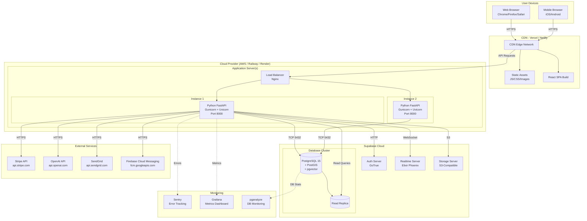
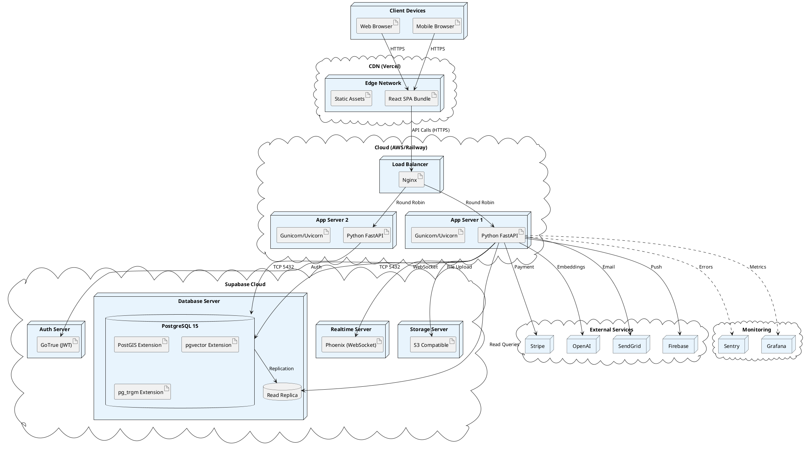

# 09 — Component & Deployment Diagrams

---

## Component Diagram

```mermaid
graph TB
    subgraph "Client Layer (Browser)"
        direction TB
        RC[React App]
        subgraph "React Components"
            Auth[Auth Module]
            CatMgmt[Cat Management]
            HospList[Hospital Listing]
            StoreList[Store Listing]
            ApptBook[Appointment Booking]
            Chat[Chat Module]
            AIComp[AI Companion]
            Dashboard[Dashboards]
            AdminPanel[Admin Panel]
        end
        RC --> Auth
        RC --> CatMgmt
        RC --> HospList
        RC --> StoreList
        RC --> ApptBook
        RC --> Chat
        RC --> AIComp
        RC --> Dashboard
        RC --> AdminPanel
    end

    subgraph "API Gateway Layer"
        NGINX[Nginx / Load Balancer]
        CORS[CORS Middleware]
        RateLimit[Rate Limiter]
        NGINX --> CORS --> RateLimit
    end

    subgraph "Backend Layer (Python)"
        direction TB
        subgraph "Controllers (REST API)"
            AuthCtrl[AuthController]
            CatCtrl[CatController]
            HospCtrl[HospitalController]
            ApptCtrl[AppointmentController]
            ChatCtrl[ChatController]
            OrderCtrl[OrderController]
            RxCtrl[PrescriptionController]
            AICtrl[AIController]
            MedCtrl[MedicineController]
            ReviewCtrl[ReviewController]
            AdmCtrl[AdminController]
        end
        
        subgraph "Middleware"
            JWTAuth[JWT Auth Middleware]
            RoleGuard[Role-Based Access Guard]
            Validator[Request Validator]
            ErrorHandler[Error Handler]
        end

        subgraph "Services (Business Logic)"
            AuthSvc[AuthService]
            CatSvc[CatService]
            HospSvc[HospitalService]
            ApptSvc[AppointmentService]
            ChatSvc[ChatService]
            OrderSvc[OrderService]
            RxSvc[PrescriptionService]
            AISvc[AIService]
            MedSvc[MedicineService]
            ReviewSvc[ReviewService]
            EmbedSvc[EmbeddingService]
            NotifSvc[NotificationService]
            GeoSvc[GeoLocationService]
            StorageSvc[StorageService]
        end

        subgraph "Repositories (Data Access)"
            UserRepo[UserRepository]
            CatRepo[CatRepository]
            HospRepo[HospitalRepository]
            ApptRepo[AppointmentRepository]
            ChatRepo[ChatRepository]
            OrderRepo[OrderRepository]
            ProdRepo[ProductRepository]
            RxRepo[PrescriptionRepository]
            MedRepo[MedicineRepository]
            VectorRepo[VectorDBRepository]
            ReviewRepo[ReviewRepository]
        end
    end

    subgraph "Data Layer"
        subgraph "Supabase"
            SBDB[(PostgreSQL + pgvector)]
            SBAuth[Supabase Auth]
            SBReal[Supabase Realtime]
            SBStore[Supabase Storage]
        end
    end

    subgraph "External Services"
        Stripe[Stripe Payment Gateway]
        OpenAI[OpenAI Embeddings API]
        GeoAPI[Geolocation API]
        Email[Email Service - SendGrid]
        Push[Push Notification - FCM]
    end

    %% Client to Gateway
    RC -->|HTTPS| NGINX

    %% Gateway to Controllers
    RateLimit --> AuthCtrl
    RateLimit --> CatCtrl
    RateLimit --> HospCtrl
    RateLimit --> ApptCtrl
    RateLimit --> ChatCtrl
    RateLimit --> OrderCtrl
    RateLimit --> AICtrl
    RateLimit --> AdmCtrl

    %% Controllers through Middleware
    AuthCtrl --> JWTAuth
    CatCtrl --> JWTAuth
    JWTAuth --> RoleGuard
    RoleGuard --> Validator

    %% Controllers to Services
    AuthCtrl -.-> AuthSvc
    CatCtrl -.-> CatSvc
    HospCtrl -.-> HospSvc
    ApptCtrl -.-> ApptSvc
    ChatCtrl -.-> ChatSvc
    OrderCtrl -.-> OrderSvc
    AICtrl -.-> AISvc
    AdmCtrl -.-> MedSvc

    %% Services to Repos
    AuthSvc -.-> UserRepo
    CatSvc -.-> CatRepo
    HospSvc -.-> HospRepo
    ApptSvc -.-> ApptRepo
    OrderSvc -.-> OrderRepo
    OrderSvc -.-> ProdRepo
    AISvc -.-> VectorRepo
    AISvc -.-> EmbedSvc

    %% Repos to DB
    UserRepo -->|SQL| SBDB
    CatRepo -->|SQL| SBDB
    HospRepo -->|SQL/PostGIS| SBDB
    VectorRepo -->|pgvector| SBDB

    %% External connections
    AuthSvc -->|OAuth| SBAuth
    ChatSvc -->|WebSocket| SBReal
    StorageSvc -->|S3 API| SBStore
    ApptSvc -->|Payment| Stripe
    OrderSvc -->|Payment| Stripe
    EmbedSvc -->|Embedding| OpenAI
    GeoSvc -->|Geocode| GeoAPI
    NotifSvc -->|Email| Email
    NotifSvc -->|Push| Push
```

---

## Deployment Diagram

---

## PlantUML Component Diagram

```plantuml
@startuml ComponentDiagram
skinparam component {
    BackgroundColor<<frontend>> #61DAFB
    BackgroundColor<<backend>> #3776AB
    BackgroundColor<<database>> #3ECF8E
    BackgroundColor<<external>> #FFD700
}

package "Frontend (React)" <<frontend>> {
    [Auth Pages] as AuthUI
    [Cat Management] as CatUI
    [Hospital Listing] as HospUI
    [Store Listing] as StoreUI
    [Appointment Booking] as ApptUI
    [Chat Interface] as ChatUI
    [AI Companion] as AIUI
    [Hospital Dashboard] as HospDash
    [Store Dashboard] as StoreDash
    [Admin Panel] as AdminUI
}

package "Backend (Python FastAPI)" <<backend>> {
    package "Controllers" {
        [AuthController] as AC
        [CatController] as CC
        [HospitalController] as HC
        [AppointmentController] as APC
        [ChatController] as CHC
        [OrderController] as OC
        [PrescriptionController] as RXC
        [AIController] as AIC
        [AdminController] as ADC
    }
    
    package "Middleware" {
        [JWT Authentication] as JWT
        [Role Authorization] as RBAC
        [Request Validation] as VAL
    }
    
    package "Services" {
        [AuthService] as AS
        [CatService] as CS
        [HospitalService] as HS
        [AppointmentService] as APS
        [ChatService] as CHS
        [OrderService] as OS
        [PrescriptionService] as RXS
        [AIService] as AIS
        [EmbeddingService] as ES
        [NotificationService] as NS
        [GeoService] as GS
    }
    
    package "Repositories" {
        [UserRepository] as UR
        [CatRepository] as CRp
        [HospitalRepository] as HR
        [AppointmentRepository] as APR
        [OrderRepository] as OR
        [VectorDBRepository] as VR
    }
}

package "Supabase" <<database>> {
    database "PostgreSQL\n+ PostGIS\n+ pgvector" as DB
    [Auth (GoTrue)] as SBA
    [Realtime (Phoenix)] as SBR
    [Storage (S3)] as SBS
}

package "External" <<external>> {
    [Stripe] as ST
    [OpenAI] as OAI
    [SendGrid] as SG
    [Firebase CM] as FCM
}

' Frontend → Controllers
AuthUI --> AC
CatUI --> CC
HospUI --> HC
ApptUI --> APC
ChatUI --> CHC
StoreUI --> OC
AIUI --> AIC
AdminUI --> ADC

' Controllers → Middleware → Services
AC --> JWT
JWT --> RBAC
AC ..> AS
CC ..> CS
HC ..> HS
APC ..> APS
CHC ..> CHS
OC ..> OS
AIC ..> AIS

' Services → Repos
AS --> UR
CS --> CRp
HS --> HR
APS --> APR
OS --> OR
AIS --> VR
AIS --> ES

' Repos → DB
UR --> DB
CRp --> DB
HR --> DB
APR --> DB
OR --> DB
VR --> DB

' External
AS --> SBA
CHS --> SBR
APS --> ST
OS --> ST
ES --> OAI
NS --> SG
NS --> FCM

@enduml
```

---

## PlantUML Deployment Diagram

---

## Environment Summary

| Component | Technology | Hosting | Purpose |
|-----------|-----------|---------|---------|
| Frontend | React 18 + Vite | Vercel CDN | User interface |
| Backend | Python FastAPI | Railway / AWS ECS | REST API + business logic |
| Database | PostgreSQL 15 | Supabase | Primary data store |
| Vector DB | pgvector (in PostgreSQL) | Supabase | AI similarity search |
| Geospatial | PostGIS (in PostgreSQL) | Supabase | Location-based queries |
| Auth | Supabase Auth (GoTrue) | Supabase | JWT authentication |
| Real-time | Supabase Realtime (Phoenix) | Supabase | Chat WebSocket |
| Storage | Supabase Storage | Supabase | Image/file uploads |
| Payments | Stripe | Stripe Cloud | Payment processing |
| AI Embeddings | OpenAI text-embedding-3-small | OpenAI Cloud | Vector generation |
| Email | SendGrid | SendGrid Cloud | Transactional emails |
| Push | Firebase Cloud Messaging | Google Cloud | Push notifications |
| Monitoring | Sentry + Grafana | Cloud | Error tracking + metrics |
