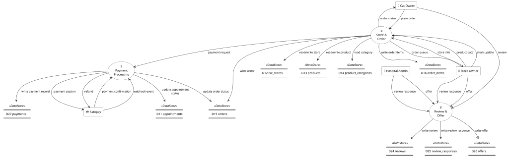

# 11 — Data Flow Diagram (DeMarco-Yourdon)

> Complete DFD for Purrfect Care.
> **Notation**: Circles/Bubbles = Processes, Two parallel horizontal lines = Data Stores, Rectangles = External Entities, Arrows = Data Flows.

---

## Level 0 — Context Diagram

```plantuml
@startuml
scale max 1024 width
skinparam wrapWidth 200
skinparam maxMessageSize 150
skinparam usecaseBackgroundColor white
skinparam usecaseBorderColor black
skinparam rectangleBackgroundColor white
skinparam rectangleBorderColor black

rectangle "👤 Cat Owner" as CO
rectangle "👨‍⚕️ Veterinarian" as VT
rectangle "🏥 Hospital Admin" as HA
rectangle "🏪 Store Owner" as SO
rectangle "🔑 System Admin" as SA
rectangle "💳 Safepay API" as STRIPE
rectangle "🤖 Gemini API" as GEMINI
rectangle "📧 Resend" as SENDGRID
rectangle "🔔 Firebase CM" as FIREBASE

usecase "<size:24><b>0</b></size>\n<size:20>Purrfect Care</size>\n<size:20>System</size>\n<size:14>(FastAPI / Cloud Run\n+ Supabase PostgreSQL)</size>" as PC

CO --> PC : Registration
CO --> PC : Login
CO --> PC : Cat Data
CO --> PC : Booking Request
CO --> PC : Order
CO --> PC : Chat Message
CO --> PC : Symptom / AI Query
CO --> PC : Review
PC --> CO : Auth Token
PC --> CO : Cat Profile
PC --> CO : Appointment Confirmation
PC --> CO : Order Status
PC --> CO : AI Recommendation
PC --> CO : Prescription
PC --> CO : Notification

VT --> PC : Credentials
VT --> PC : Availability Slots
VT --> PC : Diagnosis
VT --> PC : Prescription
VT --> PC : Chat Response
PC --> VT : Appointment Queue
PC --> VT : Patient Record
PC --> VT : Chat Message
PC --> VT : Notification

HA --> PC : Hospital Info
HA --> PC : Services
HA --> PC : Slot Schedules
HA --> PC : Vet Registration
HA --> PC : Offer
HA --> PC : Page Config
HA --> PC : Review Response
PC --> HA : Dashboard Stats
PC --> HA : Appointment Data
PC --> HA : Reviews
PC --> HA : Notification

SO --> PC : Store Info
SO --> PC : Products
SO --> PC : Offer
SO --> PC : Order Update
SO --> PC : Review Response
PC --> SO : Order Queue
PC --> SO : Analytics
PC --> SO : Reviews
PC --> SO : Notification

SA --> PC : Approval
SA --> PC : Verification
SA --> PC : Medicine Data
SA --> PC : Breed Data
SA --> PC : Health Knowledge
PC --> SA : Pending Approvals
PC --> SA : KPIs
PC --> SA : User Reports
PC --> SA : System Alerts

PC --> STRIPE : Payment Session
PC --> STRIPE : Refund
STRIPE --> PC : Payment Confirmation
STRIPE --> PC : Webhook Event (HMAC)

PC --> GEMINI : Embedding Request (768-dim)
PC --> GEMINI : Chat Generation Request
GEMINI --> PC : Vector Embedding
GEMINI --> PC : Grounded AI Answer

PC --> SENDGRID : Email Request
PC --> FIREBASE : Push Notification
@enduml
```

---

## Level 1 — System Decomposition

> To improve readability, the Level 1 diagram is broken down into three logical subsystems based on the Level 0 Context Diagram.

### Level 1a — Core User & Medical Subsystem
*Handles interactions for Cat Owners and Veterinarians regarding medical and core platform features.*

```plantuml
@startuml
scale max 1024 width
skinparam wrapWidth 200
skinparam maxMessageSize 150
skinparam usecaseBackgroundColor white
skinparam usecaseBorderColor black
skinparam rectangleBackgroundColor white
skinparam rectangleBorderColor black

skinparam rectangle<<DataStore>> {
    BorderColor transparent
    BackgroundColor transparent
    Shadowing false
}

'''' External Entities
rectangle "👤 Cat Owner" as CO
rectangle "👨‍⚕️ Veterinarian" as VT
rectangle "🏥 Hospital Admin" as HA
rectangle "🤖 Gemini API" as GEMINI

'''' Internal API Layer (FastAPI / Cloud Run with service-role key)
rectangle "☁️ FastAPI\nBackend API" as API

'''' Processes
usecase "1\nAuth &\nUser Mgmt" as P1
usecase "2\nCat\nManagement" as P2
usecase "3\nHospital &\nAppointment" as P3
usecase "5\nChat\nSystem" as P5
usecase "6\nAI Health\nCompanion\n(RAG)" as P6
usecase "7\nPrescription\n& Medicine" as P7

'''' Data Stores (DeMarco-Yourdon Horizontal Lines via Unicode Box Drawing)
rectangle "━━━━━━━━━━━━━━━\n   D1 users   \n━━━━━━━━━━━━━━━" <<DataStore>> as D1
rectangle "━━━━━━━━━━━━━━━\n D2 user_profiles \n━━━━━━━━━━━━━━━" <<DataStore>> as D2
rectangle "━━━━━━━━━━━━━━━\n   D3 cats   \n━━━━━━━━━━━━━━━" <<DataStore>> as D3
rectangle "━━━━━━━━━━━━━━━\n  D4 cat_breeds  \n━━━━━━━━━━━━━━━" <<DataStore>> as D4
rectangle "━━━━━━━━━━━━━━━\n D5 medical_records \n━━━━━━━━━━━━━━━" <<DataStore>> as D5
rectangle "━━━━━━━━━━━━━━━\n D6 patient_history \n━━━━━━━━━━━━━━━" <<DataStore>> as D6
rectangle "━━━━━━━━━━━━━━━\n   D7 vets   \n━━━━━━━━━━━━━━━" <<DataStore>> as D7
rectangle "━━━━━━━━━━━━━━━\n  D8 hospitals  \n━━━━━━━━━━━━━━━" <<DataStore>> as D8
rectangle "━━━━━━━━━━━━━━━\n D9 hospital_services \n━━━━━━━━━━━━━━━" <<DataStore>> as D9
rectangle "━━━━━━━━━━━━━━━\n D10 appointment_slots \n━━━━━━━━━━━━━━━" <<DataStore>> as D10
rectangle "━━━━━━━━━━━━━━━\n D11 appointments \n━━━━━━━━━━━━━━━" <<DataStore>> as D11
rectangle "━━━━━━━━━━━━━━━\n  D17 chat_rooms  \n━━━━━━━━━━━━━━━" <<DataStore>> as D17
rectangle "━━━━━━━━━━━━━━━\n   D18 messages   \n━━━━━━━━━━━━━━━" <<DataStore>> as D18
rectangle "━━━━━━━━━━━━━━━\n D19 ai_consultations \n━━━━━━━━━━━━━━━" <<DataStore>> as D19
rectangle "━━━━━━━━━━━━━━━\n D20 cat_health_knowledge \n━━━━━━━━━━━━━━━" <<DataStore>> as D20
rectangle "━━━━━━━━━━━━━━━\n  D21 medicines  \n━━━━━━━━━━━━━━━" <<DataStore>> as D21
rectangle "━━━━━━━━━━━━━━━\n D22 prescriptions \n━━━━━━━━━━━━━━━" <<DataStore>> as D22
rectangle "━━━━━━━━━━━━━━━\n  D23 treatments  \n━━━━━━━━━━━━━━━" <<DataStore>> as D23

'''' P1 Authentication (via FastAPI backend — issues JWT + Supabase session)
CO --> P1 : credentials
VT --> P1 : credentials
HA --> P1 : credentials
P1 --> API : create user request
P1 --> API : validate credentials
API --> D1 : write user record
API --> D2 : write profile
P1 --> CO : JWT token
P1 --> CO : Supabase session
P1 --> VT : JWT token
P1 --> VT : Supabase session
P1 --> HA : JWT token
P1 --> HA : Supabase session

'''' P2 Cat Management
CO --> P2 : cat data
P2 --> D3 : write cat
P2 --> D5 : write medical record
P2 --> D6 : write history
P2 --> D4 : breed lookup
P2 --> CO : cat profile

'''' P3 Hospital & Appointment
CO --> P3 : booking request
CO --> P3 : slot selection
CO --> P3 : cat selection
VT --> P3 : availability slots
HA --> P3 : slot schedules
HA --> P3 : vet registration request
P3 --> API : GET vets (service role bypass)
API --> D7 : read vet records
API --> D2 : read vet profile names
P3 --> API : POST register vet
API --> D1 : create auth user
API --> D2 : create vet profile
API --> D7 : create vet record
P3 --> D8 : read hospital info
P3 --> D9 : read services
P3 --> D10 : read available slots
P3 --> D10 : mark slot as booked
P3 --> D11 : insert appointment
P3 --> CO : booking confirmation
P3 --> VT : appointment queue

'''' P5 Chat
CO --> P5 : message
VT --> P5 : message
P5 --> D17
P5 --> D18

'''' P6 AI Companion (RAG)
CO --> P6 : symptoms / question
P6 --> GEMINI : embed question (768-dim)
GEMINI --> P6 : query vector
P6 --> D20 : cosine similarity search
GEMINI --> P6 : grounded answer
P6 --> D19 : log consultation
P6 --> CO : AI recommendations

'''' P7 Prescription & Medicine
VT --> P7 : prescription
P7 --> D5 : allergy check
P7 --> D21
P7 --> D22
P7 --> D23
P7 --> D6 : history entry
P7 --> CO : prescription details
@enduml
```

### Level 1b — Commerce & Business Subsystem
*Handles interactions for Store Owners, Hospital Admins, and Cat Owners regarding orders, offers, and payments.*

### Level 1c — Platform Admin & Notification Subsystem
*Handles system-wide administration and external notifications.*

```plantuml
@startuml
scale max 1024 width
skinparam wrapWidth 200
skinparam maxMessageSize 150
skinparam usecaseBackgroundColor white
skinparam usecaseBorderColor black
skinparam rectangleBackgroundColor white
skinparam rectangleBorderColor black

skinparam rectangle<<DataStore>> {
    BorderColor transparent
    BackgroundColor transparent
    Shadowing false
}

'''' External Entities
rectangle "🔑 System Admin" as SA
rectangle "👤 Cat Owner" as CO
rectangle "👨‍⚕️ Veterinarian" as VT
rectangle "🏥 Hospital Admin" as HA
rectangle "🏪 Store Owner" as SO
rectangle "📧 Resend" as SG
rectangle "🔔 Firebase CM" as FB

'''' Processes
usecase "10\nNotification\nEngine" as P10
usecase "11\nAdmin\nPanel" as P11

'''' Data Stores (Only relevant ones)
rectangle "━━━━━━━━━━━━━━━\n   D1 users   \n━━━━━━━━━━━━━━━" <<DataStore>> as D1
rectangle "━━━━━━━━━━━━━━━\n  D4 cat_breeds  \n━━━━━━━━━━━━━━━" <<DataStore>> as D4
rectangle "━━━━━━━━━━━━━━━\n   D7 vets   \n━━━━━━━━━━━━━━━" <<DataStore>> as D7
rectangle "━━━━━━━━━━━━━━━\n  D8 hospitals  \n━━━━━━━━━━━━━━━" <<DataStore>> as D8
rectangle "━━━━━━━━━━━━━━━\n  D12 cat_stores  \n━━━━━━━━━━━━━━━" <<DataStore>> as D12
rectangle "━━━━━━━━━━━━━━━\n D20 cat_health_knowledge \n━━━━━━━━━━━━━━━" <<DataStore>> as D20
rectangle "━━━━━━━━━━━━━━━\n  D21 medicines  \n━━━━━━━━━━━━━━━" <<DataStore>> as D21
rectangle "━━━━━━━━━━━━━━━\n D28 notifications \n━━━━━━━━━━━━━━━" <<DataStore>> as D28

'''' P10 Notification
P10 --> D28 : log notification
P10 --> CO : push notification
P10 --> CO : email
P10 --> VT : push notification
P10 --> VT : email
P10 --> HA : push notification
P10 --> HA : email
P10 --> SO : push notification
P10 --> SO : email
P10 --> SG : email request
P10 --> FB : push request

'''' P11 Admin
SA --> P11 : approval action
SA --> P11 : verification action
SA --> P11 : medicine data
SA --> P11 : breed data
SA --> P11 : health knowledge
P11 --> D1 : update user
P11 --> D7 : verify vet
P11 --> D8 : approve hospital
P11 --> D12 : approve store
P11 --> D21 : manage medicine
P11 --> D4 : manage breed
P11 --> SA : approval report
P11 --> SA : KPI report
P11 --> SA : user report
P11 --> SA : system alert
@enduml
```

---

## Data Store ↔ Entity Mapping

| Store ID | DB Table | Domain | Accessed By Processes |
|----------|----------|--------|-----------------------|
| D1 | `users` | Participant | P1 (via FastAPI service role), P11 |
| D2 | `user_profiles` | Participant | P1 (via FastAPI service role), P3 (vet name lookup via service role) |
| D3 | `cats` | Specific Item | P2, P6 |
| D4 | `cat_breeds` | Item | P2, P11 |
| D5 | `medical_records` | Specific Item | P2, P6, P7 |
| D6 | `patient_history` | Subsequent Tx | P2, P7 |
| D7 | `vets` | Participant | P3 (listing via FastAPI service role; slot/booking via Supabase anon RLS), P11 |
| D8 | `hospitals` | Place | P3, P11 |
| D9 | `hospital_services` | Item | P3 |
| D10 | `appointment_slots` | Transaction | P3 (is_booked flag; public SELECT RLS) |
| D11 | `appointments` | Transaction | P3 (INSERT by cat owner — migration 024 RLS), P9 |
| D12 | `cat_stores` | Place | P4, P11 |
| D13 | `products` | Item | P4 |
| D14 | `product_categories` | Item | P4 |
| D15 | `orders` | Transaction | P4, P9 |
| D16 | `order_items` | Line Item | P4 |
| D17 | `chat_rooms` | Transaction | P5 |
| D18 | `messages` | Line Item | P5 |
| D19 | `ai_consultations` | Transaction | P6 |
| D20 | `cat_health_knowledge` | RAG Knowledge Base | P6 |
| D21 | `medicines` | Item | P7, P11 |
| D22 | `prescriptions` | Subsequent Tx | P7 |
| D23 | `treatments` | Subsequent Tx | P7 |
| D24 | `reviews` | Transaction | P8 |
| D25 | `review_responses` | Subsequent Tx | P8 |
| D26 | `offers` | Transaction | P8 |
| D27 | `payments` | Subsequent Tx | P9 (Safepay webhook via FastAPI) |
| D28 | `notifications` | System | P10 |

**Coverage: 28/28 data stores • 11 processes • 6 external entities • 4 external systems**

> **Architecture note**: Auth (P1) and vet registration/listing (P3) route through the FastAPI Cloud Run backend using the Supabase **service-role key**, bypassing RLS for cross-table operations. All other Supabase reads/writes use the **anon key** bound by row-level security. Safepay replaces Stripe for payments; Resend replaces SendGrid for email; Google Gemini API (gemini-embedding-001 + gemini-2.0-flash) handles all AI workloads.
